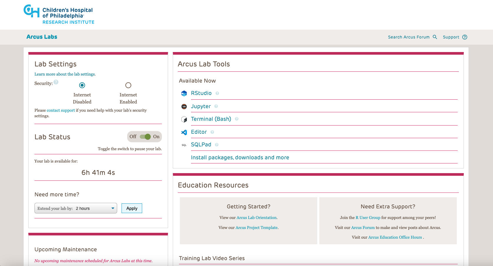
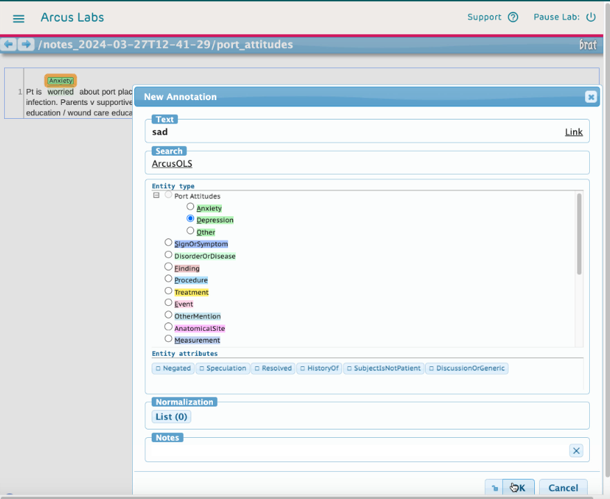
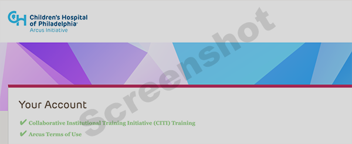

<!--
author:   Arcus Education
email:    arcus-support@chop.edu
version:  1.1.0
language: en
narrator: US English Female
title: Arcus Lab Orientation
comment:  Learn what an Arcus Lab is and how to work with it.
long_description: In the Research Institute of the Children's Hospital of Philadelphia, Arcus Computational Labs (or Arcus Labs for short) are computer systems that researchers on an Arcus Scientific Project can access in a web browser via a URL. This document describes what an Arcus lab is, what it does, and how researchers can work with an Arcus lab.  It also contains links to useful training materials in specific skills like R, Python, and SQL.
estimated_time: 1h
@learning_objectives 

After completion of this training module, learners will be able to:

* Explain what Arcus is and describe a bit about what Arcus offers
* Describe what an Arcus Scientific Lab is
* Describe what an Arcus Scientific Lab includes and how to start the process of getting a Lab
* Choose training options related to data science skills like R, Python, and SQL

@end

link:  https://cdn.jsdelivr.net/gh/arcus/education_modules@main/assets/styles.css
script: https://kit.fontawesome.com/83b2343bd4.js
script: https://cdn.jsdelivr.net/npm/mermaid@9.4.3/dist/mermaid.min.js
-->

## Arcus Lab Orientation

<div class = "overview">

## Overview

@comment

### Is this module right for me?

@long_description

### Details

**Estimated time to completion**: @estimated_time

**Pre-requisites**: It's helpful to have reviewed the Arcus website at https://arcus.chop.edu (available only on the CHOP network), to understand Arcus overall goals.

**Learning Objectives**:

@learning_objectives

</div>

<div class = "important">

Hi!  This document is still under construction and testing.  We apologize in advance for any broken links or unclear language.  We invite your feedback.  Please add a [support ticket](https://support.arcus.chop.edu/servicedesk/customer/portal/6/create/249) or [email Arcus Education](mailto:paytonk@chop.edu) to let us know what we can improve or suggest additional topics.

Please note that **many of the links here will only work if you're on the CHOP network**.

Also, you can use the buttons in the upper right to change the size of the text, translate this to another language, or view a high-contrast version of this document!

</div>

## What is Arcus?

Work With Human Data?
----

Arcus is a program of the Children's Hospital of Philadelphia Research Institute meant to improve **research rigor and reproducibility** and **data discovery and reuse** within research at CHOP, especially in the area of human and human-derived data and research.  We can provide you with data (data we give you via an Arcus Scientific Lab), archive your research data, help you learn data science skills, help you with research data management, and more!

Not a Human Subjects Researcher?
-----

While some of our tools and services are very expressly related to **human** data (e.g. data from the clinical record, biosamples, and human subject research data), we are also able to help researchers in all domains (basic, non-human models, etc.) at CHOP with other services (e.g. research data lifecycle consultations, data science education).


Not at CHOP?
-----
If you're **not** at CHOP, you can still benefit from some of our suggestions and training, even though we can't support you with things like providing datasets.

The Arcus Scientific Lab 
----
Arcus has tools and products that can be helpful to you at various stages of the research life cycle.  In this document, we're going to talk mostly about **Arcus Scientific Labs**, which are environments that are available via web browser and come pre-populated with reproducible tools and data you specify.  

The Arcus Scientific Lab (we'll shorten here to "lab" or "Arcus lab" many times) exists to allow you to answer a specific scientific question you have posed in the most reproducible, re-usable way possible, with standard file structures and toolsets.  This means that it will be easy for other researchers to re-use your data at a later date.  Working with Arcus labs has benefits now and in the future, when other investigators reuse your analyses or data and provide citations or co-authorship opportunities that will bolster your career.

## Audience

This training module will be useful for you whether you already have an Arcus Lab as part of an Arcus scientific project or you're just getting to know what the various Arcus tools are. 

Some materials here are practical instructions for people who already have Arcus labs, and some materials are introductory and explain what an Arcus lab is.  The table of contents on the left can help you navigate through the materials and allow you to learn just what matters most to you.

Log in, Learn More!
----

If you would like to learn more about what Arcus is and what we do, check out the **[Arcus website](https://arcus.chop.edu)** (available only on the CHOP network).  Even without logging in, you can see **announcements and support services** there that might be interesting to you, such as research data management consultations.

Once you log in to https://arcus.chop.edu, (you'll need to have CITI training and sign our terms of use), you'll also have access to our **self-service tools**.  These allow you to do things like browse available genomic variants, visit CHOP's data catalog, and construct clinical cohorts that meet some basic inclusion and exclusion criteria.  These self-service tools are intended to provide you some level of autonomy and awareness about Arcus data -- data which is sourced from research and clinical origins.  These tools are not exhaustive and won't be enough to actually provide you with the raw data you need, but they will give you important information about how much data is available, how many patients or human subjects are included, and characteristics about the data that can help you decide if you want to request the data.  If you do request data, it will be provided to you in an Arcus Scientific Lab!

Potential Arcus Customers
-----

If you're just learning about Arcus, no worries!  If you conduct research at the Children's Hospital of Philadelphia, chances are we might have some tools, services, or resources that can help you.  We're going to concentrate mostly on a product we call an Arcus Scientific Lab, but if you don't have a project that uses an Arcus Lab and you're just here to browse and learn, you'll still learn a lot about what's possible.

Here you'll learn about what an Arcus lab is and how to work with it.  While most of the information in the rest of this document is designed for Arcus Labs, our linked material about various data science topics like R and SQL is broadly applicable, even to folks who aren't working with Arcus. We hope you find it helpful. 

Current Arcus Customers
-----

If you're here because you've recently signed the terms of use at https://arcus.chop.edu and you're ready to learn more, welcome!  And if you just started with a new Arcus scientific project with an Arcus Lab, congratulations! This goal of this guide is to get you up and running with your new Arcus lab, regardless of your research background and expertise.

You should begin by working in this training document, which constitutes an Arcus Lab Overview. There are other documents we will suggest you look at as well, which cover additional skills. 

<div style = "clear: both;"></div>

## Arcus Lab Basics

Arcus Computational Labs (or Arcus Labs for short) exist to provide a robust, configurable computational environment that has the level of computation you need (often, more than you can get from your laptop) and is secure, compliant, and reproducible.

**When you request CHOP data from Arcus, we deliver it in an Arcus lab**.  Instead of receiving your data in files that you download to your local system to work with, Arcus supplies you with a Lab which has pre-installed [data](#included-data) and [tools](#included-tools). This lab is available by using a web browser to access a URL, which means you no longer need to download software to your computing device. It also means that all members of your team with access to the lab will have the same environment, access to the same data, and be able to share scripts more easily. See below an example of what you might see when you visit your lab’s website via Google Chrome.

Even if you're not requesting data from Arcus, but bringing your own, you might find that working in an Arcus lab is beneficial.

<!-- style = "border: 1px solid rgb(var(--color-highlight)); max-width: 600px; float: left; margin-right: 2rem; margin-bottom: 2rem;"-->

<div style = "clear:both;"></div>

Each lab will be configured to meet the needs of the research team, with appropriate memory, CPU, and storage capabilities, as well as any additional infrastructure required, such as GPUs.

Arcus labs are governed by important rules that spell out what can be exported from the environment. The Arcus lab is in some ways a "clean room" -- everything needed, data and tools, is set up by Arcus staff for use by researchers.  Data loaded in the lab should be analyzed within the Arcus lab, and very little should enter or leave the Arcus lab once it is set up.  For example, lab users should not, in general, export or download individual level data from an Arcus lab.  Lab import or export of data or other assets is governed by [Arcus Terms of Use](https://arcus.chop.edu/terms-of-use) and our privacy controls.  You can read more in our [Arcus Data Access Standard Operating Procedure](https://chop.policymedical.net/policymed/anonymous/docViewer?stoken=14de2fa8-d9f5-4188-983b-29545b20809f&dtoken=a8f05e20-ab72-4bf2-a402-60e07a2ca7da) and [Arcus Data Use Standard Operating Procedure](https://chop.policymedical.net/policymed/anonymous/docViewer?stoken=14de2fa8-d9f5-4188-983b-29545b20809f&dtoken=243b8188-914e-4ab1-b445-97083c60a0d5).

By signing the [Arcus Terms of Use](https://arcus.chop.edu/terms-of-use), you agree to follow Arcus policies related to the export of data.  For both identified and de-identified research, it is possible to download and export aggregate descriptive statistics, data visualizations, tables that demonstrate group differences, the results of statistical comparisons, and other de-identified, whole-dataset level analysis. This may require the assistance of your Arcus project owner, depending on what you would like to export.

Keep in mind that some group-level data may be overly disclosive in the case of rare diseases or other low-count populations. [Consult with Arcus Privacy](https://support.arcus.chop.edu/servicedesk/customer/portal/6/create/313?q=privacy&q_time=1676498280783) for questions about what kind of data can be exported for use in publications, grant applications, and other scientific dissemination.

Arcus labs are per-project. Each Arcus Lab is associated with a specific Arcus Scientific Project, is open to only the approved users for that project, and is isolated from every other Arcus Lab.  

### Included Data

What Can I Get?
-----

Lots of different, interrelated datasets can be provided in an Arcus lab.  You can add clinical data, for example from the [Arcus Data Repository](https://chop.alationcloud.com/data/23/), which is a data source that includes clinical data from CHOP's EHR.  You may also be using contributed data sets that other researchers generated and listed as part of the [Arcus Archives](https://chop.alationcloud.com/data/29/) as well.  In fact, any data listed in [CHOP's Enterprise Data Catalog, Gene](https://gene.chop.edu) can be added to an Arcus lab.  You may have your own data as well, in a database or in files, which you want added to your Arcus lab.

Deidentified only? Or IRB Projects, Too?
----

You can combine data from multiple sources in an Arcus project, and you can work with deidentified data or with identified data that you're using under an IRB protocol.

Paying it Forward
-----

Importantly, Arcus exists in order to promote **research reproducibility** and **data discovery and reuse**.  For that reason, when you work with Arcus, we will plan with you how you will contribute your data sets, scripts, cohorts, or findings back to the Arcus ecosystem via a data contribution to the Arcus Archives.  We do this in a way that respects your scientific stewardship of data and scholarship, and we can work with you so that your data contribution takes place at the right time and in the right way.  To learn more about Arcus data contributions, please read our [Arcus Data Contribution Orientation](https://liascript.github.io/course/?https://raw.githubusercontent.com/arcus/Arcus_Labs_Orientation/main/new_data_contribution.md#1).

Organizing Your Data 
-----

Our librarians have worked hard to create some suggested ways to organize your data such that your work is contribution-ready.  The Arcus Project Template they've developed also works to help you keep your work well-organized and easy to navigate. Please read our [Arcus Project Template Orientation](https://liascript.github.io/course/?https://raw.githubusercontent.com/arcus/Arcus_Labs_Orientation/main/data_contribution_2_data.md#1) to find out the many advantages of a well-structured project in Arcus labs!

Getting the Right Data Into Your Lab 
-----

An initial **data needs assessment** takes place during the project assessment for new Scientific Projects.  This process will determine the data that is provisioned to your lab to start.  You can learn more about this process in the [Getting an Arcus Lab](#getting-an-arcus-lab) section. 

However, some researchers find that they need to modify their data request at some point during the life of their project. To do that, you can fill out a request form.  The [general request area](https://support.arcus.chop.edu/servicedesk/customer/portal/6) of the Arcus Service Desk includes forms for requesting geospatial data, images, and ADR data.  

Importantly, additional **privacy and data assessment work** will be needed as part of the consideration of your request to expand your data.  It is useful to plan data use (your explanatory and outcome variables, any demographic information you need, inclusion and exclusion criteria, etc.) **well ahead of time** to reduce delays caused by data requests made after a project is already underway. 

What's the Arcus Data Repository?
-----

If you're planning on using clinical data, you'll likely be receiving data from the Arcus Data Repository, which includes a simplified version of data from CHOP's EHR.  

Arcus Data Repository (ADR) clinical data contains many frequently used fields from Epic data, but is not a complete duplicate of Epic.  Additionally, data in the ADR has been shaped into tables that are more intuitive than raw data from Epic.

How Do I Make a Request?
-----

Requesting data means (eventually) describing both the **cohort you want data from** (for example, male patients currently aged 13 or above who have an ICD E or F diagnosis code) and the **fields you want** (for example, demographic data, diagnoses, and emergency department encounter information).  You can start a request without having all the information complete.  In fact, our self-service tools have data request buttons that allow you to kick off a request and start the dialogue with Arcus about honing your data request to the precise data you need.

If you need help determining which data you need from the Arcus Data Repository, you can work on defining your [clinical cohort](https://education.arcus.chop.edu/arcus-clinical-cohorts/) by using the [Arcus cohort discovery tool](https://arcus.chop.edu/cohort-discovery). 

If you need help using Arcus cohort discovery, check out the [Cohort Discovery Job Aid](https://forum.arcus.chop.edu/t/cohort-discovery-tool-job-aid/590) on the Arcus Forum.  

Want to explore research data sets and other enterprise data?  Visit [Gene](https://gene.chop.edu)!

Special Data Types
-----

Many researchers bring in other data sources to analyze in Arcus. Talk to your Project Owner about any additional data needs ([genomics data](https://support.arcus.chop.edu/servicedesk/customer/portal/6/create/270), [images](https://support.arcus.chop.edu/servicedesk/customer/portal/6/create/268), [geospatial data](https://support.arcus.chop.edu/servicedesk/customer/portal/6/create/265), data from other previous or ongoing research projects, etc.).  Keep in mind that all data requests are subject to review by the privacy team and that changing the scope of your project once it has been launched may result in delays.  It's best to know what data you'd like to use at the project assessment phase.


Getting Help
----

If you need help describing the data you need, you may also ask your Project Owner, if you have a scientific project, or submit a ticket at the [Arcus Help Center](https://support.arcus.chop.edu/servicedesk/customer/portal/6/create/302) for assistance.

When you are ready to place a request for additional data, new services, or want to learn more about scientific labs or report a problem, you may do so through the [Arcus Help Center](https://support.arcus.chop.edu/servicedesk/customer/portal/6/group/65).


### Included Tools

Statistical Analysis Software
------

Currently, Arcus Computational Labs are populated with open source statistical and data analytics software.  These software (JupyterLab with language kernels such as Python and RStudio using R) allow for scripted data ingestion, cleaning, preparation, analysis, and visualization. 

Licensed point and click commercial software such as Excel, SAS, and SPSS **are not supported at this time**.  The paid, commercial license for a Stata language kernel for Jupyter (not the Stata point-and-click desktop application) can be requested if necessary for the project.

Why is this tool suite what we provide in Arcus?  We want to position researchers to work in reproducible ways that set them up for career success and publication opportunities.  Increasingly, top tier journals demand scripted (not point-and-click) data analysis, and we believe this trend will continue and become industry standard.  We also believe that scripted analysis is the most reproducible way to conduct science and is best practice for the conduct of research.  Finally, Free and Open Source Software (FOSS) like R and Python are one of the most open ways to share data with researchers in lower-resourced settings, who may not be able to afford high license costs of proprietary software like SAS.  Because Arcus is deeply invested in research rigor and reproducibility, we suggest wherever possible that researchers use scripted analysis tools that are free and open source.


Text Tools
-----

We also have a text annotator, brat, which is useful for reading text files like clinical notes, as well as for adding any annotations.

<!-- style = "border: 1px solid rgb(var(--color-highlight)); max-width: 500px;"-->


Learning to use the tools
------

It can be a big change to start to use scripted analysis instead of using point-and-click software! It requires time, effort, and lots of trial and error.  Arcus Education has many educational resources that may interest you. For more information, [put in a help ticket](https://support.arcus.chop.edu/servicedesk/customer/portal/6/create/248?q=education&q_time=1676498496556), visit [Education Office Hours](https://outlook.office365.com/owa/calendar/BKG-StandardArcusEducationOfficeHours@chop.edu/bookings/), visit our [list of self-guided tutorials](https://arcus.github.io/education_modules) that you can do on your own,  or email [`arcus-support@chop.edu`](mailto:arcus-support@chop.edu).  We'd also suggest you check out the "New to" documents, which are good for every researcher to learn about:

- **[New to data science](https://liascript.github.io/course/?https://raw.githubusercontent.com/arcus/Arcus_Labs_Orientation/main/new_to_data_science.md)** is a document that introduces helpful tools and tips for working on data science projects that will be useful to scientists coming from other types of research. Even if you have experience in data science already, you may find it worthwhile to skim the subtopics in that section so you know what's available should you want to come back to it to reference later.
- **[New to version control](https://liascript.github.io/course/?https://raw.githubusercontent.com/arcus/Arcus_Labs_Orientation/main/new_to_version_control.md)** is a document that will help you get started with git, a powerful program for helping you keep track of your research documents over time. If you don't currently use git or another form of version control, we strongly recommend you work through that section. Version control is an extremely valuable tool for reproducible research, and although there is a bit of a learning curve, it really pays off.
- **[New to GitHub](https://liascript.github.io/course/?https://raw.githubusercontent.com/arcus/Arcus_Labs_Orientation/main/new_to_version_control.md#1)** covers the difference between Git, the popular version control system, and GitHub, a website for hosting Git repositories. CHOP researchers also have access to a special version of GitHub, CHOP's Enterprise GitHub. This guide explains your options and walks through exploring a repository on CHOP's Enterprise GitHub, as well as how to create your own repository and connect it to your Arcus Lab.
- **[New to SQL](https://liascript.github.io/course/?https://raw.githubusercontent.com/arcus/Arcus_Labs_Orientation/main/new_to_sql.md)**, **[New to R](https://liascript.github.io/course/?https://raw.githubusercontent.com/arcus/Arcus_Labs_Orientation/main/new_to_r.md)** and **[New to Python](https://liascript.github.io/course/?https://raw.githubusercontent.com/arcus/Arcus_Labs_Orientation/main/new_to_python.md)** are documents that introduce you to the three languages most important to your work in an Arcus Lab: SQL, R, and python. You will need at least some familiarity with SQL in order to access any tabular data in your lab (data that takes the forms of rows and columns). Depending on your research needs, you can pick whether to learn Python or R or use some of both. If you're new to SQL, R, and Python, we recommend you focus on SQL first, since that's the first thing you'll need to be able to apply in your own lab.
- **[New to Omics](https://liascript.github.io/course/?https://raw.githubusercontent.com/arcus/Arcus_Labs_Orientation/main/new_to_omics.md#1)** will get you started if you're using the Arcus Omics Training Lab. The instructions in this document presuppose that specific files, containing pre-defined data, exist and that you're working in the Omics Training Lab.
- **[New to Text Data](https://liascript.github.io/course/?https://raw.githubusercontent.com/arcus/Arcus_Labs_Orientation/main/new_to_text.md#1)** is a very cursory introduction to some topics related to working with text data.

We estimate that completing the learning in the above "New to" modules as well as this module will require around 35-45 hours, depending on how deeply you engage with the materials. We suggest that you spread out your learning over several weeks to allow for practicing the skills you're learning in your Arcus lab.

I Don't Have Time to Learn!
------

If you don't have time to learn SQL, R, and Python, consider having your junior staff train in these skills.  When RAs and study coordinators apply to graduate school, they're now being asked about their ability to write code.  Therefore, giving junior staff an opportunity to learn scripted analysis can help you have an affordable asset in your team who can do the work and will also set them up for greater career success. 

Can't I Just Pay Someone?
-----

Additionally, the Department of Biomedical and Health Informatics (DBHI) at CHOP has staff that you can use in a billback model who can handle analysis for you, if you don't have the staff or time to acquire R, Python, and SQL skills.


### Knowledge Check 1

True or False: Each Arcus computational lab provides access to all of the data in the Arcus Data Repository (ADR)

[( )] True
[(X)] False
***

<div class = "answer">

Each Arcus lab is provisioned just with the data required for that project as determined in the data needs assessment. If you find you need additional data, you can always request more.

</div>

***

True or False: Arcus labs are limited to analysis of data from the ADR.

[( )] True
[(X)] False
***

<div class = "answer">

Although Arcus makes access to the ADR very easy, it's not your only option! Most researchers use a combination of ADR data and data from other sources.

</div>

***

True or False: The Arcus Data Repository (ADR) contains everything from Epic Clarity.

[( )] True
[(X)] False
***

<div class = "answer">

The ADR is a streamlined selection of information from Epic Clarity, not the entire thing. It includes the patient information most commonly requested by researchers (a sort of "greatest hits" of electronic health records), such as demographics, diagnoses, medications, encounters, etc.

If you're used to working in Epic, this means there will be fields you're used to seeing that won't be in the ADR. If you want information that's not in the ADR, you can make a request and the Arcus data and privacy teams can determine what's possible.

</div>

***

## Getting an Arcus Lab 

Arcus Labs are created as part of an Arcus Scientific Project -- when a researcher at CHOP decides to partner with Arcus to conduct research using Arcus tools and make a data contribution to the CHOP data ecosystem.

You can start the process of beginning a Scientific Project by filling out [a form in our help center](https://support.arcus.chop.edu/servicedesk/customer/portal/6/create/307).

When a researcher requests a Scientific Project, Arcus works together with that researcher to determine whether a project is feasible and belongs in Arcus.  Arcus staff also work with the requesting researcher to identify the data and lab needs for the project.  

### Qualifications for Users

To use Arcus (whether Labs or other Arcus tools such as Cohort Discovery), you must fulfill certain requirements, including [CITI training](https://about.citiprogram.org/). The requirements vary based on the regulatory level of the data you are working with.

* If you are working with identified human subject data, you will need to have completed Human Subjects Protection training in [CITI](https://about.citiprogram.org/). Human Subjects Protection training includes any of the following courses:
  - Biomedical Research
  - Social and Behavioral Research

* If you are working only with Non Human Subjects Research data which is deidentified or honest brokered, and does not require IRB oversight, you may complete a shorter training course:
  - Arcus Training Course
  - Administration Supporting Research Course

* If you have completed [CITI trainings](https://about.citiprogram.org/) at an institution other than CHOP (or the University of Pennsylvania, for Penn-based faculty), you must affiliate with CHOP and complete any additional required modules in order to access Arcus.
  - If you don’t have the appropriate CITI training completed, visit the [ATOP Human Subjects Protections page](https://intranet.research.chop.edu/display/deptatop/Human+Subjects+Protection+Training?preview=%2F87758768%2F87761316%2FCITI+Basic+Course+Instructions+2018.pdf) on the Research Intranet for more information.

In addition to [CITI training](https://about.citiprogram.org/), you must also comply with the following requirements:

* Be a CHOP Workforce member or Non-Traditional Personnel member with credentials in the Active Directory (these credentials are what you use to log in to CHOP services like email or Epic)
* Agree to the [Arcus Terms of Use](https://arcus.chop.edu/terms-of-use)
* Have an approved Arcus Scientific Project that requires a computational space to work with data.

<div class = "important">

**When do you need to contact the IRB?**

If your planned analysis does not involve human subjects research (for example, you are working with deidentified data or a Limited Data Set), we highly encourage you to put in a request for a Determination of the Need for IRB Review in eIRB **before** beginning your research. 
If you fail to apply for a Determination of the Need for IRB Review prior to beginning your research activities, you may not be able to publish the results. 

Our privacy team has provided language you can use in your IRB application to explain that you're working with non human subjects research data in Arcus in an [Arcus forum post on when to apply for a Determination of the Need for IRB Review](https://forum.arcus.chop.edu/t/when-to-apply-for-a-determination-of-the-need-for-irb-review/513).

</div>

### Lab Types

Arcus provides Computational Labs, which we've been discussing to this point. These are secure computational environments built for a specific team to conduct research. These are custom-built and there is a detailed approval process for use. 

Another lab Arcus provides is the Arcus Training Lab. The Arcus Training Lab is set up much like individual computational labs.  However, the Arcus Training Lab is **not** intended for conducting research, but rather, for gaining skills in using Arcus tools.  When you apply for a project with Arcus that includes a scientific lab, you will be invited to use the Arcus Training Lab to gain skills while the Arcus team works on provisioning your lab with the data and tools you need.

The Arcus Training Lab does provide access to real patient data, but only in **deidentified** form and **not the whole database of patients**. You will be able to create notebooks, tables of data, and other assets in the Arcus Training Lab, but these will be periodically removed and the Training Lab reset to its base image.  This allows you to practice using a Lab and also keeps this shared resource clean for other users.

### Access, Network, and Software Requirements

Access to Arcus Computational Lab system is generally limited to the CHOP network, which means you will need to use a CHOP device and be on-campus, use a CHOP device and be off-campus connected by VPN, or use a non-CHOP device via a secure method such as accessing the computational lab through a pass-through service like connect.chop.edu or a VDI (Virtual Desktop Interface).  If your lab needs to be accessed by NTP staff, your lab can be converted to a type that allows for access outside of the CHOP network.  This will require additional time for setup and will require additional downloaded software on the computing devices of all lab users.

Users access the Lab via a URL, so it is advisable to have the most current version of a modern Web browser installed (preferably Google Chrome). Internet Explorer or out-of-date versions of modern browsers like Chrome or Firefox may not always render lab services well.


### Arcus Scientific Project Request Stages

This section covers the typical stages from initial Scientific Project request to deployment of a new Arcus Lab associated with the project.  

<div style = "background-color:white;">

<script style="display: block" run-once="true" modify="false">
mermaid.initialize({});

var svg = mermaid.render(
'approval_flowchart',
`flowchart LR
  A[Initial Request\\nfor Consideration] --> B{Preliminary Review};
  B -- Advanced --> C[Project Owner Assigned\\nto Conduct Assessment];
  B -- Declined --> D[Request Closed];
  C --> E[Privacy Review];
  C --> F[Data Needs Assessment];
  C --> G[Data Contribution Assessment];
  C --> H[CITI Training Verification];
  E --> I{Final Approval};
  F --> I;
  G --> I;
  H --> I;
  I -- Approved --> J[Scientific Project Begins];
  I -- Declined --> D;
`,
function(g) {
    return true;
})

"HTML: " + svg
</script>

</div>

**Initial Request for Consideration**

Your first point of contact with Arcus may be informal conversations with one or more Arcus staff members to determine whether or not your project would be a good fit.

Emailing [`arcus-support@chop.edu`](mailto:arcus-support@chop.edu) is one great place to start a request, or you may go directly to [submitting a request for a new scientific project](https://support.arcus.chop.edu/servicedesk/customer/portal/6/create/307). Note that you need to be on the CHOP network to submit a request.

We try to get sufficient information about your proposed project to understand your needs and constraints.  We'll want to know things like:

* What data, if any, are you interested in from the clinical data in the Arcus Data Repository?
* What data already under your stewardship, if any, will you be bringing to the project?
* Who needs to be able to participate in this project?
* Do you have an IRB protocol?
* What is your research question?
* Who will conduct your data analysis?  

To see an example of the intake form you will fill out to request a lab, see this [sample scientific project intake form](https://forum.arcus.chop.edu/t/sample-scientific-project-intake-form/527).

<div class = "important">
<b style="color: rgb(var(--color-highlight));">Important note</b><br>

To save time and ensure your request goes as smoothly as possible, read these [questions to consider **before** submitting an Arcus project intake form](https://forum.arcus.chop.edu/t/tips-for-before-you-write-your-project-aims-and-cohort-definition/488) first. 

</div>

**Preliminary Review and Assessment**

When you submit a request for a lab, it goes through a preliminary review and then a more formal project assessment before your lab is created and made available to you.

The preliminary review is just to determine whether or not to engage in the full project assessment.

If your request is greenlighted for assessment, then you will be assigned a **Project Owner** among the Arcus staff who will help guide you through the project assessment. The goal of the project assessment is to clarify the needs for the project to make sure that it is something Arcus will be a good fit for.

A major goal of the project assessment is to identify what, specifically, the scientific team will need from Arcus in terms of data, software, training, and support. One component of the project assessment is a **data needs assessment**, to discuss the definition of the cohort to be studied and what information on those patients will be needed (e.g. diagnoses, medications, notes, procedures, demographics, flowsheets). 

<div class = "important">
<b style="color: rgb(var(--color-highlight));">Important note</b><br>

**We have guides to help you articulate your project aims and cohort definition**

You may already have language drafted for your project aims and cohort definition from a grant proposal or IRB application, but chances are those descriptions will need to be adapted for implementation in an Arcus lab.

We have instructions and examples available for [writing your project aims](https://forum.arcus.chop.edu/t/tips-for-writing-project-aims-as-part-of-a-new-arcus-scientific-project/486) and [defining a cohort](https://forum.arcus.chop.edu/t/tips-for-writing-a-cohort-definition-as-part-of-a-new-arcus-scientific-project/487) for your Arcus project. 

</div>

There will also be a **data contribution assessment** to discuss possible data contributions to the [Arcus Archives](https://education.arcus.chop.edu/arcus-data-catalog/) at the end of the project; researchers using Arcus are expected to contribute their data when appropriate.

The project assessment will also include a **privacy review** to identify and mitigate any potential privacy risks ([read more about the privacy review here](https://forum.arcus.chop.edu/t/what-is-a-privacy-review-and-what-does-the-process-entail/190)).

The project assessment can vary greatly in length, with particularly well-defined and straightforward projects being assessed in a matter of days and more complex projects or projects that are still in early stages of development taking months. For researchers working under a deadline (e.g. for a grant application), Arcus will try to accommodate your timeline; one of the first questions your Project Owner will ask you during the project assessment is if there are any time constraints we should be aware of.

Before your lab can be approved, everyone who will have access to your lab will need to have verification of their [CITI training](https://about.citiprogram.org/) on file (this is a requirement for all Arcus users and will be the case even if you'll only be accessing deidentified data). They will also need to agree to the Arcus Terms of Use.

<!-- style = "border: 1px solid rgb(var(--color-highlight)); max-width: 400px; float: left; margin-right: 2rem; margin-bottom: 2rem;"-->

To check that they meet these requirements, everyone who will need access to your lab should go to [https://arcus.chop.edu](https://arcus.chop.edu) (only accessible behind CHOP's firewall) and log in with their CHOP credentials using the button in the top right corner of the screen. If your CITI training is on file and you've agreed to the [Arcus Terms of Use](https://arcus.chop.edu/terms-of-use), then you should see two green checkmarks under "Your Account".  

Note that for work in Arcus labs, human subjects protection training is required, which in CHOP's CITI account resolves to the  courses titled "Social-Behavioral-Educational Researchers" and "Biomedical Researchers".  Either course fulfills the human research protections training required to participate fully in Arcus labs.  For more information about signing up with CITI, please see [instructions on the CHOP Research Institute](https://www.research.chop.edu/sites/default/files/web/sites/default/files/pdfs/ORC_CITI.pdf).

### When Your Lab is Approved

When the project assessment is complete and your lab is approved, then the team of Arcus developers will build a computational lab environment for you, based on the needs determined during your project assessment.

<div style = "background-color:white;">

<script style="display: block" run-once="true" modify="false">
mermaid.initialize({});

var svg = mermaid.render(
'lab_process_flowchart',
`flowchart LR
  J[Scientific Project Begins] --> K[Project Owner\\nCoordinates Resources];
  K --> L[Provision Data];
  K --> M[Provision\\nScientific Lab];
  K --> N[Other Tasks\\nAs Needed];
  L --> O[Project Owner\\nVerifies Resources];
  M --> O;
  N --> O;
  O --> P[Project Owner\\nDelivers Lab\\nTo Requestor];
  P --> Q[Requestor Begins\\nData Analysis Work];
`,
function(g) {
    return true;
})

"HTML: " + svg
</script>

</div>

When the lab is built, the Arcus data team will provision your lab with the required data, as determined during your project assessment. For more information about the data in Arcus, see [Included Data](#included-data).

You'll receive an email letting you know when your lab is available, and providing the URL for you to access your lab. Your Project Owner will meet with you and your team to introduce you to the lab environment.

### Knowledge Check 2

True or False: In most cases, your new Arcus lab will be made available to you immediately after your request.

[( )] True
[(X)] False
***

<div class = "answer">

There is a preliminary review and then a more detailed project assessment to determine whether or not Arcus can support your project before your lab will be issued.

Note that if you're on a tight timeline, Arcus may be able to work with you to speed things up. Talk to your Project Owner.

</div>

***

Which of the following are required to access **identified** patient data via Arcus? Select all that apply.

[[X]] CITI training
[[X]] Read and agree to the Arcus Terms of Use

Which of the following are required to access **deidentified** data via Arcus? Select all that apply.

[[X]] CITI training
[[X]] Read and agree to the Arcus Terms of Use
***

<div class = "answer">

This answer applies to both questions above. Everyone who will use your lab must have at least one version of CITI training on file in order to access Arcus, regardless of the nature of the research.

For identified data, you'll need CITI training on human subjects research. For deidentified data, you can have CITI training on either human subjects research or non human subjects research (e.g. the “Arcus and/or CDW” course).

</div>

***

True or False: If you'll be working only with deidentified data in Arcus, you don't need to contact the IRB before beginning your research.

[( )] True
[(X)] False
***

<div class = "answer">

Although work with purely deidentified data will not count as human subjects research and therefore does not require IRB oversight, you still need to put in a request for a Determination of Not Human Subjects Research from the IRB **before** beginning your research. 

For more details, see this [Arcus forum post from our legal team on when to apply for a Determination of the Need for IRB Review](https://forum.arcus.chop.edu/t/when-to-apply-for-a-determination-of-the-need-for-irb-review/513).

</div>

***

Which of the following best describes Arcus data contributions?

[( )] Researchers using Arcus will have the option to contribute their data at the end of the project if they wish to do so
[(X)] Researchers using Arcus are required to contribute their data unless it would be inappropriate to do so
[( )] Researchers using Arcus are required to contribute their data unless it would be inappropriate to do so, and for the data immediately available to other Arcus users without access restrictions
***

<div class = "answer">

Researchers using Arcus are expected to contribute data to the Arcus Archive, but there are a number of options in place to restrict access as appropriate, including the option to place a purpose-specific embargo or require approval according to scientific review criteria before access.

During your project assessment, you will meet with an archivist from the Arcus team to discuss potential data contributions from your project, and they will work with you to come up with an appropriate data storage and reuse plan. [See this job aid for more information about data contributions to Arcus](https://assets.arcus.chop.edu/education/job-aids/arcus-data-sharing-sop.pdf).  

</div>

***

## Using an Arcus Lab

Each Lab will have its own unique URL that allows project stakeholders (defined by project leaders on both the scientific and Arcus side) to log in.  Not sure what this URL is?  Log in to the main Arcus site at https://arcus.chop.edu and look in the "My Labs" tab to see all the Arcus labs you have access to, with clickable links to allow you to go to those labs directly.

We recommend using the Chrome browser to access your lab.

When you go to your lab's URL, you will be prompted to log in with your CHOP credentials. Then (assuming your CITI credentials and [Arcus Terms of Use](https://arcus.chop.edu/terms-of-use) agreement are up to date), you will see your lab dashboard.  

We'll go over the various panes that appear in your landing page in the next few sections.

<!-- style = "border: 1px solid rgb(var(--color-highlight)); max-width: 400px; float: left; margin-right: 2rem; margin-bottom: 2rem;"-->

<div style = "clear:both;"></div>

### Lab Status Pane

<!-- style = "border: 1px solid rgb(var(--color-highlight)); max-width: 400px; float: left; margin-right: 2rem; margin-bottom: 2rem;"-->

When your lab is running, you'll see a clock counting down until it will shut down. Labs cost a fair amount of computational power when they're running, so they are set to automatically pause after a period of time to save resources. If you need to keep your lab active for longer than that, you can always extend the time.  Don't worry, your lab "shutting down" doesn't delete any files or data!  It's more akin to your computer going into "sleep" mode after a period of inactivity.

If you finish using your lab before the clock runs out, please pause your lab using the "power" button in the top right corner of your screen or the toggle switch in the "Lab Status" pane.


### Project Members Pane

On the left side of your lab, you'll see a list of approved users for your lab. This will include everyone on your research team, your Project Owner, all of the members of the Arcus Education team (Arcus Education staff help with training and troubleshooting for all of the scientific labs), and any other Arcus staff associated with your project.

If you notice someone missing from that list who should have access, or if you see someone you don't think should have access, alert your Project Owner.

### Arcus Lab Tools Pane

The top right part of the screen includes links to the tools in your lab environment itself. When you first access your lab (or access it after a time of inactivity), most of the tools will be greyed out and labeled as "Currently Offline".

<!-- style = "border: 1px solid rgb(var(--color-highlight)); max-width: 400px; float: left; margin-right: 2rem; margin-bottom: 2rem;"-->

Once your lab is running, you can open any of the tools by clicking on them. Each tool has a small question mark icon next to it; if you click the question mark icon, it will show more details about that tool, including links to documentation to help you get started.

Here is an example of what some commonly provisioned tools might look like after clicking the question mark icon:

<!-- style = "border: 1px solid rgb(var(--color-highlight)); max-width: 600px; float: left; margin-right: 2rem; margin-bottom: 2rem;"-->

<div style = "clear:both;"></div>

Most Arcus users working with tabular data (data in rows and columns) will use SQLPad and either RStudio or Jupyter.

<div style = "clear: both;"></div>

Here are some introductory materials that might be helpful:

* [New to SQL](https://liascript.github.io/course/?https://raw.githubusercontent.com/arcus/Arcus_Labs_Orientation/main/new_to_sql.md)
* [New to R](https://liascript.github.io/course/?https://raw.githubusercontent.com/arcus/Arcus_Labs_Orientation/main/new_to_r.md)
* [New to Python](https://liascript.github.io/course/?https://raw.githubusercontent.com/arcus/Arcus_Labs_Orientation/main/new_to_python.md)
* [SQL Article](https://education.arcus.chop.edu/sql-intro/)
* [R or Python?](https://education.arcus.chop.edu/statistical-programming-languages/)

You won't see any data files in your lab when you log in; instead, you will be able to access the data via SQL queries and bring it into an analysis environment (e.g. using R or Python). For initial exploration of your data, SQLPad is probably the best place to start. You can see examples of how to access your data via SQLPad, RStudio, and python Jupyter notebooks in the [training videos](#training-videos).

### Education Resources Pane

This is a very important section for new Arcus users.  The Education Resources pane has important links to help you get started as well as useful training videos.

<!-- style = "border: 1px solid rgb(var(--color-highlight)); max-width: 400px; float: left; margin-right: 2rem; margin-bottom: 2rem;"-->

Beneath the lab environment links, you will see a list of training videos available. These step through everything you need to get started in your lab. If you are new to Arcus, you will likely find most of your questions answered in these training videos.  We **urge** you to watch all of the videos.  This will take about an hour of your time but we think that it is time well spent.  Even if a topic doesn't seem applicable to you, please watch the associated video -- we aim to make them short and general.

<div style = "clear: both"></div>

Topics currently covered in the training videos include:

- Logging in
- Data dictionaries and intro to SQLPad
- Obtaining data in SQLPad
- Saving queries in SQLPad
- Ingesting and analyzing data in Jupyter
- Ingesting and analyzing data in RStudio
- Working with files using a file browser

### Exporting 

Arcus labs are built to be like "clean rooms" or gloveboxes, in that your data and tools are provided for you in a specific way, and you cannot, as a researcher, bring data in or out of your lab.

But you have to have tables, figures, and statistical test outputs for your publications!  What to do?  Arcus distinguishes between individual-level data, the export of which is generally prohibited, and aggregate data, such as group-level summary statistics or data visualizations for figures.  This latter type of data can be downloaded by [request](https://support.arcus.chop.edu/servicedesk/customer/portal/6/create/348).  Once your request is approved, you can [download data](https://forum.arcus.chop.edu/t/how-do-i-download-files-from-labs/512) to use for publications.  

### Knowledge Check 3

Which of the following best describes an Arcus lab?

[( )] Your Arcus lab is a secure environment for you to access data, which you can then download and analyze on your computer
[( )] Your Arcus lab is a piece of software you will have to install on your machine to be able to use
[(X)] Your Arcus lab is a secure environment for you to access and analyze your data within your web browser without downloading or installing anything
***

<div class = "answer">

An Arcus lab is a secure computational environment that exists in your browser, so you don't have to install any software on your computer to be able to use it. You access and analyze your data all within this secure environment.

Note that "the systems and tools developed for Arcus are designed to further your work while protecting patient/study subject privacy and institutional security" (from the [Arcus Terms of Use](https://arcus.chop.edu/terms-of-use)). You may not download the data to analyze or store elsewhere.

</div>

***

True or False: Each member of your team will have their own Arcus lab, but they'll all have access to the same data.

[( )] True
[(X)] False
***

<div class = "answer">

You will have one URL for your lab, and each member of your team will access it there.

Each team member will have personal folders within the lab that they can use to save work in progress or personal notes, but we strongly recommend that you avail yourself of the `/shared` folder to collaborate and add resources like scripts that everyone can work with.

</div>

***

Which of the following is available on the landing page for your Arcus lab? Select all that apply.

[[X]] A list of the people who have access to your lab
[[ ]] A summary of your data files
[[X]] A clock showing time remaining until your lab pauses
[[X]] A list of training videos that show you how to get started in your new lab
[[X]] Links to open the software available to use in your lab
[[X]] A link to the [Arcus Help Center](https://support.arcus.chop.edu/servicedesk/customer/portals)
***

<div class = "answer">

Remember that you won't directly see your data in your lab (on the landing page, or in the applications). To access your data you need to use SQL queries to bring it into your analysis environment.

</div>

***

If you're new to Arcus, what is the best place on the landing page to start?  We're looking for a two-word answer (all lowercase).

[[training videos]]
[[?]] Hint: Check [this section](#training-videos) again.  The answer rhymes with "braining videos".
<script>
  let input = "@input".trim();
  /video/i.test(input);
</script>
***

<div class = "answer">

The [training videos](#training-videos) walk through everything you need to get started in your lab. Many questions new users have are covered in those videos.  We aim to make these brief enough to not slow you down but helpful enough so that you can get started.  These videos are not intended to be deep data science training education, but we have suggestions for how to get that training, too!

</div>

***

## Ongoing Communication

Once you have an approved lab request, your primary point of contact is your assigned **Project Owner**. This person will be an Arcus staff member, and their role is to act as a concierge ensuring that your project is set up with what you need to help make your scientific project experience a success.

There are also a number of other ways for you to contact Arcus for support, including submitting a ticket in the [Arcus Help Center](https://support.arcus.chop.edu/servicedesk/customer/portals) and posting a question on the [Arcus Forum](https://forum.arcus.chop.edu/).

The **Arcus Help Center** ([https://support.arcus.chop.edu/servicedesk/customer/portals](https://support.arcus.chop.edu/servicedesk/customer/portals)) is the system Arcus uses to organize and track requests from lab users and issues that need to be resolved. There is a link to the Arcus Help Center on your lab's landing page, in the top left section titled "Lab status". The [Arcus Help Center](https://support.arcus.chop.edu/servicedesk/customer/portals) is especially useful for defined, specific issues, such as the following:

- submitting a bug report if you think something is malfunctioning in your lab
- requesting a new user be added to your lab
- requesting additional data be supplied to your lab, including images
- requesting lab enhancements, such as additional memory

You need to be behind CHOP's firewall to access the [Arcus Help Center](https://support.arcus.chop.edu/servicedesk/customer/portals).

**Arcus Forum** ([https://forum.arcus.chop.edu/](https://forum.arcus.chop.edu/)) is a question-and-answer site (it uses the same format as [StackOverflow](https://stackoverflow.com/), for those familiar with that). Arcus staff also use the [Arcus Forum](https://forum.arcus.chop.edu/) to post announcements about technical updates and fixes to labs, as well as how-to guides for frequently asked questions. You need to be behind the CHOP firewall to access the [Arcus Forum](https://forum.arcus.chop.edu/).


### Knowledge Check 4

Which of the following best describes the role of the Project Owner?

[( )] They are the lead researcher on the project
[(X)] They act as a reference and point of connection between the project researcher(s) and Arcus staff
[( )] They are available to assist with research project tasks like writing and checking code
***

<div class = "answer">

The Project Owner acts as a concierge, connecting scientific project users with the right Arcus staff to set up a scientific project in the most helpful way possible.

Project Owners don't assist with research tasks like writing code or analyzing data, although they can help connect researchers to training and resources so they can do those things themselves.  The [Data Science and Biostatistics Unit](https://www.research.chop.edu/data-science-and-biostatistics-unit) is a fee-for-service team within DBHi that can be hired as additional help for scientists who need help working in their Arcus labs.

</div>

***

True or False: The only way you should get in touch with Arcus is via your Project Owner.

[( )] True
[(X)] False
***

<div class = "answer">

Although your Project Owner is one option, you are welcome to get in touch with other Arcus staff in whatever way works best for you. Two useful avenues are the [Arcus Help Center](https://support.arcus.chop.edu/servicedesk/customer/portals) and the [Arcus Forum](https://forum.arcus.chop.edu/) site.

</div>

***

If the data in your lab don't look right to you (e.g. you see twice as many patients as you were expecting), which of the following would be good ways to ask for help? Select all that apply.

[[X]] email your Project Owner
[[X]] submit a ticket at the [Arcus Help Center](https://support.arcus.chop.edu/servicedesk/customer/portals)
[[X]] post a question on the [Arcus Forum](https://forum.arcus.chop.edu/)
***

<div class = "answer">

Any of these are fine ways to seek help!

If you have a clear idea of what's going wrong, the most efficient approach might be to submit a ticket in the [Arcus Help Center](https://support.arcus.chop.edu/servicedesk/customer/portals) for the Data team describing the problem.

If you're not sure what's going wrong, then approaching your Project Owner first may save time as they may be able to help you narrow down the issue and direct it to the right person.

If you post on the [Arcus Forum](https://forum.arcus.chop.edu/), the people responding there won't necessarily have access to the details of your lab (as your PO or the Data team would), but they can help if you troubleshoot if you think the error may be in your SQL query, for example.

No matter what, whatever way you pick to ask for help, you can expect to be treated with compassion and respect. Whoever you get in touch with will do their best to connect you with the right solution as quickly as possible.
</div>

***

Which of the following can you do when you are **outside** of CHOP's firewall? Select all that apply.

[[X]] email your Project Owner
[[ ]] submit a ticket at the [Arcus Help Center](https://support.arcus.chop.edu/servicedesk/customer/portals)
[[ ]] post a question on the [Arcus Forum](https://forum.arcus.chop.edu/)
***

<div class = "answer">

The [Arcus Help Center](https://support.arcus.chop.edu/servicedesk/customer/portals) and [Arcus Forum](https://forum.arcus.chop.edu/) are only available behind the firewall, so you'll need to be on CHOP's network or on the VPN to access them.

</div>

***

## Organizing Your Project

Arcus Scientific Projects use a project template implemented by our Library Science team. It's a basic recommended file directory structure for organizing all of the various files related to your study.

It's designed to save researchers time, improve reproducibility, and make it easier to adhere to best practice guidelines like the [NIH's data sharing policy](https://grants.nih.gov/grants/policy/data_sharing/). It will also make things much smoother when it comes time to [contribute data to Arcus](https://assets.arcus.chop.edu/arcus_education_assets/job_aids/arcus_data_contribution_guide.pdf).

Your lab will come with the project template already in place, so all you have to do is set up your workflows to conform to the template.

To get learn more, read [this Forum post about Arcus's Project Template](https://forum.arcus.chop.edu/t/the-arcus-project-template/255).  

In addition to the project template, there are a number of other Research Data Management best practices you can implement to save yourself time.

### File Naming

The Arcus Library Science team has compiled some excellent resources to help you decide on a file naming and organization system that will suit your needs.

- [File naming tips sheet](https://storage.googleapis.com/arcus-edu-libsci/Arcus%20RDM%20Resources/fileNaming_bestPractices_MIT.pdf)
- [File naming conventions and activity sheet](https://storage.googleapis.com/arcus-edu-libsci/Arcus%20RDM%20Resources/arcus_rdm_filenaming_activity.pdf)
- [Recommended practices for README files](https://storage.googleapis.com/arcus-edu-libsci/Arcus%20RDM%20Resources/Arcus%20RDM%20Data%20Dictionaries%20Best%20Practices.pdf)

### Data Documentation

The Arcus Library Science team has put together some great templates and best practices for good data documentation:

- [Recommended practices for data dictionaries](https://storage.googleapis.com/arcus-edu-libsci/Arcus%20RDM%20Resources/Arcus%20RDM%20Data%20Dictionaries%20Best%20Practices.pdf)
- A [basic ETL (extract, transform, load) template](https://storage.googleapis.com/arcus-edu-libsci/Arcus%20RDM%20Resources/arcus_rdm_etl_template.csv), and the [README](https://storage.googleapis.com/arcus-edu-libsci/Arcus%20RDM%20Resources/arcus_rdm_etl_template_README.txt) that goes with it
- A [data collection/processing template](https://storage.googleapis.com/arcus-edu-libsci/Arcus%20RDM%20Resources/Arcus_RDM_DataCollection_Processing_Template.txt), and its [README](https://storage.googleapis.com/arcus-edu-libsci/Arcus%20RDM%20Resources/Arcus_RDM_DataCollection_Processing_README.pdf)

For more background on this topic, see this [post that answers the question "What is metadata?"](https://education.arcus.chop.edu/what-is-metadata/).

### Version Control

An important aspect of research data management is the history of your files.  Git is already installed in your lab, and you can also use the Git client native to RStudio.

To go more in depth, consider:

* [New to version control](https://liascript.github.io/course/?https://raw.githubusercontent.com/arcus/Arcus_Labs_Orientation/main/new_to_version_control.md)
* [GitHub's guide to getting started with git](https://docs.github.com/en/get-started/using-git/about-git)

For R users, check out this excellent resource: [Happy Git with R](https://happygitwithr.com/). It is a full and detailed set of instructions for how to get started using git if you're already using R and RStudio.

## Troubleshooting: the Reproducible Example

When you encounter an issue with your code and want to ask for help, you'll find the concept of the **reproducible example** to be very useful.

A reproducible example is a piece of code that 1) demonstrates your problem and 2) is entirely self-contained, so someone else could copy just that code and run it on their own machine and reproduce your problem. Crucially, just copy-pasting the lines of code from your script that are giving you trouble will usually **not** work as a reproducible example.

To illustrate, let's consider an example of a user having trouble with the `xtabs` function in R. You don't need to understand the code to follow this example, this is just to show different methods of asking a question. Let's take a look at a few different ways they could ask for help.

### Attempt 1

> Hi, I'm trying to get a crosstab table from my data using the `xtabs` function, but it's not working. I'm getting an error that says "‘sum' not meaningful for factors". Can you help?

Although this is a clear and specific request, someone trying to answer this question actually doesn't have a lot to go on --- the problem might be in the data themselves, or there might be a mistake in how the user is writing the code, or maybe the code is actually fine and the problem is just that the user is misunderstanding what this function does so they're using `xtabs` when actually they should be using a different function altogether. Or it could be something else entirely! It's impossible to know.

The way to fix code --- your own or someone else's --- is to test it until it works. Even very experienced programmers don't typically write code without checking that it does what they think it will.

If you want someone to help with your code, you need to give them the chance to run it.

### Attempt 2

> Hi, I'm trying to get a crosstab table from my data using the `xtabs` function, but it's not working.
>
> Here's the code I'm running and the error I get:
```
> xtabs(A ~ B, my_data)

Error in Summary.factor(1:5, na.rm = TRUE) :
  ‘sum' not meaningful for factors
```

Although it looks like this is providing a lot more information than the request in Attempt 1, it's actually not. We can see exactly what the user did here, which is somewhat helpful, but since we don't know what the variables A and B are like, we can't tell whether there's a problem in how they're being used in this function.

Having access to your code doesn't mean someone will be able to run it.

### Attempt 3

> Hi, I'm trying to get a crosstab table from my data using the `xtabs` function, but it's not working. I'm getting an error that says "‘sum' not meaningful for factors". Can you help?
>
> Here's an example of the issue using the `warpbreaks` data:
```
> xtabs(wool ~ tension, warpbreaks)
Error in Summary.factor(c(1L, 1L, 1L, 1L, ... :
  ‘sum' not meaningful for factors
```

Here, the user is relying on one of the many [example datasets that come built into R](http://www.sthda.com/english/wiki/r-built-in-data-sets) for just this reason. That means anyone who has R installed will already have the `warpbreaks` data ready and available, whether they realize it or not. If you like, you can open R right now and copy-paste `xtabs(wool ~ tension, warpbreaks)` and you'll see the error the user reports.

This is now a **reproducible example**, and it will be much easier for folks to help figure out what's causing the error.

Note that in addition to using **built-in datasets** like those that come with R, you can also make a reproducible example by **creating example data right in your example code** or by **linking to a publicly available external dataset**.

### Reproducible, minimal, and readable!

Although having your example be reproducible is key, you can write even better examples if you also work to keep them **minimal**, meaning there isn't any extra code beyond what is needed to illustrate your problem, and **readable**, meaning you've taken steps to make your example as easy as possible for someone else to read, like using simple, clear variable names.

For more details on what makes a good example, see these [instructions on StackOverflow](https://stackoverflow.com/help/minimal-reproducible-example).

**But isn't that a lot of work just to ask a question?**

It's true: Good examples take time and thought to write. Since you can't just copy-paste your own code, you usually need to re-write the relevant bit of code from scratch, keeping just the elements important to your problem and making sure anyone helping you will be able to run it on their own machine.

Writing reproducible examples is time consuming, but you'll find it pays off because you're much more likely to get useful answers to your question, often with working code based on your example which you can then take back and apply in your own script.

Also, remember that you're asking someone else to take time to think about your problem for you --- it's an act of respect to show you've done the work to make it as easy as possible for them to help you.

And sometimes the tinkering that goes into creating a reproducible example will actually solve your problem for you! In trying to create a minimal, reproducible version, you may figure out what the problem was all on your own.  

### Troubleshooting in Arcus Labs

There are many advantages to doing your work in an Arcus lab, including increased security, storage, and computing power, but another advantage is that when you ask for help, you can get support from someone who can work in the **exact same environment** you're working in and access the **exact same data**. This removes many of the barriers to being able to replicate issues.

That means that something like Attempt 2 above might actually be sufficient, as long as you're asking for help from someone who has access to your computational lab. Whether you're going back and forth between your team members or working on an issue with Arcus staff, you can make your troubleshooting much more efficient by all working in the same environment with the same data. This can save your team a tremendous amount of time over the life of your project.

## Appendix: What is this Documentation Built In?


As you learn about your lab, you might find it useful to save a record of your studies and which resources are most valuable for your group. This can be a google doc, notebook, etc., whatever works best for you to keep track of your studies.

If you like, you can even start by copying (or forking, if you're comfortable with GitHub!) this orientation document and then adding your own notes and deleting or editing parts that aren't useful to your group.  If that's something you want to pursue, you'll find [a "raw" copy of this document on GitHub](https://raw.githubusercontent.com/arcus/Arcus_Labs_Orientation/main/arcus_orientation.md) --- copy/paste or download it and edit to make it your own.  Or, if you're comfortable using GitHub, check out the repository for this and other Arcus Lab Orientation materials at [https://github.com/arcus/Arcus_Labs_Orientation](https://github.com/arcus/Arcus_Labs_Orientation).

<div class = "important">

Note that nice formatting with a sidebar and pagination menu are made possible through [Liascript](https://liascript.github.io).  You can take documents written in markdown and use Liascript to render them in a way that's much easier to digest.  For example, this very document, [written in fairly simple markdown](https://raw.githubusercontent.com/arcus/Arcus_Labs_Orientation/main/arcus_orientation.md), looks much better when [viewed in Liascript](https://liascript.github.io/course/?https://raw.githubusercontent.com/arcus/Arcus_Labs_Orientation/main/arcus_orientation.md).  If you want to create your own training documents with instant formatting that make your markdown a bit nicer, all you need to do is publish a markdown document in a public GitHub project, with a few small optional additions to help with Liascript formatting details (like a logo or special styling).

</div>

This is a markdown document; if you decide to download this document and make your own version, feel free to just write in it however you like and ignore the formatting.  Or, if you want to learn markdown formatting, you can do so very quickly. Markdown is a simple system that lets you add basic formatting to plain text documents, and there is a [great cheatsheet here](https://daringfireball.net/projects/markdown/basics). No matter how you take notes, the goal is to compile a personalized list of tips and resources that you'll be able to go back to for you own reference and/or to train others in your lab.
