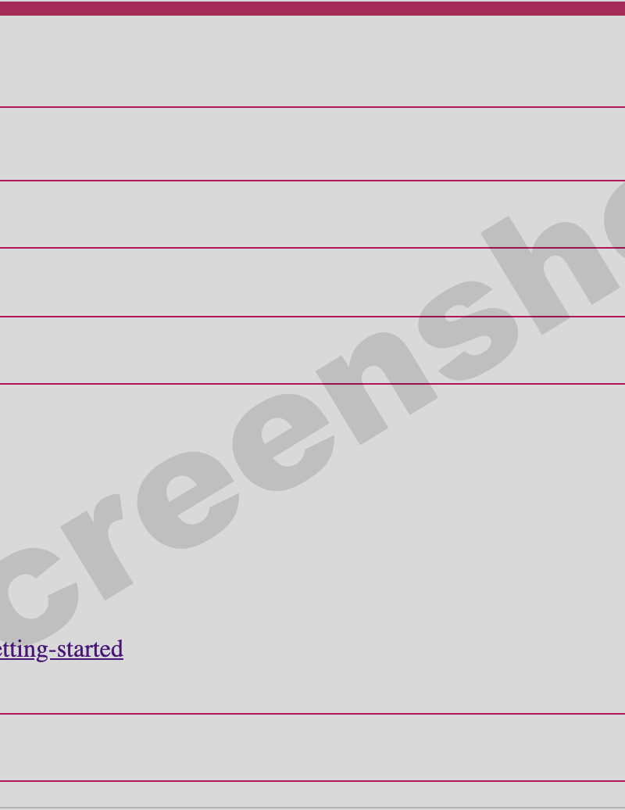

<!--
link:  https://chop-dbhi-arcus-education-website-assets.s3.amazonaws.com/css/styles.css
script: https://kit.fontawesome.com/83b2343bd4.js
title: Arcus Labs Orientation
-->

## How to Use This Guide

<div class = "important">

Hi!  This document is still under construction and testing.  We apologize in advance for any broken links or unclear language.  We invite your feedback.  Please add a [support ticket](https://support.arcus.chop.edu/servicedesk/customer/portal/6/create/249) or [email Arcus Education](mailto:paytonk@chop.edu) to let us know what we can improve or suggest additional topics.

</div>

**If you're here because you've just started with a new Arcus Lab:**

<!-- style = "max-width:400px; float:left; margin-right: 2rem; margin-bottom: 2rem;"-->

Congratulations! This goal of this guide is to get you up and running with your new lab, regardless of your research background and expertise.

Everyone should start with the [**Quickstart** section](#quickstart), since that will bring you up to speed fast on what to expect when you first open your lab and how to get started.

If you're already comfortable with data science tools like SQL, R, python, and version control, then the [Quickstart section](#quickstart) may be enough to get you going. Most researchers will benefit from working through some or all of the other linked documents as well, though:

- **[New to data science](https://liascript.github.io/course/?https://raw.githubusercontent.com/arcus/Arcus_Labs_Orientation/main/new_to_data_science.md)** is a document that introduces helpful tools and tips for working on data science projects that will be useful to scientists coming from other types of research. Even if you have experience in data science already, you may find it worthwhile to skim the subtopics in that section so you know what's available should you want to come back to it to reference later.
- **[New to version control](https://liascript.github.io/course/?https://raw.githubusercontent.com/arcus/Arcus_Labs_Orientation/main/new_to_version_control.md)** is a document that will help you get started with git, a powerful program for helping you keep track of your research documents over time. If you don't currently use git or another form of version control, we strongly recommend you work through that section. Version control is an extremely valuable tool for reproducible research, and although there is a bit of a learning curve, it really pays off.
- **[New to SQL](https://liascript.github.io/course/?https://raw.githubusercontent.com/arcus/Arcus_Labs_Orientation/main/new_to_sql.md)**, **[New to R](https://liascript.github.io/course/?https://raw.githubusercontent.com/arcus/Arcus_Labs_Orientation/main/new_to_r.md)** and **[New to Python](https://liascript.github.io/course/?https://raw.githubusercontent.com/arcus/Arcus_Labs_Orientation/main/new_to_python.md)** are documents that introduce you to the three languages most important to your work in an Arcus Lab: SQL, R, and python. You will need at least some familiarity with SQL in order to access any tabular data in your lab (data that takes the forms of rows and columns). Depending on your research needs, you can pick whether to learn Python or R or use some of both. If you're new to SQL, R, and Python, we recommend you focus on SQL first, since that's the first thing you'll need to be able to apply in your own lab.

As you learn about your lab, save a record of your studies and which resources are most valuable for your group. This can be a google doc, notebook, etc., whatever works best for you to keep track of your studies.

If you like, you can even start by copying (or forking, if you're comfortable with GitHub!) this orientation document and then adding your own notes and deleting or editing parts that aren't useful to your group.  If that's something you want to pursue, you'll find [a "raw" copy of this document on GitHub](https://raw.githubusercontent.com/arcus/Arcus_Labs_Orientation/main/arcus_orientation.md) --- copy/paste or download it and edit to make it your own.  Or, if you're comfortable using GitHub, check out the repository for this and other Arcus Lab Orientation materials at [https://github.com/arcus/Arcus_Labs_Orientation](https://github.com/arcus/Arcus_Labs_Orientation).

<div class = "important">

Note that nice formatting with a sidebar and pagination menu are made possible through [Liascript](https://liascript.github.io).  You can take documents written in markdown and use Liascript to render them in a way that's much easier to digest.  For example, this very document, [written in fairly simple markdown](https://raw.githubusercontent.com/arcus/Arcus_Labs_Orientation/main/arcus_orientation.md), looks much better when [viewed in Liascript](https://liascript.github.io/course/?https://raw.githubusercontent.com/arcus/Arcus_Labs_Orientation/main/arcus_orientation.md).  If you want to create your own training documents with instant formatting that make your markdown a bit nicer, all you need to do is publish a markdown document in a public GitHub project, with a few small optional additions to help with Liascript formatting details (like a logo or special styling).

</div>

This is a markdown document; if you decide to download this document and make your own version, feel free to just write in it however you like and ignore the formatting.  Or, if you want to learn markdown formatting, you can do so very quickly. Markdown is a simple system that lets you add basic formatting to plain text documents, and there is a [great cheatsheet here](https://daringfireball.net/projects/markdown/basics). No matter how you take notes, the goal is to compile a personalized list of tips and resources that you'll be able to go back to for you own reference and/or to train others in your lab.

**If you don't have an Arcus lab and you're just here to browse and learn:**

Welcome! Most of the information here is designed for Arcus Labs, but our linked material about various topics like R and SQL is broadly applicable, even to folks who aren't working with Arcus. We hope you find it helpful. If you would like to learn more about what Arcus is and what we do, check out this [overview video](https://digitalrepository.chop.edu/arcus/1/) or this [Arcus-101 guide](https://education.arcus.chop.edu/guides/arcus-101/).  We'd also suggest you check out the "New to" documents, which are good for every researcher to learn about:

* [New to data science](https://liascript.github.io/course/?https://raw.githubusercontent.com/arcus/Arcus_Labs_Orientation/main/new_to_data_science.md)
* [New to SQL](https://liascript.github.io/course/?https://raw.githubusercontent.com/arcus/Arcus_Labs_Orientation/main/new_to_sql.md)
* [New to R](https://liascript.github.io/course/?https://raw.githubusercontent.com/arcus/Arcus_Labs_Orientation/main/new_to_r.md)
* [New to Python](https://liascript.github.io/course/?https://raw.githubusercontent.com/arcus/Arcus_Labs_Orientation/main/new_to_python.md)
* [New to version control](https://liascript.github.io/course/?https://raw.githubusercontent.com/arcus/Arcus_Labs_Orientation/main/new_to_version_control.md)

## Quickstart

This is a quick overview of an Arcus lab. It covers content such as how to obtain a lab, understand what tools are available, and how to communicate with Arcus about your lab.

What the quickstart guide does **NOT** cover:

- How to write SQL queries to access your data (see [New to SQL](https://liascript.github.io/course/?https://raw.githubusercontent.com/arcus/Arcus_Labs_Orientation/main/new_to_sql.md) for more information)
- How to analyze your data in R or Python (see [New to R](https://liascript.github.io/course/?https://raw.githubusercontent.com/arcus/Arcus_Labs_Orientation/main/new_to_r.md) and [New to Python](https://liascript.github.io/course/?https://raw.githubusercontent.com/arcus/Arcus_Labs_Orientation/main/new_to_python.md) for more information)
- How to use Jupyter notebooks or R Markdown notebooks to document your analysis code (see [New to R](https://liascript.github.io/course/?https://raw.githubusercontent.com/arcus/Arcus_Labs_Orientation/main/new_to_r.md) and [New to Python](https://liascript.github.io/course/?https://raw.githubusercontent.com/arcus/Arcus_Labs_Orientation/main/new_to_python.md) for more information)
- How to use version control on your lab files (see [New to version control](https://liascript.github.io/course/?https://raw.githubusercontent.com/arcus/Arcus_Labs_Orientation/main/new_to_version_control.md) for more information)
- Explanations of **why** you would want to do any of the above rather than using tools like Excel, SAS, or Stata (see [New to data science?](https://liascript.github.io/course/?https://raw.githubusercontent.com/arcus/Arcus_Labs_Orientation/main/new_to_data_science.md) for more information)

## Training lab vs. computational lab

There are two kinds of labs available from Arcus, and they serve very different purposes.

The first is computational labs, also called scientific labs. These are secure computational environments built for a specific team to conduct research. These are custom-built and there is a detailed approval process for use. For a more detailed explanation, see [the Arcus Computational Labs job aid](https://assets.arcus.chop.edu/arcus_education_assets/job_aids/arcus_lab_job_aid.pdf). Computational labs are also the focus of the rest of this guide.

The second type of lab is a training lab. These are just like computational labs except they are **not** intended for conducting research, and therefore have both limited resources and a very fast approval process. Training labs do provide access to real patient data, but only in **deidentified** form and **not the whole database of patients**. The goal of training labs is to create a space where researchers can do quick proof-of-concept checks before starting a full research program, and to give potential Arcus users a chance to try the system out. For a more detailed explanation, see the [Arcus training labs job aid](https://assets.arcus.chop.edu/arcus_education_assets/job_aids/arcus_training_lab.pdf).


## What to expect: Timeline for starting a new computational lab

This section covers the typical stages from initial request to deployment of a new Arcus computational lab. If you aren't interested in this process, or if you already have a lab ready, you may wish to skip directly to this section's [knowledge check](#knowledge-check-1).

**The initial request**

Your first point of contact with Arcus may be informal conversations with one or more Arcus staff members to determine whether or not your project would be a good fit (emailing [arcus-support@chop.edu](mailto:arcus-support@chop.edu) is one great place to start), or you may go directly to [submitting a request for a new scientific project](https://support.arcus.chop.edu/servicedesk/customer/portal/6/create/307) (note that you need to be behind CHOP's firewall to submit a request).

**Review and assessment**

When you submit a request for a lab, it goes through a preliminary review and then a more formal project assessment before your lab is created and made available to you.

The preliminary review is just to determine whether or not to engage in the full project assessment.

If your request is greenlighted for assessment, then you will be assigned a Project Owner among the Arcus staff who will help guide you through the project assessment. The goal of the project assessment is to clarify the needs for the project to make sure that it is something Arcus will be a good fit for.

A major goal of the project assessment is to identify what, specifically, the scientific team will need from Arcus in terms of data, software, training, and support. One component of the project assessment is a **data needs assessment**, to discuss the definition of the cohort to be studied and what information on those patients will be needed (e.g. diagnoses, medications, notes, procedures, demographics, flowsheets). There will also be a **data contribution assessment** to discuss possible data contributions to the [Arcus Archives](https://education.arcus.chop.edu/arcus-data-catalog/) at the end of the project; researchers using Arcus are expected to contribute their data when appropriate.

The project assessment will also include a **privacy review** to identify and mitigate any potential privacy risks ([read more about the privacy review here](https://forum.arcus.chop.edu/t/what-is-a-privacy-review-and-what-does-the-process-entail/190)).

The project assessment can vary greatly in length, with particularly well-defined and straightforward projects being assessed in a matter of days and more complex projects or projects that are still in early stages of development taking months. For researchers working under a deadline (e.g. for a grant application), Arcus will try to accommodate your timeline; one of the first questions your Project Owner will ask you during the project assessment is if there are any time constraints we should be aware of.

### Access to Arcus

Before your lab can be approved, everyone who will have access to your lab will need to have verification of their [CITI training](https://about.citiprogram.org/) on file (this is a requirement for all Arcus users and will be the case even if you'll only be accessing deidentified data). They will also need to agree to the Arcus Terms of Use.

 <!-- style = "max-width:400px; float:left; margin-right: 2rem; margin-bottom: 2rem;"-->

To check that they meet these requirements, everyone who will need access to your lab should go to [https://arcus.chop.edu](https://arcus.chop.edu) (only accessible behind CHOP's firewall) and log in with their CHOP credentials using the button in the top right corner of the screen. If your CITI training is on file and you've agreed to the Terms of Use, then you should see two green checkmarks under "Your Account".  


Note that for work in Arcus labs, human subjects protection training is required, which in CHOP's CITI account resolves to the  courses titled "Social-Behavioral-Educational Researchers" and "Biomedical Researchers".  Either course fulfills the human research protections training required to participate fully in Arcus labs.  For more information about signing up with CITI, please see [instructions on the CHOP Research Institute](https://www.research.chop.edu/sites/default/files/web/sites/default/files/pdfs/ORC_CITI.pdf).

### When your lab is approved

When the project assessment is complete and your lab is approved, then the team of Arcus developers will build a computational lab environment for you, based on the needs determined during your project assessment.

When the lab is built, the Arcus data team will provision your lab with the required data, as determined during your project assessment. For more information about the data in Arcus, see [requesting data for your lab](#requesting-data-for-your-lab).

You'll receive an email letting you know when your lab is available, and providing the URL for you to access your lab. Your Project Owner will meet with you and your team to introduce you to the lab environment.

### Knowledge check 1

True or False: In most cases, your new Arcus lab will be made available to you immediately after your request.

[( )] True
[(X)] False
***

<div class = "answer">

There is a preliminary review and then a more detailed project assessment to determine whether or not Arcus can support your project before your lab will be issued.

Note that if you're on a tight timeline, Arcus may be able to work with you to speed things up. Talk to your Project Owner.

</div>

***

Which of the following are required to access **identified** patient data via Arcus? Select all that apply.

[[X]] CITI training on human subjects research
[[X]] read and agree to the Arcus Terms of Use

Which of the following are required to access **deidentified** data via Arcus? Select all that apply.

[[X]] CITI training on human subjects research
[[X]] read and agree to the Arcus Terms of Use
***

<div class = "answer">

This answer applies to both questions above.  Everyone who will use your lab must have CITI training on file in order to access Arcus, regardless of the nature of the research.

</div>

***

Which of the following best describes Arcus data contributions?

[( )] Researchers using Arcus will have the option to contribute their data at the end of the project if they wish to do so
[(X)] Researchers using Arcus are required to contribute their data unless it would be inappropriate to do so
[( )] Researchers using Arcus are required to contribute their data unless it would be inappropriate to do so, and for the data immediately available to other Arcus users without access restrictions
***

<div class = "answer">

Researchers using Arcus are expected to contribute data to the Arcus Archive, but there are a number of options in place to restrict access as appropriate, including the option to place a purpose-specific embargo or require approval according to scientific review criteria before access.

During your project assessment, you will meet with an archivist from the Arcus team to discuss potential data contributions from your project, and they will work with you to come up with an appropriate data storage and reuse plan. [See this job aid for more information about data contributions to Arcus](https://assets.arcus.chop.edu/education/job-aids/arcus-data-sharing-sop.pdf).  

</div>

***

## Using your lab

Your Arcus lab is a secure computational environment that exists in your browser. You don't need to download or install anything, you (and your team members) just go to your lab's URL and you'll have everything you need there to access and analyze your data. Note that you always need to be behind CHOP's firewall to access your lab.

### What's in your lab

<!-- style = "max-width:400px; float:left; margin-right: 2rem; margin-bottom: 2rem;"-->

When you go to your lab's URL, you will be prompted to log in with your CHOP credentials. Then you will see the landing page for your lab.

#### Project Members

In the top left corner, you'll see a list of approved users for your lab. This will include everyone on your research team, your Project Owner, all of the members of the Arcus Education team (Arcus Education staff help with training and troubleshooting for all of the scientific labs), and any other Arcus staff associated with your project.

If you notice someone missing from that list who should have access, or if you see someone you don't think should have access, alert your Project Owner.

#### Lab status

<!-- style = "max-width:400px; float:left; margin-right: 2rem; margin-bottom: 2rem;"-->

When your lab is running, you'll see a clock counting down until it will shut down. Labs cost a fair amount of computational power when they're running, so they are set to automatically pause after a period of time to save resources. If you need to keep your lab active for longer than that, you can always extend the time.

If you finish using your lab before the clock runs out, please pause your lab using the button in the top right corner of your screen.

<!-- style = "max-width:400px; float:left; margin-right: 2rem; margin-bottom: 2rem;"-->

#### The lab environment

The top right part of the screen includes links to the tools in your lab environment itself. When you first access your lab, the tools will be greyed out with a note letting you know that your lab is paused. If you click on the tool section, it will load your lab. Note that it may take a moment for your lab to load.

Once your lab is running, you can open any of the tools by clicking on them.

You won't see any data files in your lab when you log in; instead, you will be able to access the data via SQL queries and bring it into an analysis environment (e.g. using R or python). For initial exploration of your data, SQLPad is probably the best place to start. You can see examples of how to access your data via SQLPad, RStudio, and python Jupyter notebooks in the [training videos](#training-videos).

#### Training videos

This is a very important section for new Arcus users.

<!-- style = "max-width:400px; float:left; margin-right: 2rem; margin-bottom: 2rem;"-->

Beneath the lab environment links, you will see a list of training videos available. These step through everything you need to get started in your lab. If you are new to Arcus, you will likely find most of your questions answered in these training videos.

<div style = "clear: both"></div>

Topics currently covered in the training videos include:

- Logging in
- Data dictionaries and intro to SQLPad
- Obtaining data in SQLPad
- Saving queries in SQLPad
- Ingesting and analyzing data in Jupyter
- Ingesting and analyzing data in RStudio
- Working with files using a file browser

### Knowledge check 2

Which of the following best describes an Arcus lab?

[( )] Your Arcus lab is a secure environment for you to access data, which you can then download and analyze on your computer
[( )] Your Arcus lab is a piece of software you will have to install on your machine to be able to use
[(X)] Your Arcus lab is a secure environment for you to access and analyze your data within your web browser without downloading or installing anything
***

<div class = "answer">

An Arcus lab is a secure computational environment that exists in your browser, so you don't have to install any software on your computer to be able to use it. You access and analyze your data all within this secure environment.

Note that "the systems and tools developed for Arcus are designed to further your work while protecting patient/study subject privacy and institutional security" (from the [Arcus Terms of Use](https://arcus.chop.edu/terms-of-use)). You may not download the data to analyze or store elsewhere.

</div>

***

True or False: Each member of your team will have their own Arcus lab, but they'll all have access to the same data.

[( )] True
[(X)] False
***

<div class = "answer">

You will have one URL for your lab, and each member of your team will access it there.

Each team member will have personal folders within the lab that they can use to save work in progress or personal notes, but we strongly recommend that you avail yourself of the `/shared` folder to collaborate and add resources like scripts that everyone can work with.

</div>

***

Which of the following is available on the landing page for your Arcus lab? Select all that apply.

[[X]] A list of the people who have access to your lab
[[ ]] A summary of your data files
[[X]] A clock showing time remaining until your lab pauses
[[X]] A list of training videos that show you how to get started in your new lab
[[X]] Links to open the software available to use in your lab
[[X]] A link to the [Arcus Help Center](https://support.arcus.chop.edu/servicedesk/customer/portals)
***

<div class = "answer">

Remember that you won't directly see your data in your lab (on the landing page, or in the applications). To access your data you need to use SQL queries to bring it into your analysis environment.

</div>

***

If you're new to Arcus, what is the best place on the landing page to start?

[[the training videos]]
[[?]] Hint: Check [this section](#training-videos) again.
<script>
  let input = "@input".trim();
  /video/i.test(input);
</script>
***

<div class = "answer">

The [training videos](#training-videos) walk through everything you need to get started in your lab. Many questions new users have are covered in those videos.  We aim to make these brief enough to not slow you down but helpful enough so that you can get started.  These videos are not intended to be deep data science training education, but we have suggestions for how to get that training, too!

</div>

***

## Requesting data for your lab

An initial data needs assessment takes place during the project assessment, which will determine the data that is provisioned to your lab to start. However, many researchers find that they need to modify their data request at some point during the life of their project. For both the initial data needs assessment and any further data requests, there are a number of useful tools in place.

If you're planning on using clinical data from the Arcus Data Repository, you can work on defining your [clinical cohort](https://education.arcus.chop.edu/arcus-clinical-cohorts/) by using the [Arcus cohort discovery tool](https://assets.arcus.chop.edu/arcus_education_assets/job_aids/arcus_cohort_discovery.pdf). If you need help using Arcus cohort discovery, you can ask your Project Owner or submit a ticket at the [Arcus Help Center](https://support.arcus.chop.edu/servicedesk/customer/portal/6/create/302) for assistance.

To explore the tables and variables available in the [Arcus Data Repository (ADR)](https://education.arcus.chop.edu/arcus-data-repository/), you can use the [ADR Data Model Browser](https://adr-mdm.arcus.chop.edu/browser/). Note that the data model browser is most useful for folks who have already built some familiarity with the ADR --- if you're still finding your way around, then please reach out to Arcus staff for help deciding which tables and variables you will need.

You are not limited to what's in the ADR! Many researchers bring in other data sources to analyze in Arcus. Talk to your Project Owner about any additional data needs ([genomics data](https://support.arcus.chop.edu/servicedesk/customer/portal/6/create/270), [images](https://support.arcus.chop.edu/servicedesk/customer/portal/6/create/268), [geospatial data](https://support.arcus.chop.edu/servicedesk/customer/portal/6/create/265), data from other previous or ongoing research projects, etc.).  Keep in mind that all data requests are subject to review by the privacy team and that changing the scope of your project once it has been launched may result in delays or costs.  It's best to know what data you'd like to use at the project assessment phase.

When you are ready to place a request for additional data, new services, or want to learn more about scientific labs or report a problem, you may do so through the [Arcus Help Center](https://support.arcus.chop.edu/servicedesk/customer/portal/6/group/65).

### Knowledge check 3

True or False: Each Arcus computational lab provides access to all of the data in the Arcus Data Repository (ADR)

[( )] True
[(X)] False
***

<div class = "answer">

Each Arcus lab is provisioned just with the data required for that project as determined in the data needs assessment. If you find you need additional data, you can always request more.

</div>

***

True or False: Arcus labs are limited to analysis of data from the ADR.

[( )] True
[(X)] False
***

<div class = "answer">

Although Arcus makes access to the ADR very easy, it's not your only option! Most researchers use a combination of ADR data and data from other sources.

</div>

***

True or False: The Arcus Data Repository (ADR) contains everything from Epic Clarity.

[( )] True
[(X)] False
***

<div class = "answer">

The ADR is a streamlined selection of information from Epic Clarity, not the entire thing. It includes the patient information most commonly requested by researchers (a sort of "greatest hits" of electronic health records), such as demographics, diagnoses, medications, encounters, etc.

If you're used to working in Epic, this means there will be fields you're used to seeing that won't be in the ADR. If you want information that's not in the ADR, you can make a request and the Arcus data and privacy teams can determine what's possible.

</div>

***

## Ongoing communication

Once you have an approved lab request, your primary point of contact is your assigned **Project Owner**. This person will be an Arcus staff member, and their role is to act as a concierge ensuring that your project is set up with what you need to help make your scientific project experience a success.

There are also a number of other ways for you to contact Arcus for support, including submitting a ticket in the [Arcus Help Center](https://support.arcus.chop.edu/servicedesk/customer/portals) and posting a question on the [Arcus Forum](https://forum.arcus.chop.edu/).

The **Arcus Help Center** ([https://support.arcus.chop.edu/servicedesk/customer/portals](https://support.arcus.chop.edu/servicedesk/customer/portals)) is the system Arcus uses to organize and track requests from lab users and issues that need to be resolved. There is a link to the Arcus Help Center on your lab's landing page, in the top left section titled "Lab status". The [Arcus Help Center](https://support.arcus.chop.edu/servicedesk/customer/portals) is especially useful for defined, specific issues, such as the following:

- submitting a bug report if you think something is malfunctioning in your lab
- requesting a new user be added to your lab
- requesting additional data be supplied to your lab, including images
- requesting lab enhancements, such as additional memory

You need to be behind CHOP's firewall to access the [Arcus Help Center](https://support.arcus.chop.edu/servicedesk/customer/portals).

**Arcus Forum** ([https://forum.arcus.chop.edu/](https://forum.arcus.chop.edu/)) is a question-and-answer site (it uses the same format as [StackOverflow](https://stackoverflow.com/), for those familiar with that). Arcus staff also use the [Arcus Forum](https://forum.arcus.chop.edu/) to post announcements about technical updates and fixes to labs, as well as how-to guides for frequently asked questions. You need to be behind the CHOP firewall to access the [Arcus Forum](https://forum.arcus.chop.edu/).


### Knowledge check 4

Which of the following best describes the role of the Project Owner?

[( )] They are the lead researcher on the project
[(X)] They act as a reference and point of connection between the project researcher(s) and Arcus staff
[( )] They are available to assist with research project tasks like writing and checking code
***

<div class = "answer">

The Project Owner acts as a concierge, connecting scientific project users with the right Arcus staff to set up a scientific project in the most helpful way possible.

Project Owners don't assist with research tasks like writing code or analyzing data, although they can help connect researchers to training and resources so they can do those things themselves.  The [Data Science and Biostatistics Unit](https://www.research.chop.edu/data-science-and-biostatistics-unit) is a fee-for-service team within DBHi that can be hired as additional help for scientists who need help working in their Arcus labs.

</div>

***

True or False: The only way you should get in touch with Arcus is via your Project Owner.

[( )] True
[(X)] False
***

<div class = "answer">

Although your Project Owner is one option, you are welcome to get in touch with other Arcus staff in whatever way works best for you. Two useful avenues are the [Arcus Help Center](https://support.arcus.chop.edu/servicedesk/customer/portals) and the [Arcus Forum](https://forum.arcus.chop.edu/) site.

</div>

***

If the data in your lab don't look right to you (e.g. you see twice as many patients as you were expecting), which of the following would be good ways to ask for help? Select all that apply.

[[X]] email your Project Owner
[[X]] submit a ticket at the [Arcus Help Center](https://support.arcus.chop.edu/servicedesk/customer/portals)
[[X]] post a question on the [Arcus Forum](https://forum.arcus.chop.edu/)
***

<div class = "answer">

Any of these are fine ways to seek help!

If you have a clear idea of what's going wrong, the most efficient approach might be to submit a ticket in the [Arcus Help Center](https://support.arcus.chop.edu/servicedesk/customer/portals) for the Data team describing the problem.

If you're not sure what's going wrong, then approaching your Project Owner first may save time as they may be able to help you narrow down the issue and direct it to the right person.

If you post on the [Arcus Forum](https://forum.arcus.chop.edu/), the people responding there won't necessarily have access to the details of your lab (as your PO or the Data team would), but they can help if you troubleshoot if you think the error may be in your SQL query, for example.

No matter what, whatever way you pick to ask for help, you can expect to be treated with compassion and respect. Whoever you get in touch with will do their best to connect you with the right solution as quickly as possible.
</div>

***

Which of the following can you do when you are **outside** of CHOP's firewall? Select all that apply.

[[X]] email your Project Owner
[[ ]] submit a ticket at the [Arcus Help Center](https://support.arcus.chop.edu/servicedesk/customer/portals)
[[ ]] post a question on the [Arcus Forum](https://forum.arcus.chop.edu/)
***

<div class = "answer">

The [Arcus Help Center](https://support.arcus.chop.edu/servicedesk/customer/portals) and [Arcus Forum](https://forum.arcus.chop.edu/) are only available behind the firewall, so you'll need to be on CHOP's network or on the VPN to access them.

</div>

***

## Overview of tools

In the Available Tools section of your lab landing page, you'll see a list of the tools in your lab. Each has a small question mark icon next to it; if you click the question mark icon, it will show more details about that tool, including links to documentation to help you get started.



Most Arcus users will use SQLPad and either RStudio or Jupyter, but other tools may not be needed. If you're not familiar with any of these tools, we recommend you start with SQLPad.

Here are some introductory materials that might be helpful:

* [New to SQL](https://liascript.github.io/course/?https://raw.githubusercontent.com/arcus/Arcus_Labs_Orientation/main/new_to_sql.md)
* [New to R](https://liascript.github.io/course/?https://raw.githubusercontent.com/arcus/Arcus_Labs_Orientation/main/new_to_r.md)
* [New to Python](https://liascript.github.io/course/?https://raw.githubusercontent.com/arcus/Arcus_Labs_Orientation/main/new_to_python.md)
* [SQL Article](https://education.arcus.chop.edu/sql-intro/)
* [R or Python?](https://education.arcus.chop.edu/statistical-programming-languages/)

## How to set up your project: Files, directories, and version control

Arcus projects use a project template implemented by our Library Science team. It's a basic recommended file directory structure for organizing all of the various files related to your study.

It's designed to save researchers time, improve reproducibility, and make it easier to adhere to best practice guidelines like the [NIH's data sharing policy](https://grants.nih.gov/grants/policy/data_sharing/). It will also make things much smoother when it comes time to [contribute data to Arcus](https://assets.arcus.chop.edu/arcus_education_assets/job_aids/arcus_data_contribution_guide.pdf).

Your lab will come with the project template already in place, so all you have to do is set up your workflows to conform to the template.

To get learn more, read [this Forum post about Arcus's Project Template](https://forum.arcus.chop.edu/t/the-arcus-project-template/255).  

In addition to the project template, there are a number of other Research Data Management best practices you can implement to save yourself time.

### File naming

The Arcus Library Science team has compiled some excellent resources to help you decide on a file naming and organization system that will suit your needs.

- [File naming tips sheet](https://storage.googleapis.com/arcus-edu-libsci/Arcus%20RDM%20Resources/fileNaming_bestPractices_MIT.pdf)
- [File naming conventions and activity sheet](https://storage.googleapis.com/arcus-edu-libsci/Arcus%20RDM%20Resources/arcus_rdm_filenaming_activity.pdf)
- [Recommended practices for README files](https://storage.googleapis.com/arcus-edu-libsci/Arcus%20RDM%20Resources/Arcus%20RDM%20Data%20Dictionaries%20Best%20Practices.pdf)

### Data documentation

The Arcus Library Science team has put together some great templates and best practices for good data documentation:

- [Recommended practices for data dictionaries](https://storage.googleapis.com/arcus-edu-libsci/Arcus%20RDM%20Resources/Arcus%20RDM%20Data%20Dictionaries%20Best%20Practices.pdf)
- A [basic ETL (extract, tansform, load) template](https://storage.googleapis.com/arcus-edu-libsci/Arcus%20RDM%20Resources/arcus_rdm_etl_template.csv), and the [README](https://storage.googleapis.com/arcus-edu-libsci/Arcus%20RDM%20Resources/arcus_rdm_etl_template_README.txt) that goes with it
- A [data collection/processing template](https://storage.googleapis.com/arcus-edu-libsci/Arcus%20RDM%20Resources/Arcus_RDM_DataCollection_Processing_Template.txt), and its [README](https://storage.googleapis.com/arcus-edu-libsci/Arcus%20RDM%20Resources/Arcus_RDM_DataCollection_Processing_README.pdf)

For more background on this topic, see this [post that answers the question "What is metadata?"](https://education.arcus.chop.edu/what-is-metadata/).

### Version control

An important aspect of research data management is the history of your files.  Git is already installed in your lab, and you can also use the Git client native to RStudio.

To go more in depth, consider:

* [New to version control](https://liascript.github.io/course/?https://raw.githubusercontent.com/arcus/Arcus_Labs_Orientation/main/new_to_version_control.md
* [GitHub's guide to getting started with git](https://docs.github.com/en/get-started/using-git/about-git)

For R users, check out this excellent resource: [Happy Git with R](https://happygitwithr.com/). It is a full and detailed set of instructions for how to get started using git if you're already using R and RStudio.

## An important topic: the reproducible example

When you encounter an issue with your code and want to ask for help, you'll find the concept of the **reproducible example** to be very useful.

A reproducible example is a piece of code that 1) demonstrates your problem and 2) is entirely self-contained, so someone else could copy just that code and run it on their own machine and reproduce your problem. Crucially, just copy-pasting the lines of code from your script that are giving you trouble will usually **not** work as a reproducible example.

To illustrate, let's consider an example of a user having trouble with the `xtabs` function in R. You don't need to understand the code to follow this example, this is just to show different methods of asking a question. Let's take a look at a few different ways they could ask for help.

### Attempt 1

> Hi, I'm trying to get a crosstab table from my data using the `xtabs` function, but it's not working. I'm getting an error that says "‘sum' not meaningful for factors". Can you help?

Although this is a clear and specific request, someone trying to answer this question actually doesn't have a lot to go on --- the problem might be in the data themselves, or there might be a mistake in how the user is writing the code, or maybe the code is actually fine and the problem is just that the user is misunderstanding what this function does so they're using `xtabs` when actually they should be using a different function altogether. Or it could be something else entirely! It's impossible to know.

The way to fix code --- your own or someone else's --- is to test it until it works. Even very experienced programmers don't typically write code without checking that it does what they think it will.

If you want someone to help with your code, you need to give them the chance to run it.

### Attempt 2

> Hi, I'm trying to get a crosstab table from my data using the `xtabs` function, but it's not working.
>
> Here's the code I'm running and the error I get:
```
> xtabs(A ~ B, my_data)

Error in Summary.factor(1:5, na.rm = TRUE) :
  ‘sum' not meaningful for factors
```

Although it looks like this is providing a lot more information than the request in Attempt 1, it's actually not. We can see exactly what the user did here, which is somewhat helpful, but since we don't know what the variables A and B are like, we can't tell whether there's a problem in how they're being used in this function.

Having access to your code doesn't mean someone will be able to run it.

### Attempt 3

> Hi, I'm trying to get a crosstab table from my data using the `xtabs` function, but it's not working. I'm getting an error that says "‘sum' not meaningful for factors". Can you help?
>
> Here's an example of the issue using the `warpbreaks` data:
```
> xtabs(wool ~ tension, warpbreaks)
Error in Summary.factor(c(1L, 1L, 1L, 1L, ... :
  ‘sum' not meaningful for factors
```

Here, the user is relying on one of the many [example datasets that come built into R](http://www.sthda.com/english/wiki/r-built-in-data-sets) for just this reason. That means anyone who has R installed will already have the `warpbreaks` data ready and available, whether they realize it or not. If you like, you can open R right now and copy-paste `xtabs(wool ~ tension, warpbreaks)` and you'll see the error the user reports.

This is now a **reproducible example**, and it will be much easier for folks to help figure out what's causing the error.

Note that in addition to using **built-in datasets** like those that come with R, you can also make a reproducible example by **creating example data right in your example code** or by **linking to a publicly available external dataset**.

### Reproducible, minimal, and readable!

Although having your example be reproducible is key, you can write even better examples if you also work to keep them **minimal**, meaning there isn't any extra code beyond what is needed to illustrate your problem, and **readable**, meaning you've taken steps to make your example as easy as possible for someone else to read, like using simple, clear variable names.

For more details on what makes a good example, see these [instructions on StackOverflow](https://stackoverflow.com/help/minimal-reproducible-example).

### But isn't that a lot of work just to ask a question?

It's true: Good examples take time and thought to write. Since you can't just copy-paste your own code, you usually need to re-write the relevant bit of code from scratch, keeping just the elements important to your problem and making sure anyone helping you will be able to run it on their own machine.

Writing reproducible examples is time consuming, but you'll find it pays off because you're much more likely to get useful answers to your question, often with working code based on your example which you can then take back and apply in your own script.

Also, remember that you're asking someone else to take time to think about your problem for you --- it's an act of respect to show you've done the work to make it as easy as possible for them to help you.

And sometimes the tinkering that goes into creating a reproducible example will actually solve your problem for you! In trying to create a minimal, reproducible version, you may figure out what the problem was all on your own.  

## Advantages to Arcus Labs

There are many advantages to doing your work in an Arcus lab, including increased security, storage, and computing power, but another advantage is that when you ask for help, you can get support from someone who can work in the **exact same environment** you're working in and access the **exact same data**. This removes many of the barriers to being able to replicate issues.

That means that something like Attempt 2 above might actually be sufficient, as long as you're asking for help from someone who has access to your computational lab. Whether you're going back and forth between your team members or working on an issue with Arcus staff, you can make your troubleshooting much more efficient by all working in the same environment with the same data. This can save your team a tremendous amount of time over the life of your project.
