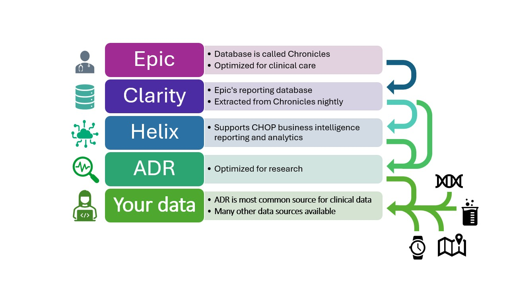

<!--
link:   https://storage.googleapis.com/chop-dbhi-arcus-education-website-assets/css/styles.css
script: https://kit.fontawesome.com/83b2343bd4.js
title: Clinical Data and the ADR
-->

# Clinical Data in Arcus

In Arcus, we aim to make getting access to and working with clinical data for research purposes simpler. This guide will discuss the Arcus Data Repository: why it exists, some of what it contains, and how to get more information. 

## Clinical data

For our purposes, when we say "clinical data", we mean data from the electronic health record that relates to patient encounters. We are not including data collected on research subjects for the purpose of research, even if these research subjects are also patients of CHOP.  Please note, however, that data collected for research is also available through Arcus, as is any dataset available in [CHOP's enterprise data catalog](https://gene.chop.edu).

Clinical data includes information about patients, medication administrations, procedures, and many, many other entities and encounters at CHOP!

There are quite a few names and acronyms related to clinical data at CHOP, some of which are listed below:  

- EHR: Electronic health record 
- Epic: The EHR that CHOP uses-- this is where clinical data is recorded
- Hyperspace: Epic's user interface
- Chronicles: Real-time Epic database (the data you see in Hyperspace lives in Chronicles)
- Clarity: Reporting database for Epic
- Helix: CHOP's new cloud-based data warehouse
- ADR: Arcus Data Repository

## The Arcus Data Repository

For researchers wanting to perform retrospective analyses on clinical data, there are a variety of problems they might face:

* The purposes are not the same: Clinical data is not collected with research in mind! 
* Data organization: The organizational systems that make patient care more efficient might be quite different from those needed for research. 
* Data access/privacy: Not all clinical data should be made available for all types of research.
* Performance: The database that stores patient data for clinical use (Chronicles) would be very inefficient for returning research-relevant information. Also, crucially, we can't risk burdening Chronicles with computationally-intensive research queries because it could pose a safety risk to patients.

These are some of the problems that the Arcus Data Repository (ADR) aims to address. 

So what is the ADR? 

* A relational database of most frequently requested EHR data. These data are pulled from Clarity and Helix and stored in Google BigQuery.
* The ADR has identified or de-identified datasets available, depending on your needs and regulatory status (IRB, non human subjects research, etc.).

**Important note**: This does not mean that the data are "pre-cleaned"! Data will still be messy or incomplete.

## Clinical data journey to the ADR

CHOP stores a _vast_ amount of clinical data, and it is incredibly complex! For efficient storage and access, data from Epic Chronicles is uploaded to Clarity (a SQL database) nightly. From there, data are loaded into Helix, a cloud-based data warehouse that supports reporting and analytics (Helix also contains data from non-Epic sources, such as Workday, ServiceNow, and REDCap). These databases are where the ADR gets its data. The ADR documentation in the CHOP data catalog contains information about the lineage of the data; [check out this lineage of the contact date field in the encounter table](https://chop.alationcloud.com/attribute/933634/lineage/) as an example. 

You might be wondering why the ADR exists at all, if Clarity and Helix are available. There are a few reasons for this: 

- When data is pulled into the ADR from Helix and Clarity, some records are removed, such as duplicate patient records, encounters that never actually happened, or "test" records. This means that you don't need to account for these kinds of records in your analyses.

- The ADR is a curated list of the most requested data from researchers, so Arcus can often find what researchers are looking for quickly.

You might also ask, why not just get the data straight from Epic in Hyperspace (Epic's user interface)? While Epic does have some data analysis and visualization tools, such as SlicerDicer, they are not built with research as the primary focus. The ADR _is_ designed for research, and because it is a curated list, it is much easier to find and deliver exactly what you need to answer your research question.  

### Relational databases

The ADR is a relational database, stored in Google BigQuery. But what is a relational database? 

A **relational database** is a storage solution in which tables are related by columns they have in common. 

Because medical data contains many **one-to-many** relationships and a lot of inter-related information, relational databases are an efficient way to store these data. The process of organizing data into a relational database is called **normalization**. 

<b style="color: rgb(var(--color-highlight));">Learning connection</b> 

For more information about this topic see our [database normalization module](https://liascript.github.io/course/?https://raw.githubusercontent.com/arcus/education_modules/main/database_normalization/database_normalization.md#1).

## Exploring the ADR

The ADR currently contains more than 50 tables, and it continues to grow. It represents a "greatest hits" selection of the most commonly requested data for research. There are identified and de-identified versions available, depending on your research needs.

You can read more about the ADR and look at some of the metadata about the tables in the ADR in the [CHOP Data Catalog](https://chop.alationcloud.com/data/23/).

The next few sections will go through some of the tables in the ADR. While there are a variety of entities represented in these tables, many of the tables that you'll start with represent either **patients** or **encounters**. 

## Patient

The `patient` table in the ADR is a table containing information about patient demographics. This includes information like:

- Age
- Race
- Sex
- Contact information 

The entity being represented is **patients**. The patient table contains one patient per row, with their identifiers and demographic information. Each row is identified by a unique `pat_id`, assigned by Arcus (this is not the same as the MRN). All patients included in the ADR have had at least one CHOP encounter. 

Besides the `patient` table itself, there are several other tables that contain information at the patient level, such as `patient_geospatial`, `patient_race`, and `demographic_history`. Like in the `patient` table, the information in these tables is not associated with a specific encounter. 

## Encounter

The `encounter` table in the ADR contains information about encounters at CHOP. The term "encounter" can mean things like:

- Office visits
- Phone calls
- Surgeries 

But there are many other types of encounters.

Each row is a single encounter (a single patient can have more than one encounter!), and each row is identified by a unique `encounter_id`. The table contains information about the patient who had the encounter, the time, date, place, duration, admission status, and much more; this also includes canceled visits and no-shows. 

Besides the `encounter` table itself, there several other tables in the encounter domain: 

- `encounter_adt`
- `encounter_chief_complaint`
- `encounter_reason`
- `encounter_diagnosis` 

These tables contain additional information related to specific encounters, such as admissions or diagnoses.  

## Other kinds of tables

Patients and encounters are not the only entities represented in the ADR. Some tables will represent entities such as medications, procedures, providers, diagnosis codes, and more. These tables will contain information about the entity they represent; for example, the `medication` table contains information such as the generic name of the medication, administration route, and various associated classes and codes. Just like `patient` and `encounter`, these tables will have unique identifiers that allow you to join to other tables as needed. 

Still other tables, such as `problem_list`, `anesthesia_event`, and `immunization`, also represent entities that aren't patients or encounters, but are _related_ to specific patients and encounters. The `immunization` table, for example, contains information about immunization records, but there are specific patients and encounters associated with them. 

## So how do I find what I need?

## Getting more information

This was just a brief overview of the clinical data in the Arcus data repository, but you may have more questions! There are a few places you can get more information:

- Browse data available in the ADR using the [Clinical Data Finder Tool](https://arcus.chop.edu/apps/clinical-data-finder)
- Read the [metadata for ADR tables and fields](https://chop.alationcloud.com/data/23/) in Gene, CHOP's enterprise data catalog
- [Explore data in Arcus](https://arcus.chop.edu/i-want-to/explore-data)
- [Book time with Arcus Education](https://outlook.office365.com/owa/calendar/BKG-StandardArcusEducationOfficeHours@chop.edu/bookings/)
- [Book time with the Arcus data team](https://outlook.office365.com/owa/calendar/ArcusDataRepositoryOfficeHours@CHOP365.onmicrosoft.com/bookings/)

## Starting a research project with Arcus

So what do you need to do next if you're interested in conducting research on CHOP's clinical data with Arcus?

- Confirm your Arcus access (CHOP credentials, [CITI training](https://forum.arcus.chop.edu/t/citi-training-requirement-for-arcus/174), [Arcus terms of use](https://arcus.chop.edu/terms-of-use)).

- Know at least [a little SQL](https://liascript.github.io/course/?https://raw.githubusercontent.com/arcus/education_modules/main/sql_basics/sql_basics.md#1), or hire someone who does.

- (Recommended) Use the [Cohort Discovery Tool](https://arcus.chop.edu/apps/cohort-discovery) to check the feasibility of your project.

- [Submit a request to Arcus!](https://pm.arcus.chop.edu/servicedesk/customer/portal/6/create/307).

