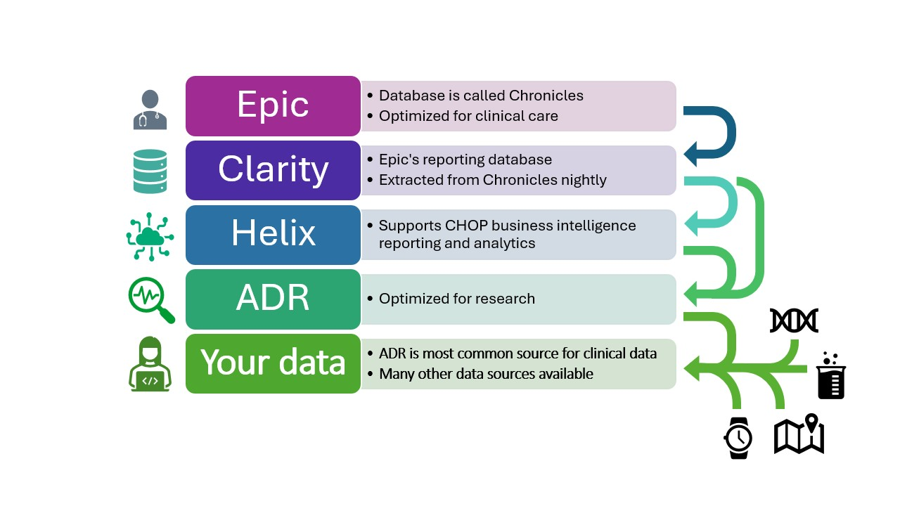

<!--
link:   https://storage.googleapis.com/chop-dbhi-arcus-education-website-assets/css/styles.css
script: https://kit.fontawesome.com/83b2343bd4.js
title: Clinical Data and the ADR
-->

# Clinical Data in Arcus

In Arcus, we aim to make getting access to and working with clinical data for research purposes simpler. This guide will discuss the Arcus Data Repository: why it exists, some of what it contains, and how to get more information. 

## Clinical data

For our purposes, when we say "clinical data", we mean data from the electronic health record that relates to patient encounters. We are not including data collected on research subjects for the purpose of research, even if these research subjects are also patients of CHOP.  Please note, however, that data collected for research is also available through Arcus, as is any dataset available in [CHOP's enterprise data catalog](https://gene.chop.edu).

Clinical data includes information about patients, medication administrations, procedures, and many, many other entities and encounters at CHOP!

There are quite a few names and acronyms related to clinical data at CHOP, some of which are listed below:  

- EHR: Electronic health record 
- Epic: The EHR that CHOP uses-- this is where clinical data is recorded
- Hyperspace: Epic's user interface
- Chronicles: Real-time Epic database (the data you see in Hyperspace lives in Chronicles)
- Clarity: Reporting database for Epic
- Helix: CHOP's new cloud-based data warehouse
- ADR: Arcus Data Repository

## The Arcus Data Repository

For researchers wanting to perform retrospective analyses on clinical data, there are a variety of problems they might face:

* The purposes are not the same: Clinical data is not collected with research in mind! 
* Data organization: The organizational systems that make patient care more efficient might be quite different from those needed for research. 
* Data access/privacy: Not all clinical data should be made available for all types of research.
* Performance: The database that stores patient data for clinical use (Chronicles) would be very inefficient for returning research-relevant information. Also, crucially, we can't risk burdening Chronicles with computationally-intensive research queries because it could pose a safety risk to patients.

These are some of the problems that the Arcus Data Repository (ADR) aims to address. 

So what is the ADR? 

* A relational database of most frequently requested EHR data. These data are pulled from Clarity and Helix and stored in Google BigQuery.
* The ADR has identified or de-identified datasets available, depending on your needs and regulatory status (IRB, non human subjects research, etc.).

**Important note**: This does not mean that the data are "pre-cleaned"! Data will still be messy or incomplete.

## Clinical data journey to the ADR

CHOP stores a _vast_ amount of clinical data, and it is incredibly complex! For efficient storage and access, data from Epic Chronicles is uploaded to Clarity (a SQL database) nightly. From there, data are loaded into Helix, a cloud-based data warehouse that supports reporting and analytics (Helix also contains data from non-Epic sources, such as Workday, ServiceNow, and REDCap). These databases are where the ADR gets its data. The ADR documentation in the CHOP's data catalog, Gene, contains information about the lineage of the data; [check out this lineage of the contact date field in the encounter table](https://chop.alationcloud.com/attribute/933634/lineage/) as an example. 

You might be wondering why the ADR exists at all, if Clarity and Helix are available. There are a few reasons for this: 

- When data are pulled into the ADR from Helix and Clarity, some records are removed, such as duplicate patient records, encounters that never actually happened, or "test" records. This means that you don't need to account for these kinds of records in your analyses.

- The ADR is a curated list of the most requested data from researchers, making it easier to find what you are looking for quickly.

You might also ask, why not just get the data straight from Epic in Hyperspace (Epic's user interface)? While Epic does have some data analysis and visualization tools, such as SlicerDicer, they are not built with research as the primary focus. The ADR _is_ designed for research, and because it is a curated list, it is much easier to find and deliver exactly what you need to answer your research question.  

### Relational databases

The ADR is a relational database, stored in Google BigQuery. But what is a relational database? 

A **relational database** is a storage solution in which tables are related by columns they have in common. 

Because medical data contains many **one-to-many** relationships and a lot of inter-related information, relational databases are an efficient way to store these data. The process of organizing data into a relational database is called **normalization**. 

<b style="color: rgb(var(--color-highlight));">Learning connection</b> 

For more information about this topic see our [database normalization module](https://liascript.github.io/course/?https://raw.githubusercontent.com/arcus/education_modules/main/database_normalization/database_normalization.md#1).

## Exploring the ADR

The ADR currently contains more than 50 tables, and it continues to grow. It represents a "greatest hits" selection of the most commonly requested data for research. There are identified and de-identified versions available, depending on your research needs.

You can read more about the ADR and look at some of the metadata about the tables in the ADR in the [CHOP Data Catalog](https://chop.alationcloud.com/data/23/).

The next few sections will go through some of the tables in the ADR. While there are a variety of entities represented in these tables, many of the tables that you'll start with represent either **patients** or **encounters**. 

## Patient

The `patient` table in the ADR is a table containing information about patient demographics. This includes information like:

- Age
- Race
- Sex
- Contact information 

The entity being represented is **patients**. The patient table contains one patient per row, with their identifiers and demographic information. Each row is identified by a unique `pat_id`, assigned by Arcus (this is not the same as the MRN). All patients included in the ADR have had at least one CHOP encounter. 

Besides the `patient` table itself, there are several other tables that contain information at the patient level, such as `patient_geospatial`, `patient_race`, and `demographic_history`. Like in the `patient` table, the information in these tables is not associated with a specific encounter. 

## Encounter

The `encounter` table in the ADR contains information about encounters at CHOP. The term "encounter" can mean things like:

- Office visits
- Phone calls
- Surgeries 

But there are many other types of encounters.

Each row is a single encounter (a single patient can have more than one encounter!), and each row is identified by a unique `encounter_id`. The table contains information about the patient who had the encounter, the time, date, place, duration, admission status, and much more; this also includes canceled visits and no-shows. 

Besides the `encounter` table itself, there several other tables in the encounter domain: 

- `encounter_adt`
- `encounter_chief_complaint`
- `encounter_reason`
- `encounter_diagnosis` 

These tables contain additional information related to specific encounters, such as admissions or diagnoses. 

Some tables are specific to a particular kind of encounter. 
For example, `encounter_adt` is only populated for inpatient encounters, and `encounter_chief_complaint` is only populated for encounters in the Emergency Department. 

## Other kinds of tables

Patients and encounters are not the only entities represented in the ADR. Some tables will represent entities such as medications, procedures, providers, diagnosis codes, and more. These tables will contain information about the entity they represent; for example, the `medication` table contains information such as the generic name of the medication, administration route, and various associated classes and codes. Just like `patient` and `encounter`, these tables will have unique identifiers that allow you to join to other tables as needed. 

Still other tables, such as `problem_list`, `anesthesia_event`, and `immunization`, also represent entities that aren't patients or encounters, but are _related_ to specific patients and encounters. The `immunization` table, for example, contains information about immunization records, but there are specific patients and encounters associated with them. 

## Examples of data questions

To explore the structure of the ADR in more detail, let's consider a few potential questions a researcher might ask of CHOP's clinical data. 

Of course, none of these example questions is likely to match your own research aims specifically. 
Rather than a set of instructions to follow, please consider these examples as applied descriptions of some of the ADR's most important tables and how they work together. 

In particular, we'll touch (briefly) on the following tables, linked here to their metadata in Gene, CHOP's enterprise data catalog:

- [`encounter`](https://chop.alationcloud.com/table/58534/columns)
- [`encounter_diagnosis`](https://chop.alationcloud.com/table/58525/columns/) 
- [`problem_list`](https://chop.alationcloud.com/table/58542/columns/)
- [`immunization`](https://chop.alationcloud.com/table/58523/columns/)
- [`procedure_order`](https://chop.alationcloud.com/table/58521/columns/)
- [`medication_order`](https://chop.alationcloud.com/table/58555/columns/)
- [`patient_geospatial`](https://chop.alationcloud.com/table/657597/columns)
- [`surgery_encounter`](https://chop.alationcloud.com/table/58537/columns)
- [`encounter_adt`](https://chop.alationcloud.com/table/58541/columns)
- [`flowsheet_measure`](https://chop.alationcloud.com/table/58532/columns)

And we'll also reference the following "lookup" tables, which provide further information things that show up in the above tables (for example, the diagnosis lookup tables include the name of the diagnosis as it appears in Epic as well as associated ICD10 or ICD9 codes): 

- [`diagnosis_icd9`](https://chop.alationcloud.com/table/58565/)
- [`diagnosis_icd10`](https://chop.alationcloud.com/table/58527/)
- [`master_diagnosis`](https://chop.alationcloud.com/table/58559/)
- [`procedure`](https://chop.alationcloud.com/table/58548/)
- [`medication`](https://chop.alationcloud.com/table/58524/)

### Is there a difference in the rate of asthma dx for pts who have vs have not received a covid vaccine?

For this question, you'll need information on diagnoses, and also immunizations. 
Diagnoses are stored primarily in two tables: `encounter_diagnosis` and `problem_list`.

You'll notice neither of those tables contain things like diagnosis descriptions or associated ICD10 codes. 
Instead, those tables include the field `dx_id` to identify a specific diagnosis, and then you need to join to one of the diagnosis lookup tables (`diagnosis_icd9`, `diagnosis_icd10` or `master_diagnosis`) on `dx_id` to pull in additional information, such as the description in Epic or ICD10 code(s) associated with that diagnosis. 

<b style="color: rgb(var(--color-highlight));">Clinical record vs. clinical reality</b> 

Keep in mind that a diagnosis recorded in a patient's record doesn't necessarily mean that the patient truly has that condition. 
There needs to be a diagnosis associated with any ordered procedure in order to bill insurance for it, so diagnoses may be recorded in the EHR to "rule out" that condition, etc. 
If you use only the presence of an asthma diagnosis in either `encounter_diagnosis` or `problem_list` for inclusion in your cohort, you will likely have many false positives (patients who are included, but who do not actually have asthma). 

Think carefully about how to capture the population you wish to study. 
For example, you might define "patients with asthma" as patients who have an asthma diagnosis in `encounter_diagnosis` or `problem_list` **and** also a prescription for an inhaler. 
Or you might require that they have an asthma diagnosis recorded on at least two separate encounters at least six months apart. 

Chart review is an effective method for verifying that your inclusion and exclusion criteria are accurately capturing your patient group.

Vaccine history is recorded in `immunization`. 
This includes immunizations that were given at CHOP as well as historic immunizations recorded. 
It also includes records for immunizations that were not given (deferred or deleted, for example), see the [immunization status fields](https://chop.alationcloud.com/attribute/933228/) for more information.

You'll see many keys in the `immunization` table, including `pat_id` and `encounter_id`, but also `proc_ord_id` (which you can use to join to the `procedure_order` table) and `med_ord_id` (which you can use to join to the `medication_order` table).

To get additional information on a specific vaccine administered at CHOP, you might join `immunization` to `medication_order` on `med_ord_id`, and then to `medication` (which is a lookup table) on `med_id` to get additional information about that vaccine. 
Note that this approach would only work for immunizations associated with a medication order -- historic immunizations, or those associated with a procedure order rather than a medication order, would not be able to link to the `medication` table in this way.
For an immunization associated with a procedure order rather than a medication order, you would join `immunization` to `procedure_order` on `proc_ord_id`, and then to `procedure` (a lookup table) on `proc_id`. 

### What is the impact of child opportunity index (COI) on risk of rehospitalization after surgery? 

The child opportunity index (COI) is related to a patient's home address, which is recorded in the `patient_geospatial` table. 
To identify the COI for a patient **at the time of their surgery** you would need to join `patient_geospatial` to `encounter` by date. 

<b style="color: rgb(var(--color-highlight));">Which date field should I use?</b> 

Date (and time) information for encounters is stored in Epic in many places. 

In general, we recommend using the `effective_datetime` field unless you have a specific reason to use something else. 
The [`effective_datetime` field uses logic based on encounter type to integrate information from several other datetime fields](https://chop.alationcloud.com/attribute/932373/) in a sensible way
that works for most research applications. 

There are several tables with surgical information, but for this particular research question details about the surgical encounter itself may not be needed, just the fact that a surgical encounter happened.
A good place to start for information about a surgical encounter is the `surgery_encounter` table.

To assess rehospitalization, the `encounter_adt` table would be a good place to start. 
The initials ADT stand for "admission, discharge, and transfer"; you'll find several ADT tables with information about inpatient encounters. 

### Comparison of over- vs. under-weight BMI in referrals to nutrition specialists

BMI data (as well as measurements like vitals, etc.) are stored in flowsheets. 
The table `flowsheet_measure` includes measurements from 30+ different flowsheet templates that capture BMI.
You may wish to limit your analysis to BMI saved as part of a specific set of templates/workflows, or just use all captured BMI measurements. 
The fields `flowsheet_name` and `flowsheet_disp_name` tell you what was measured (in this case, you would want one or both of those fields to include the string "BMI"), and the measurement itself is saved in `flowsheet_value`. 

<b style="color: rgb(var(--color-highlight));">How should I associate flowsheet measures with encounters?</b> 

There is no `encounter_id` field in the `flowsheet_measures` table.

Because the flowsheet information is often done in an inpatient setting, it actually joined with an inpatient id. 
Use the field `inpatient_data_id` to join `flowsheet_measures` to `encounter`.

Note that under- and over-weight BMIs may also be recorded in Epic as diagnoses, so an alternative approach would be to use the `encounter_diagnosis` table (joined to the lookup table `diagnosis_icd10` on the field `dx_id` if you wish to filter by ICD10 codes) to identify encounters with a under- or over-weight diagnosis. 

There are separate diagnoses for under- and over-weight associated with different causes (for example, a patient with an eating disorder may show up only with the diagnosis for that disorder, not also for having a high or low BMI). 
So, using diagnosis information rather than BMI measurements from flowsheets could result in a clinically different population; the best approach would depend on your specific research question.

To see which encounters resulted in referrals to nutrition specialists, you would look in the `procedure_order` table. 
The field `proc_ord_type_name` captures the type of procedure ordered, one option of which is "Referral".
You can use `proc_ord_desc` to get more detailed information (a referral to nutrition specifically).

## Getting more information

This was just a brief overview of the clinical data in the Arcus data repository, but you may have more questions! There are a few places you can get more information:

- Browse data available in the ADR using the [Clinical Data Finder Tool](https://arcus.chop.edu/apps/clinical-data-finder)
- Read the [metadata for ADR tables and fields](https://chop.alationcloud.com/data/23/) in Gene, CHOP's enterprise data catalog
- [Explore data in Arcus](https://arcus.chop.edu/i-want-to/explore-data)
- [Book time with Arcus Education](https://outlook.office365.com/owa/calendar/BKG-StandardArcusEducationOfficeHours@chop.edu/bookings/)
- [Book time with the Arcus data team](https://outlook.office365.com/owa/calendar/ArcusDataRepositoryOfficeHours@CHOP365.onmicrosoft.com/bookings/)

## Starting a research project with Arcus

So what do you need to do next if you're interested in conducting research on CHOP's clinical data with Arcus?

- Confirm your Arcus access (CHOP credentials, [CITI training](https://forum.arcus.chop.edu/t/citi-training-requirement-for-arcus/174), [Arcus terms of use](https://arcus.chop.edu/terms-of-use)).

- Know at least [a little SQL](https://liascript.github.io/course/?https://raw.githubusercontent.com/arcus/education_modules/main/sql_basics/sql_basics.md#1), or hire someone who does.

- (Recommended) Use the [Cohort Discovery Tool](https://arcus.chop.edu/apps/cohort-discovery) to check the feasibility of your project.

- [Submit a request to Arcus!](https://pm.arcus.chop.edu/servicedesk/customer/portal/6/create/307).

