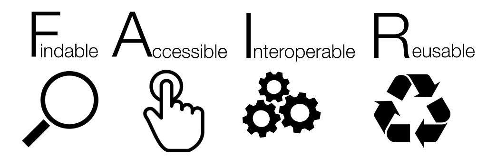

<!--

author:   Arcus Library Sciences
email: dlarcuslibraryscience@chop.edu
version:  1.0.0
current_version_description: Brief description of why this version exists
module_type: standard
docs_version: 1.1.0
language: en
narrator: UK English Female
title: Arcus Data Contribution Orientation
comment:  Learn about archiving research data with Arcus
long_description: Arcus Archives is the canonical repository for research data at CHOP. Archiving research data preserves the important research performed at CHOP according to archival standards while facilitating data sharing. This module reviews reasons to archive research data at Arcus, and the data scoping, privacy review and technical considerations taken before receiving data. Module 2 covers the steps of archiving the data at Arcus.

estimated_time: 30 minutes

@pre_reqs
It's helpful to have reviewed the [Arcus website](https://arcus.chop.edu) at  (available only on the CHOP network), to understand Arcus’s overall goals.

@end

@learning_objectives

After the completion of this training module, learners will be able to:

* Justify archiving research data with Arcus
* Know the tools Arcus uses for sharing data at CHOP
* Understand the steps taken before transferring data to Arcus for archiving.

@end

@contingent_text

@end

import: https://raw.githubusercontent.com/arcus/education_modules/main/_module_templates/macros.md
-->

# Example with contingent text
@overview

## Data Type

Please select what type(s) of data you have:

- [ ] clinical data
- [ ] omics data

This is a general paragraph that will show up regardless of what is selected above. 
More contingent text follows, but it's done with a macro this time instead of copying out the whole script each time.

@contingent_text(0,`More clinical info, including a comma.`)

@contingent_text(1,`This content is about omics.`)
