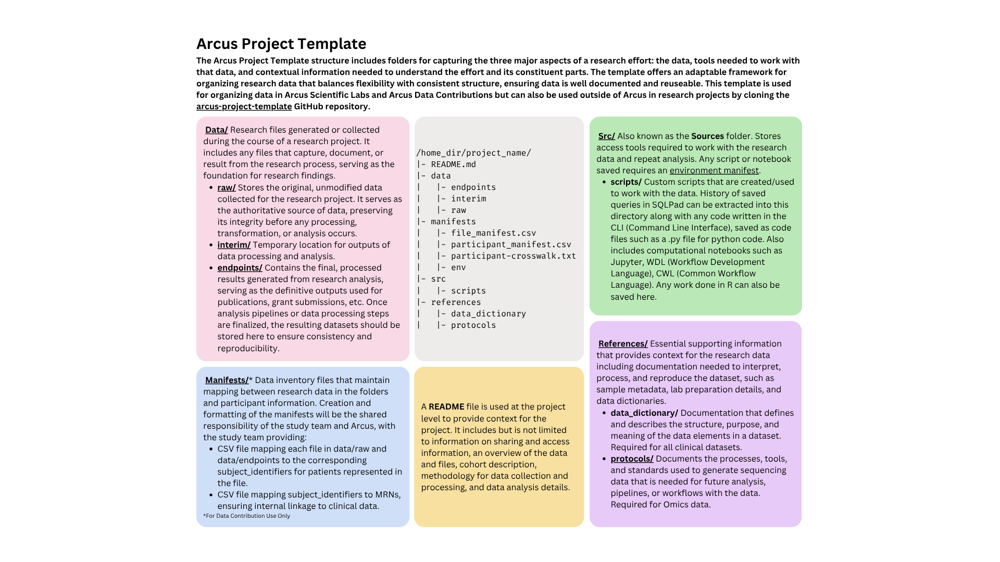
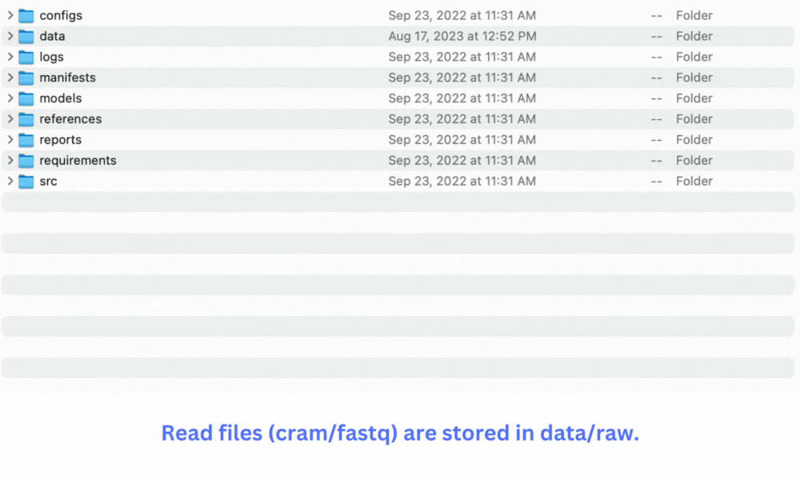
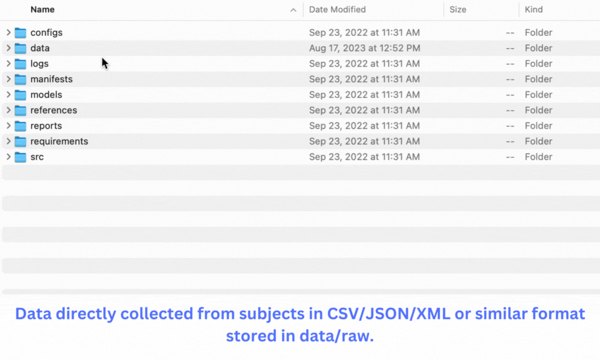
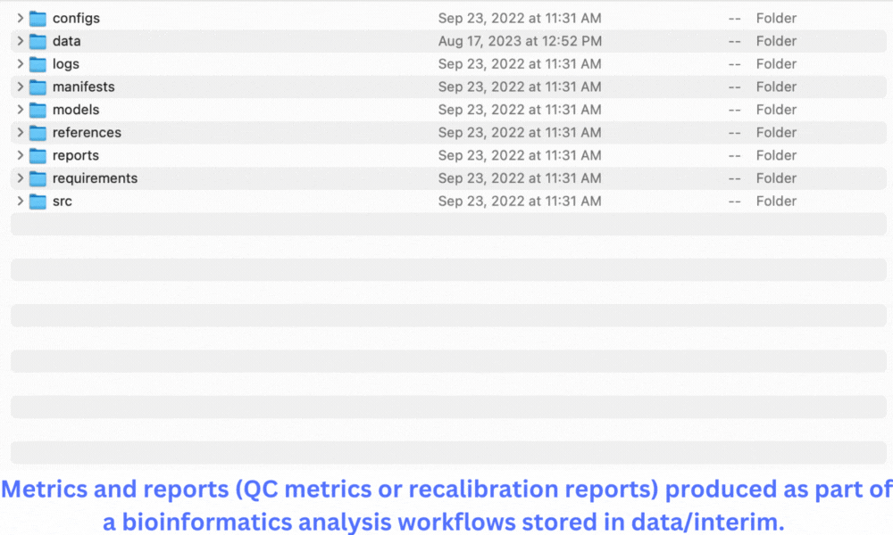
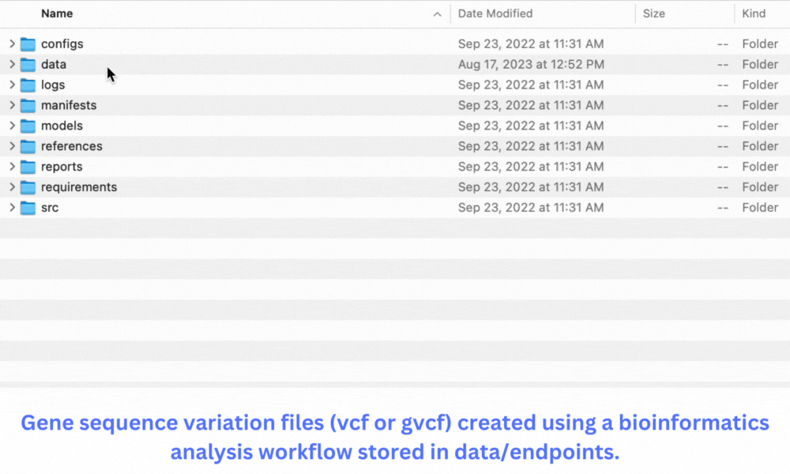

<!--

author:   Arcus Library Sciences
email: dlarcuslibraryscience@chop.edu
version:  1.0.0
current_version_description: Brief description of why this version exists
module_type: standard
docs_version: 1.1.0
language: en
narrator: UK English Female
title: Arcus Project Template Orientation
comment:  Learn about the project template directory structure, which is used in Acus labs and for archiving data.
long_description: Arcus Archives is the canonical repository for research data at CHOP. Archiving research data preserves the important research performed at CHOP according to archival standards while facilitating data sharing. This module reviews reasons to archive research data at Arcus, and the data scoping, privacy review and technical considerations taken before receiving data. Module 2 covers the steps of archiving the data at Arcus.

estimated_time: 30 minutes

@pre_reqs
We recommend completing the Arcus Data Contribution Orientation before doing this module. It's helpful to have reviewed the [Arcus website](https://arcus.chop.edu) at  (available only on the CHOP network), to understand Arcus’s overall goals.

@end

@learning_objectives

After the completion of this training module, learners will be able to:

* Use the project template directory structure to organize clinical data and omics data in any storage environment
* How to use the project template within a Arcus Scientific Computing lab
* Prepare a research data contribution for archiving in Arcus

@end

@contingent_text
<script modify="false">
try {
  let data_type = @input(`data_type`)

  if(data_type[@0]) {
    send.liascript(`@1`)
  } else send.clear()
} catch(e) { }
</script>
@end

import: https://raw.githubusercontent.com/arcus/education_modules/main/_module_templates/macros.md
-->

# Arcus Project Template Orientation

<div class = "overview">

## Overview

@comment

### Is this module right for me?

@long_description

### Details

**Estimated time to completion**: @estimated_time

**Pre-requisites**:

@pre_reqs

**Learning Objectives**:

@learning_objectives

</div>

<div class = "important">

Hi! This document is still under construction and testing. We apologize in advance for any broken links or unclear language. We invite your feedback. Please add a [support ticket](https://support.arcus.chop.edu/servicedesk/customer/portal/6/create/249) or [email Arcus Library Sciences](mailto:dlarcuslibraryscience@chop.edu) to let us know what we can improve or suggest additional topics.

Please note that **many of the links here will only work if you're on the CHOP network**.

</div>

## Audience

This module introduces the CHOP community to the Project Template, a structured file directory for managing research data. It is useful to ANYONE at CHOP involved in creating, managing or analyzing research data.

The Project Template offers an easy to use and flexible structure for organizing data, and ensures necesary context is preserved for project files and documents. It provides a shared, documented framework for organizing a research effort. This achieves multiple goals:

- It assists research teams in building transparency and reproducible workflows
- It establishes a structure for easier long-term preservation
- It preserves context needed for future reuse of research by collaborators or for the original researcher
- It organizes a research project for archiving within Arcus

<div class = "learn-more">
<b style="color: rgb(var(--color-highlight));">Learning connection</b><br>

The Project Template is useful in creating reproduceable, generalized and reuseable research. To learn more about reproduceable, generalized and reuseable principles in research, check out the [following module](https://liascript.github.io/course/?https://raw.githubusercontent.com/arcus/education_modules/main/reproducibility/reproducibility.md#1) from the Arcus Education team.

</div>

### In progress data contributors

Thank you for agreeing to contribute your data, all contributed research data will be arranged in CHOP's Project Template structure. This module describes all sections of the project template structure, what data goes in each section, and shows examples of research data arranged in the template.

This module can be used as a reference while you navigate the archiving process, please reach out to the Digital Archivist if you have further questions. Please share this module with others on your research team involved with preparing the data contribution, or other researchers that may be interested in archiving data with Arcus.

### Future data contributors

This module is an overview of CHOP's Project Template structure, all contributed data is aranged in this structure for archiving in Arcus. The Project Template is useful at all stages of research, we suggest implementing it as early as possible in your research as it provides a shared, documented framework for organizing a research effort.

Arcus's Library Science team is happy to meet with researchers at all phases of research for research data management consultations and planning for future archival contributions. This includes early in your research project, as we can help set up a project template file directory structure for storing data and recommend metadata and organization best practices. In addition to this module, there are additional data management resources available on CHOP’s [Arcus resources page](https://www.research.chop.edu/applications/arcus/resources).

If after viewing this module, you are prepared to archive data with Arcus, please fill out [the following request](https://pm.arcus.chop.edu/servicedesk/customer/portal/6/create/256) to start the process.

### Arcus Lab Users

The Project Template is added to all Arcus Scientific Computing Labs (Arcus Lab), so all you have to do is set up your workflows to conform to the template. This module describes all sections of the project template structure, what data goes in each section, and shows examples of research data arranged in the template.

As part of the Arcus Lab deployment, your team should have received a Project Template orientation by a member of the Library Science team. If you missed the orientation, or need a refresher on the orientation, please see this [video of the orientation](https://www.youtube.com/watch?v=YJvA_cryI1s). Much of the content covered in the video is also in this module.

When appropriate, archiving your research in Arcus is expected with a Scientific Project with an Arcus Lab. This is documented in the [Arcus Terms of Use](https://arcus.chop.edu/terms-of-use). Archiving is required if you would like to move any data created within an Arcus Lab to a new Scientific Project or if other research teams would like to reuse your data.

When you are ready to archive your lab data, please submit the following request in the [Arcus Help Center](https://pm.arcus.chop.edu/servicedesk/customer/portal/6/create/256) to begin the data contribution process.

## Arcus Data Lifecycle

Arcus' goal for research data management and the project template is to provide tools that are relevant throughout the entire lifecycle of research data. The project template is adaptabtable and iterative, as opposed to being a rigid, inflexible solution. The project template exhibits the required flexibility to encompass diverse data capturing needs, while also maintaining a universal quality that facilitates seamless communication among various projects spanning different domains, thereby promoting effective data sharing.

**How was this structure developed?**

The CHOP project template file directory structure was adapted from [DrivenData’s Cookiecutter Data Science template](https://cookiecutter.readthedocs.io/en/stable/). It was adapted by former Arcus Digital Archivist, Christiana Dobrzynski, and former CHOP Bioinformaticist, Perry Evans. Both Arcus’s and DrivenData’s templates aim to organize research data and tools for accuracy and reproducibility. See [DataDriven's introduction](http://drivendata.github.io/cookiecutter-data-science/) to learn more about the goals and purpose of project template structures for data preservation and sharing.

The CHOP project template evolved through iterations and feedback from CHOP researchers. A multi-disciplinary groups of practicioners were consulted in the template adaptation development, including:

- Bioinformatics
- Cancer research
- Microbiome center
- Research IT
- Clinical sequening unit
- Medical Informatics Unit

**How is the Project Template used at Arcus?**

The Project Template prioritizes streamlined archiving and reproducible research pathways. It archives a wide range of research types from the Research Institute, making them discoverable through tools like [Arcus Cohort Discovery](https://arcus.chop.edu), [Gene](https://chop.alationcloud.com), and [Omics Variant Browser](https://arcus.chop.edu). The Project Template facilitates organizing diverse research data in a single directory structure, enabling automated archiving, metadata management, and data delivery throughout the research data lifecycle. This file directory structure is used for the entire lifecycle of research data within Arcus:


The project template provides a shared structure so that institutional knowledge previously held locally by various members of the data creation team becomes centralized.

The utility of the project template for lab drive organization and integration with the Arcus archives is summarized in the graphic below.


## Project Template

The project template structure includes directories for capturing three major aspects of a research effort: the data (data), the tools needed to work with that data (access tools), and the contextual information needed to understand the effort and its constituent parts (contextual). The high level directories are as follows (items with asterix are required):

- **_Configs_** (contextual)
- **_Data_** (data)\*
- **_Manifests_** (data)\*
- **_Models_** (access tools)
- **_References_** (contextual)
- **_Reports_** (contextual)
- **_Requirements_** (contextual)
- **_SRC_** (access tools)

Below is an image of the entire Project Template Directory, with more detail about each section:



### Research Data

The Project Template brings together three categories of information: Research Data, Access Tools and Contextual files. Research data is the actual data collected during the course of research processes used for analysis. The manifests describe this data, crosswalking files to participants. Research data (with manifests) is the minimun required information for all Arcus data contributions.


### Access Tools

Access Tools are the code used to do the analysis. This can include machine models, scripts and Jupyter notebooks.


### Contextual Files

Contextual Files provide information needed to understand the data and analysis. This can include omics protocols, data dictionaries, reports and diagrams.


## Project Template Directories

The next part of this module will walk through each sub-directory of the project template in detail. Though the project template is flexible enough to handle a wide range of research data, it's application and the filetypes in each directory will be different depending on the type of project. For this reason, we have two differnt examples: clinical data or omics data. In many of the following sections, you can select the option to view examples and specific information for the data type.

Regardless of project type, Arcus follows industry standard guidelines for digital archiving and apply these standrds to incoming data contributions. File names should follow a consistent and clear schema, and not contain and spaces, periods or special characters. Further recommendations for filenaming are below:

- [File naming tips sheet](https://storage.googleapis.com/arcus-edu-libsci/Arcus%20RDM%20Resources/fileNaming_bestPractices_MIT.pdf)
- [File naming conventions and activity sheet](https://storage.googleapis.com/arcus-edu-libsci/Arcus%20RDM%20Resources/arcus_rdm_filenaming_activity.pdf)
- [Recommended practices for README files](https://storage.googleapis.com/arcus-edu-libsci/Arcus%20RDM%20Resources/Arcus%20RDM%20Data%20Dictionaries%20Best%20Practices.pdf)

Whenever feasible, Arcus prefers to archive non-proprietary file formats as opposed to proprietary ones. Proprietary formats necessitate specific software for access or utilization, while non-proprietary formats are frequently open-source. Whenever you have the option, it's advisable to store data in a non-proprietary (open) file format. This choice enhances the accessibility of your content to others, enabling effortless reuse across various software platforms. Furthermore, this approach guarantees the continued utility of the file in the long term. In contrast, proprietary files carry the risk of becoming obsolete due to potential software incompatibility or restricted access.

<div class = "important">
<b style="color: rgb(var(--color-highlight));">Important note</b><br>

When it is necessary to save files in a proprietary format, consider including a README file that documents the name and version of the software used to generate the file, as well as the company who made the software. This could help down the road if we need to figure out how to open these files again.

</div>

For both the clinical data and omics examples in the Project Template walk through, we reference our preferred data formats for each type of data. Below are some general resources to help in choosing file formats:

- [Library of Congress Recommended Formats Statement](https://www.loc.gov/preservation/resources/rfs/)
- [UCSC Glossary of Omics File Formats](https://genome.ucsc.edu/FAQ/FAQformat.html)
- [NIH Clinical Trials Data Formats Overview](https://rethinkingclinicaltrials.org/chapters/conduct/acquiring-real-world-data/data-formats/#:~:text=XML%20is%20used%20as%20the,number%20of%20defined%20document%20templates.)

## data/

The data folder is where the data files are organized. Data is the information collected during the course of research processes used for analysis. The data directory maintains descriptions of authoritative source data and their associated files and metadata in both raw and processed formats. There are four sub-directories within the data folder for organizing the data: _raw/_, _interim/_, _endpoints/_, and _ref-data_.

All files within the **data/** folder and its subdirectories will be listed in the **file_manifest.csv**. The manifests are detailed in the [manifests](## manifests) section of this course.

### data/raw

This directory holds authoritative source data that should never be deleted. This folder is where the original, unmodified data for the research project is stored. In a research process, this is the data used for the initial analysis. Further sub-directories can be added to organize data, if necessary.

**Within an [Arcus Scientific Lab](https://liascript.github.io/course/?https://raw.githubusercontent.com/arcus/Arcus_Labs_Orientation/main/arcus_orientation.md#1)**

- Arcus delivered archival data will be found here.
- Study team generated data brought into Arcus goes here.
- This data is managed by Arcus, and should not be modified by the research team.

**Raw** data is different depending on the type of research. Please select what type(s) of data you would like more information about, you can select both:

- [ ] omics data
- [ ] clinical data
<script output="data_type">"@input"</script>

<script modify="false">
try {
  let data_type = @input(`data_type`)

  if(data_type[0]) {
    send.liascript(`### Omics Data




For omics data, the raw folder contains the sequencing data. Most sequencing providers will generate a [**fastq**](https://maq.sourceforge.net/fastq.shtml) file or [**cram**](https://samtools.github.io/hts-specs/CRAMv3.pdf) file, we prefer these filetypes for archiving.
* These files contain genomic sequences called reads. With paired reads, there are two fastq files per sample. Cram files are single files aligned to a reference genome.

- We collect the compressed fastq form fastq.gz, which can be made with lossless compression utility tools like gzip. fastq metadata are described in the fastq directory.
- Cram files are human readable and highly space efficient by using reference-based compression of sequence data. These files enable us to run a complete re-analysis of the data. Cram files require a companion index file, crai.

`)
  } else send.clear()
} catch(e) { }
</script>

<script modify="false">
try {
  let data_type = @input(`data_type`)

  if(data_type[1]) {
    send.liascript(`### Clinical Data




For a registry, database, or any other type of clinical dataset the raw data will be the research directly collected from subjects whether managed by automated processes or via manual entry. This version of the dataset often contains identifiable information and is most critical for secondary use.

- CSV and TSV formats are a great option for archiving flat file documents from an external data source to be contributed for archiving.
- Structured data in the [HL7's FHIR format](https://www.hl7.org/fhir/) or another ontology in the XML or JSON standard are also a preferred option.

**Within an [Arcus Scientific Lab](https://liascript.github.io/course/?https://raw.githubusercontent.com/arcus/Arcus_Labs_Orientation/main/arcus_orientation.md#1)**
- Clinical data is often delivered to users in the BigQuery format to optimize search capabilities and performance. This data is accessed using SQL pad, which is preloaded into the lab. For Electronic Health Record (EHR) data, we have an existing workflow with the ADR team for preseving work in this format.

<div class = "important">
<b style="color: rgb(var(--color-highlight));">Important note</b><br>

- REDCap is a great application for clinical data projects of all sizes available to all CHOP personnel. The REDCap team at CHOP has great resources for [data collection best practices](https://storage.googleapis.com/arcus-edu-libsci/PDFs/Best%20Practices%20for%20REDCap%20Data%20Collection.pdf) for new projects and how to [import data](https://storage.googleapis.com/arcus-edu-libsci/PDFs/REDCap_Data_Import_Instructions.pdf) residing in a different application for complete projects ready to be archived. If you automate data collection directly from patients encounters in the EHR, there are options to feed that data directly into [REDCap via an API](https://liascript.github.io/course/?https://raw.githubusercontent.com/arcus/education_modules/main/using_redcap_api/using_redcap_api.md#1). If you collect data in REDCap, there is an option to both tag data with an identifiability label at the onset of a project as well as export data with all identifiable fields tagged.

</div>
`)
  } else send.clear()
} catch(e) { }
</script>

<script modify="false">
try {
  let data_type = @input(`data_type`)

  if(!data_type[0] & !data_type[1]) {
    send.liascript(`**Nothing is selected** 
<br>

`)
  } else send.clear()
} catch(e) { }
</script>

### data/interim

The interim directory is for storing outputs of data processing and analysis completed using the original, unmodified data store in **data/raw**. Further sub-directories can be added to organize data, if necessary.

**Within an [Arcus Scientific Lab](https://liascript.github.io/course/?https://raw.githubusercontent.com/arcus/Arcus_Labs_Orientation/main/arcus_orientation.md#1)**

- Data in this directory is managed by the study team
- It should be used as an unregulated space for intermediate and temporary files.
- Recommend establishing retention schedules for regular review/clean-up of data in this folder.

**Interim** data is different depending on the type of research. Please select what type(s) of data you would like more information about, you can select both:

- [ ] omics data
- [ ] clinical data
<script output="data_type_interim">"@input"</script>

<script modify="false">
try {
  let data_type = @input(`data_type_interim`)

  if(data_type[0]) {
    send.liascript(`
    #### data/interim/ omics example



This directory is for the quality control and other reporting created during a bioinformatics workflow, using the sequnce files stored in the \_data/raw\_ directory.

- QC metrics Quality Control (QC) metrics are reported at various stages of analysis pipelines and give information about the quality of the data generated. QC metrics files should be in a tabular file format, with .type\_metrics or .duplicate\_metrics as the extension.
    `)
  } else send.clear()
} catch(e) { }
</script>

<script modify="false">
try {
  let data_type = @input(`data_type_interim`)

  if(data_type[1]) {
    send.liascript(`
    #### data/interim clinical example


This directory is for practice work generated during clincal research when analyzing and sharing original, unmodified data saved in \_data/raw\_. This can provide be a good insight into the research process and will be archived on a case by case basis. Additionaly, alternatively formatted data, or excluded data can be saved in the interim directory. Data should be saved as a tsv, csv, xml or json file if possible.
    `)
  } else send.clear()
} catch(e) { }
</script>

@contingent_text(0,`More clinical info, including a comma.`)
@contingent_text(1,`This content is about omics.`)

#### data/interim/ omics example


This directory is for the quality control and other reporting created during a bioinformatics workflow, using the sequnce files stored in the \_data/raw\_ directory.

- QC metrics Quality Control (QC) metrics are reported at various stages of analysis pipelines and give information about the quality of the data generated. QC metrics files should be in a tabular file format, with .type_metrics or .duplicate_metrics as the extension.

#### data/interim clinical example


This directory is for practice work generated during clincal research when analyzing and sharing original, unmodified data saved in \_data/raw\_. This can provide be a good insight into the research process and will be archived on a case by case basis. Additionaly, alternatively formatted data, or excluded data can be saved in the interim directory. Data should be saved as a tsv, csv, xml or json file if possible.

### data/endpoints

The endpoints directory are holds the final results created as part of a research analysis. Often, these are files created to support papers or grants, and other dissemination. Further sub-directories can be added to organize data, if necessary.

**Within an [Arcus Scientific Lab](https://liascript.github.io/course/?https://raw.githubusercontent.com/arcus/Arcus_Labs_Orientation/main/arcus_orientation.md#1)**

- Data in this directory is managed by the study team.
- Data in this directory will be saved if the project is archived in Arcus.

**Endpoints** data is different depending on the type of research. Please select what type(s) of data you would like more information about, you can select both:

- [ ] omics data
- [ ] clinical data

#### data/endpoints omics example

<!-- style = "max-height: 500px;" -->

This directory is for files created at the end of a bioinformatics workflow, like gvcf and vcf files.

- **gvcf** files contain variant information, describing genomic regions with no variants for a single sample. They are used to compare variant calls across samples to make vcf files. We collect them to enable the easy construction of larger cohorts. We collect the compressed version of a gvcf file (g.vcf.gz) which can be made with a lossless compression utility tool like [gzip](https://www.gzip.org). All gvcf files should include an index file, .tbi
- **vcf** files usually contain multiple samples, and are the starting point for most reserach project's analysis. They are not appropriate for constructing cohorts from multiple projects because they are missing necessary information contained in the gvcf files. We collect the compressed version of a vcf file (vcf.gz), which can be made with a lossless compression utility tool like gzip[gzip](https://www.gzip.org). The variant calls in these files might differ from those in a gvcf file because they are made by considering information from all samples. A researcher would want to use these files when considering each project separately. All vcf files should include an index file, .tbi

#### data/endpoints clinical example


This directory contains an analyzed version of a dataset or deidentified datasets.

- Sometimes these files can be more cohort scoped or present a refinement into an initial research questions.
- This data is highly valuable for reuse because often errors in the clinical record emerge from this process and can be illustrative for researchers in an overlapping or similar specialty.
- Data should be saved as a tsv, csv, xml or json file if possible.

### data/ref-data

This directory is for any external or public datasets not created by the study team neccessary to understand or repeat the anlysis for the project.

**Within an [Arcus Scientific Lab](https://liascript.github.io/course/?https://raw.githubusercontent.com/arcus/Arcus_Labs_Orientation/main/arcus_orientation.md#1)**

- External or public datasets not supplied by Research IS or your lab, such as census data, will be available in this directory.

**Ref-data** data is differnt depending on the type of research. Please select what below if need need more information about omics data for this directory:

- [ ] omics data

#### data/ref-data/platform_data omics example

- As cram files are a compressed format, some information is needed as a seperate file. If possible we collect a fasta file for the reference genome used. The fasta file describes offsets for each contig, to compute exactly where to find a particular reference base at specific genomic coordinates. Each fasta file requires an index file as fasta.fai
- bed files are a text file format used to store genomic regions as coordinates and associated annotations, see [documentation](https://samtools.github.io/hts-specs/BEDv1.pdf) for more information on the format. If available, we collect this file as a .bed extension.

## manifests/

Manifests are an inventory of all data in the collection, and provide a mapping between research data in the data folders, and participant information. The manifests also create a mapping between data and associated pipeline and technical information about workflows. There are three main manifests that are mandatory for every archival collection:

- file_manifest.csv
- participant_manifest.csv
- partcipant-crosswalk.txt

Additional manifests are only required if needed for the data or collection type. These files are detailed in the next sections. The graphic below illustrates the linking between the files:


**Within an [Arcus Scientific Lab](https://liascript.github.io/course/?https://raw.githubusercontent.com/arcus/Arcus_Labs_Orientation/main/arcus_orientation.md#1)**

- Managed by Arcus, you will not need to create these for yourselves
- This will only appear in the lab if archival data is delivered

### manifests/file_manifest

The _file_manifest.csv_ matches the biosample_id to each file in the ~data folders~. Below is more detail about each section in the file:

- biosample_id is an ID number for each file. For some studies, each file is derived about specific biosamples, so we suggest using the sample id. deally, biosample_id links to the CHOP biobank. When you cannot link the the biobank, treat biosample_id as the IDs you use for samples taken from participants. For studies where there are no biosamples, the biosample_id can be the file name.
- file_type is the type of file, indicated by the file extension
- protocol is only for omics data, select the omics data example below for more information
- file*path is the file path for each file in the \_data* folders. File paths should start with ~data/~ and end with the full file name with extension

The **file_manifest.csv** may look differnt depending on the type of research. Please select what below if need need more information about omics data for this directory:

- [ ] omics data
- [ ] clinical data

#### manifests/file_manifest omics examples

- file_manifest.csv matches biosample IDs to data files and experimental protocols, described in yaml files. Many files might share the same experimental protocol. These yaml protocol files describe experiment and data processing details (described later).

| column                  | definition                                                                                                                                                                                                                                                                                                                       | type   |
| ----------------------- | -------------------------------------------------------------------------------------------------------------------------------------------------------------------------------------------------------------------------------------------------------------------------------------------------------------------------------- | ------ |
| biosample_id            | This ID links to PARTICIPANT_MANIFEST.                                                                                                                                                                                                                                                                                           | String |
| file_type               | Each experiment template has a list of required file types. Use those terms.                                                                                                                                                                                                                                                     | String |
| protocol                | Each experiment template has protocol yaml files or capture kit information used to describe experiment metadata. This column points to the file path of the protocol or the capture kit information for this file. Paths should start with references/procotols/ or data/ref-data/platform-data                                 | String |
| file_path               | Use one file path per row. It should start with data/.                                                                                                                                                                                                                                                                           | String |
| file_groups             | Files in the same group are related. Paired fastq files belong in the same group. A bam file and its index belong in the same group. Plink bfiles belong in the same group.                                                                                                                                                      | String |
| derived_from_file_group | This column describes relations between file groups. We want to capture consecutive pipeline steps. For example, a bam file is derived from a paired fastq group. Use the name of the file_groups used to construct this file. Delimit multiple groups with a semicolon. Use NA when there are no prior step files to reference. | String |

#### manifests/file_manifest clinical example

- Since clinical research efforts don't always collect biospecimen data.
- The list of required files we collect for this file are as follows:

> - instance_id
> - file_path
> - file_groups

### manifests/participant_manifest

The participant_manifest.csv links identifies which participants information links to each files in the file_manifest. Below is more detail about each section of the file:

- local_patient_id is a local identifier the study team used to identify the patient
- The biosample_id will be the same as the one listed in the file_manifests.csv. Linking a local_participant_id to a biosample_id identifies which patients information is related to the file.
- cohort is optional, please fill this in if there is additional cohort information or identification needed.

The **participant_manifest.csv** may look differnt depending on the type of research. Please select what below if need need more information about omics data for this directory:

- [ ] omics data
- [ ] clinical data

#### manifests/participant_manifest omics example

- participant_manifest.csv matches participants/patients to cohorts and biosample IDs. Ideally, biosample_id links to the CHOP biobank. When you cannot link the the biobank, treat biosample_id as the IDs you use for samples taken from participants. If you deal with only one sample type, you might use the participant ID. If you run a treatment/control experiment, you might use {participantID}\_treat and {participantID}\_control as as a biosample ID scheme. If you work with different tissue samples from participants, you might use {participantID}\*{tissue} as a biosample ID scheme.

| column               | definition                                                                                                                    | type   |
| -------------------- | ----------------------------------------------------------------------------------------------------------------------------- | ------ |
| local_participant_id | This ID uniquely defined a person, and can be linked to an MRN.                                                               | String |
| cohort               | Use this column to group participants into cohorts that will be cwopared (For example, case vs healthy control).              | String |
| biosample_id         | Ideally, this ID can link to the CHOP biobank. When this is not possible, use the sample ID from your project.                | String |
| family_id            | When participants are related, use family_id to group related participants. With trios or duos, the proband ID is often used. | String |
| family_role          | Use a term from eHB_relationship_types_as_of_10_30.json to indicate mother, father, proband, sister, etc..                    | String |

#### manifests/participant_manifest clinical example

- Since clinical research efforts don't always collect biospecimen data.
- When you cannot link the the biobank, treat instance_id as the IDs you use for samples taken from participants
- Can use Epic Patient ID (start with Z) as the local_participant_id
- The list of required files we collect for this file are as follows:

> - participant_manifest.csv
> - local_participant_id
> - cohort
> - instance_id

### manifests/participant_crosswalk

- participant-crosswalk.txt is a tab delimited file with no header that links local_participant_id in PARTICIPANT_MANIFEST to MRNs.

column,definition,type,notes
local_id_type,The type of participant id (local).,String,This will always be local.
local_participant_id,Id that is used in PARTICIPANT*MANIFEST,String,
auth_id*\type,The type of participant id(chop),String,This will always be chop.
aut\h_participan\t_id,Authorative Id of the participant. (Often MRN),String,Use an 8 digit MRN. Left-pad the MRN with zeroes as necessary.

### manifests/participant_family_role

The participant_family_role.csv file is only needed for some omics data MORE DETAIL.

- participant_family_role.csv If you have family data, use this file to describe relationships with terms from data_dicts/eHB_relationship_types_as_of_10_30.json.

| local_participant_id | local_relative_id | relative_family_role |
| -------------------- | ----------------- | -------------------- |
| participant1         | participant2      | biological mother    |
| participant2         | participant1      | biological son       |
| participant1         | participant3      | biological father    |
| participant3         | participant1      | biological son       |
| participant1         | participant4      | biological sister    |
| participant4         | participant1      | biological brother   |

| column               | defintion                                                                                                             | type   |
| -------------------- | --------------------------------------------------------------------------------------------------------------------- | ------ |
| local_participant_id | The local id of a participant.                                                                                        | String |
| local_relative_id    | The local id of a relative to the participant.                                                                        | String |
| relative_family_role | The familial relationship of the relative to the participant. Use terms from eHB_relationship_types_as_of_10_30.json. | String |

- familyid_crosswalk.csv This manifest should be used with trio and cohort. A trio will contain three participants, a cohort can contain hundreds. This file walks the name for the trio or cohort file with the local_participant_id's included in it.

| family_id | individual_id | paternal_id | maternal_id | sex |
| --------- | ------------- | ----------- | ----------- | --- |
| LML100    | 101354        |             |             | 2   |
| LML100    | 101355        |             | 101354      | 1   |
| LML101    | 102454        |             |             | 2   |
| LML101    | 102455        | 102456      | 102454      | 1   |
| LML101    | 102456        |             |             | 1   |
| LML102    | 103767        |             |             | 1   |
| LML102    | 103768        |             |             | 2   |
| LML102    | 103769        | 103767      | 103768      | 2   |
| LML103    | 108976        | 108977      | 108978      | 1   |
| LML103    | 108977        |             |             | 1   |
| LML103    | 108978        |             |             | 2   |
| LML104    | 104666        | 104667      | 104668      | 2   |
| LML104    | 104667        | -9          | -9          | 1   |
| LML104    | 104668        | -9          | -9          | 2   |

| family_id            | Required, the family_id for the trio data                                           |
| -------------------- | ----------------------------------------------------------------------------------- |
| local_participant_id | Required, the local_particpant_id for each of the participants included in the trio |
| paternal_id          | Optional, the local_participant_id for the father of the participant                |
| maternal_id          | Optional, the local_participant_id for the mother of the participant                |
| sex                  | Optional, the sex of the participant. 1 for male, 2 for female                      |

### manifests/file_derivation.csv

The file_derivation.csv is only required for omics contributions with multiple filetypes generated through a bioinformatics pipeline or workflow.

- file_derivation.csv describes the relationships between files in a pipeline or workflow.

| column                 | definition                                                      | type   |
| ---------------------- | --------------------------------------------------------------- | ------ |
| destination_file_group | The files in this file group is derived from source_file_group. | String |
| source_file_group      | File group used to derive the destination_file_group.           | String |

### manifests/env_manifest.csv

For each script/notebook in _src/_, and each model in _models/_, there should be an env._ file (here env._ refers to a file named env with any extension, so env.yaml or env.txt, for example) that describes the environment in which it was created or run. Environment files should be named as follows: descriptiveName*env.\* and placed in a folder called environments within the \_configs/* directory. Either individuals files or entire folders (whichever is the appropriate level) in scripts and notebooks within the _src/_ directory, or the _models/_ directory will need to be added to the env_manifest.csv file, matching them with their related environment file. See the see below for more infromation about this file:

| column                | definition                                                                                                                                                                                                                                                                          | type   |
| --------------------- | ----------------------------------------------------------------------------------------------------------------------------------------------------------------------------------------------------------------------------------------------------------------------------------- | ------ |
| programming_filegroup | Enter the highest level folder that the environment file relates to. If the file relates to an entire directory then put the whole directory file path. If the file relates to a suddirectory enter that filepath. If it relates to a single file enter the file path and filename. | String |
| related_environment   | Enter the environment filename. Some environment files will be entered multiple times as they relate to multiple files.                                                                                                                                                             | String |
|                       |

## src/

The src or sources folder stores the access tools required to work with the research data and repeat the analysis. The need for access tools is dependent on the type of research, not all research has rules, scripts or notebooks. Any scripts saved in the src folder require an environment manifest to document the computing environment the code is run in, see the [environment manifest page](#manifestsenv_manifestcsv) for more information. Subdirectory folders can be customized and added as needed, below are the common directories or data types used in scientific research:

- **notebooks**: Jupyter, Beaker, Zeppelin, WDL, CWL etc.
- **scripts**: custom software, code, tools
- **rules**: for computational workflows
- **test**: unit testing for code, customizable to team needs

<div class = "important">
<b style="color: rgb(var(--color-highlight));">Important note</b><br>
Version Control is important when working collaboratively with access tools like scripts and workflows. For a description of version control and version control systems, see the Arcus Education module, [Intro to version control](https://liascript.github.io/course/?https://raw.githubusercontent.com/arcus/education_modules/main/git_intro/git_intro.md#1)
</div>

**src** files may look differnt depending on the type of research. Please select what below if need need more information about omics data for this directory:

- [ ] omics data
- [ ] clinical data

### src/subfolders clinical example

Reproducibility in research is a major goal of the Arcus program and organizing and documentating code so that it can be used beyond the confines of the originally collected dataset is critical to achieving this aim. See the [DART Module on Reproducibility in Research](https://liascript.github.io/course/?https://raw.githubusercontent.com/arcus/education_modules/main/reproducibility/reproducibility.md#5) for more information on this topic. Below are some examples of the type of information commonly saved in the _src_ directory:

- History of saved queries in SQLPad can be extracted directly from the sqlite database into the _src/scripts_ directory
- Code written in the command line interface can be saved in the _src/scripts_ directory
- Work done in the R or Jupyter notebook applications can be saved in _src/notebooks_ directory
- Though Arcus preferes to archive non-proprietary filetypes, some common data analysis programs are not easily exported out of their proprietary formats, such as Stata or SAS. If you work in Stata or SAS, a non propriterary text version of your .dta or .SAS file can be saved in the src folder so that your analysis workflow can be accessed and interpreted by a secondary user. Additionaly for Sata and SAS analysis, if possible export the workflow steps as a txt file.

### src/subfolders omics example

[Workflow Development Language](https://terra.bio/deciphering-a-mystery-workflow-written-in-wdl/) or WDL and [Common Workflow Language](https://www.commonwl.org) or CWL are open standard tools for managing computionally intensive bioinformatics workflows. These are not definitionally programming languages but more clearly and interoperably explain parameters for running complex omics command line operations across bioinformatics pipelines. WDL and CWL are commonly used in bioinformatics pipelines to describe and share data processing and analysis workflows. For example, the diagram below displays a Genomic Data Commons Pipeline that converts reads (CRAM or BAM) to FASTQ and (re)aligns them to the latest human reference genome.


Workflows documented in WDL or CWL are incredibly useful for both understanding and recreating a bioinformatics workflow. These scripts should be saved in the _src/notebooks_ directory.

## models/

The models directory is for saving any type of machine learning models, model predictions, model summaries, datasheets for model training data. Please consult with the Library Science team on your specific model type for more information about formats and directory structure for archiving.

## references/

This directory contains general information about the research effort such as IRB documents, reference papers, sample information, lab prep information, and data dictionaries. This directory holds the technical information needed to understand the research data. Further subdirectories can be customized depending on the collection.

**references** files may look differnt depending on the type of research. Please select what below if need need more information about omics data for this directory:

- [ ] omics data
- [ ] clinical data

### references/data_dictionary clinical example

If you are contributing a dataset, them you should includes a data dictionary in the _references/_ directory, in a subdirectory titled _data_dictionary_. A data dictionary will help people better understand the scope, purpose, and nuance of the data you are collecting. Some data dictionaries are extensively detailed, but even a basic minimal data dictionary is better than none at all. Data dictionaries are usually used for tabular datasets, but can be used for data in other formats as well.

Below are the fields you can consider including in your data dictionary. Only a few are considered truly **required** - the rest are optional but can be extremely helpful, so you should consider whether they make sense to collect in your case. You may also have additional fields to include that are not listed here; you know your data best!

- If your data model follows a specific ontology it is crucial to denote that in your included documentation.
- NIH has fantastic tools through its Unified Medical Language System (UMLS). These include [extensive vocabulary lists of nearly 200 ontologies](https://www.nlm.nih.gov/research/umls/sourcereleasedocs/index.html) and a [metathesaurus application](https://www.nlm.nih.gov/research/umls/knowledge_sources/metathesaurus/index.html) that crosswalks between validated ontologies.

**Name​**: (required) provide the name of the data element you are describing as it appears in the dataset.

**Description**​: (required) provide a brief description of the data element. Things to include here if applicable: source of data element, units of measure, formulas for calculated fields, nuances of data capture environment, anything else relevant to understanding what this field means and how to use it.

**Human-readable Name**​: (optional) provide a human readable name / title for the data element. This can be handy if the names in your dataset are hard to parse or hard to understand.

**Type**​: (optional) indicates the type of data i.e. numeric, string, date, etc. If you are collecting data in a database that enforces types, sometimes this can be easily extracted. This is useful to know for future transformation or integration of datasets

**IsNull**​: (optional) this a yes/no field that indicates whether the item can be null (absent of information) or not. If this is set to “no”, this indicates data should ​always​ be present in the field, and is helpful to users who may wonder whether an absence of data is to be expected or indicative of a problem

**Values**​: (optional) if there is a restricted list of values that can populate this field, include that here. An example might be “eye color” with the value list “blue, brown, grey”. Providing the list of values helps users understand why data may be absent. E.g. are there no green-eyed people in the dataset because there were none in the population or because “green” was not one of the available values for this field?

**Date added**​: (optional) indicate the date on which this particular field was added to the dataset. This can be useful for understanding why data may be absent.

**Date removed / Date deprecated**​: (optional) indicate the date on which this particular field ceased to be collected as part of the dataset. This can be useful for understanding why data may be absent.

**Relationships**​: (optional) indicate whether the data element is related to other data elements in your data set (in relational database terms, this is where you would indicate a “foreign key”)

**Additional Documentation**

- In addition to documenting data fields, your data dictionary should also include an overarching description of the dataset itself.
- If you have more than one dataset, or more than one data table, include a description for each. The descriptions for data tables and datasets should include some idea of the scope of data included, as well as the purpose in collecting or creating the data and its intended use.

#### Sample Data Dictionary from the [PEDSnet Data Contribution](https://chop.alationcloud.com/article/3810/)

| table_name | field_name               | description                                                                                                | type       | phi | ordinal_position | crosswalk_needed | crosswalk_note |
| ---------- | ------------------------ | ---------------------------------------------------------------------------------------------------------- | ---------- | --- | ---------------- | ---------------- | -------------- |
| person     | person_id                | A unique identifier for each person; this is created by each contributing site.                            | BigInteger | 1   | 1                | 1                |                |
| person     | gender_concept_id        | A foreign key that refers to a standard concept identifier in the Vocabulary for the gender of the person. | Integer    | 0   | 2                | 0                |                |
| person     | gender_source_concept_id | A foreign key to the gender concept that refers to the code used in the source.                            | Integer    | 0   | 3                | 0                |                |

#### Sample Explanation of Tables from the PEDSnet Data Contribution

| name             | description                                                                                                                                                                                                                                                                                                                                                                                                                                                                                                                                                                                                                                                                                                                                                                                                                                                       |
| ---------------- | ----------------------------------------------------------------------------------------------------------------------------------------------------------------------------------------------------------------------------------------------------------------------------------------------------------------------------------------------------------------------------------------------------------------------------------------------------------------------------------------------------------------------------------------------------------------------------------------------------------------------------------------------------------------------------------------------------------------------------------------------------------------------------------------------------------------------------------------------------------------- |
| adt_occurrence   | The adt_occurrence table contains information about distinct admission, discharge, or transfer events that occur as part of a clinical visit. The typical use case is to identify portions of an inpatient admission that represent different levels of care or locations within a facility, but it can be used for additional characteristics of a visits (e.g. specialty consultation). The time of each event must fall between the start and end times of the associated visit_occurrence.                                                                                                                                                                                                                                                                                                                                                                    |
| care_site        | The Care Site domain contains a list of uniquely identified physical or organizational units where healthcare delivery is practiced (offices, wards, hospitals, clinics, etc.).                                                                                                                                                                                                                                                                                                                                                                                                                                                                                                                                                                                                                                                                                   |
| concept_ancestor | The CONCEPT_ANCESTOR table is designed to simplify observational analysis by providing the complete hierarchical relationships between Concepts. Only direct parent-child relationships between Concepts are stored in the CONCEPT_RELATIONSHIP table. To determine higher level ancestry connections, all individual direct relationships would have to be navigated at analysis time. The CONCEPT_ANCESTOR table includes records for all parent-child relationships, as well as grandparent-grandchild relationships and those of any other level of lineage. Using the CONCEPT_ANCESTOR table allows for querying for all descendants of a hierarchical concept. For example, drug ingredients and drug products are all descendants of a drug class ancestor. This table is entirely derived from the CONCEPT, CONCEPT_RELATIONSHIP and RELATIONSHIP tables. |

### references/protocols omics examples

For Omics data, protocols are the metadata that document the processes, tools and standards used to generate sequencing data. Protocols are important to complete, as the information will be needed for future analysis, pipelines or workflows with the data.

Arcus documents the protocol information in structured yaml files. The YAML structure and information captured depends on the sequencing method (such as High-Throughput sequencing, Microarray or Metabolics) and the file type (like FASTQ, CRAM, VCF, etc.). High-Throughput sequencing data includes whole genome sequencing, whole exome sequencing and RNA-seq data. Microarrays include SNP data. A new yaml file should be created whenever the process, tools or standards are different for a set of files. The protocol yaml is linked to the files in the file_manifest.csv file. Below are descriptions of the information requested in the protocols, a template for all of these is downloadable in a public GitHub repository, [arcus/omics-protocols](https://github.research.chop.edu/arcus/omics-protocols).

Below is further description about the metadata elements in a sample fastq protocol:

- **sequencing_type**: Type of sequencing that was performed. You should use the term from the vocabulary list. Common types: WGS, WES, RNA-Seq

- **platform_name**: Platform that was used to perform the sequencing. You should use the term from the vocabulary list. Common platforms: Illumina, Solid, Roche, Ion Torrent

- **instrument_model**: Specific sequencing machine used to produce the sequence file. For a list of illumina platforms, see this link. You should use the term from the vocabulary list.

- **platform_unit**: The platform unit string holds three types of information, the FLOWCELL_BARCODE.LANE.SAMPLE_BARCODE. The FLOWCELL_BARCODE refers to the unique identifier for a particular flow cell. The LANE indicates the lane of the flow cell and the SAMPLE_BARCODE is a sample/library-specific identifier.

- **capture_roi**: File name or file path in the repo for a file that gives specifications and details for the region of interest.

- **capture_kit**: Name of the library preparation kit used with the platform for sequencing the sample. It is important that the name of the kit is standardized and consistent, you should copy the name EXACTLY as it was recorded by the sequencing vendor. Capture kit titles that have been used by previous contributuions are recorded in the the vocabulary list, please use the title listed there when possible.

- **process_description**: Further detail about the library or process used when sequencing the files that is not captured by other metadata terms.

- **read_group_id**: A tag that identifies which read group each read belongs to. A read group is a set of reads generated from a single run of a sequencing instrument, and should be unique for each group.

- **aligned**: Fill in: true or false.

- **genome_build**: If the file is aligned, record the genome build the sequence is aligned to. You should use the term from the vocabulary list. Commonly used genome_build terms: HG19 human reference genome, HG38 human reference genome

- **sequencing_center**: Name of the sequencing center or vendor that did the sequencing of the samples. You should use the term from the vocabulary list. Commonly used sequencing centers: Children's Hospital of Philadelphia (CHOP) Division of Genomic Diagnostics (DGD), Children's Hospital of Philadelphia (CHOP) High Throughput Sequencing (HTS) Center, Children's Hospital of Philadelphia (CHOP) Center for Applied Genomics (CAG), Broad Institute

- **run_date**: Date the sequence was performed on.

- **targeted_depth**: Total amount of sequence data produced by the instrument (pre-alignment), divided by the reference genome size. It should have been provided by the vendor.

- **stranded**: ONLY RELEVANT FOR RNA-seq DATA. Whether the strand specificity of origin for each transcript was retained. Fill in: true or false.

- **strand_name**: ONLY RELEVANT FOR RNA-seq DATA, and only filled in if above is true. Strand information or kit used. You should use the term from the vocabulary list.

- **creator**: Name and job title of the creator of the protocol.

- **info_provider**: Name and job title for the person that provided the information. May be the same as the creator.

> - Sample Protocol for a RNA-seq Sequencing Run

```yaml
---
sequencing_type: RNA-seq
platform_name: Illumina
instrument_model: Illumina HiSeq 2500
platform_unit: H06HDADXX130110.1.ATCACGAT
capture_roi:
capture_kit:
process_description: Total RNA with RIN values above 6 was normalized to 400ng, converted to cDNA, then used to prepare each library using the Illumina TruSeq Stranded Messenger RNA Library Kit and the IDT for Illumina Unique Dual Index Kit in an automated Sciclone Liquid Handler Instrument. Final libraries were analyzed on a Perkin Elmer Labchip GX for quantification and QC.
read_group_id: flowcell_laneNameAndNumber
genome_build: HG38 human reference genome
sequencing_center: Children's Hospital of Philadelphia (CHOP) Division of Genomic Diagnostics (DGD)
run_date: 01202019
targeted_depth: 30

# for RNA-seq files
stranded: true
strand_name: Illumina TruSeq Stranded Messenger RNA Library Kit

# information about this file
creator: Joe Smith, Digital Archivist
info_provider: Doctor Quinn, Bioinformatics Scientist

# information about this template
meta:
  version: 2.0.0
```

# reports/

The reports holds published papers and content used for producing papers, presentations, websites, metrics, etc. It can additionaly hold the following information:

- Figures & tables: generated metrics and graphics for supporting reports
- Log.md: computational notebook (if one was used to create the content)
- Methods.md: version controlled methods section for the project
- Further subdirectories can be customized based on the needs of the collection.

# requirements/

- Any module or library dependencies for workflows.
- Additional requirements files can be added as needed.

# configs/

- Configuration files for workflows or applications.

## configs/environments

image here showing structure in ujo

### Capturing an Analysis Environment

- For each script/notebook in src, each model in models, and any files in data/endpoints, there should be an env._ file (here env._ refers to a file named env with any extension, so env.yaml or env.txt, for example) that describes the environment in which it was created or run.
- Environment files should be named as follows: descriptiveName_env.\* and placed in a folder called environments within the configs/ directory.
- Either individuals files or entire folders(whichever is the appropriate level) in scripts and notebooks within the src/ directory, the models/ directory, or the data/endpoints folder will need to be added to the env_manifest.csv file, matching them with their related environment file.

### Arcus Lab Images

- There should also be a file named lab-image-tag within a folder titled lab-image within the configs/ directory that contains the tag of the Arcus Lab Image that the Lab was using.
- Though unlikely, if artifacts use more that one image than follow the directions above (in the environments section): add a descriptive name to each lab-image-tag file, and add the file paths and related files or directories to the env_manifest linking them together.
