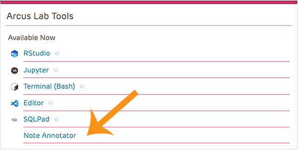
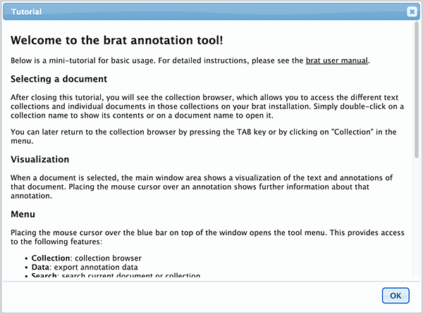
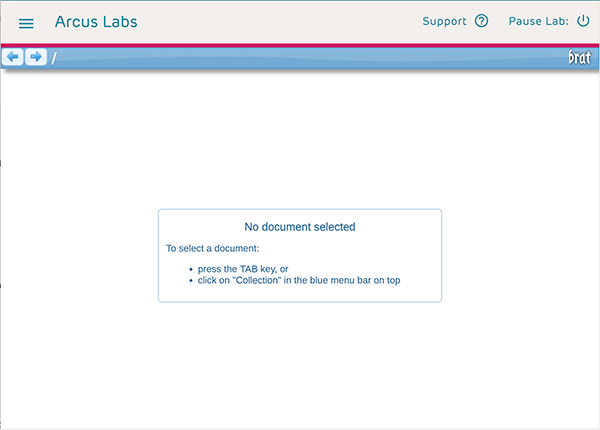
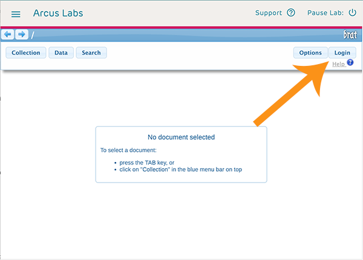
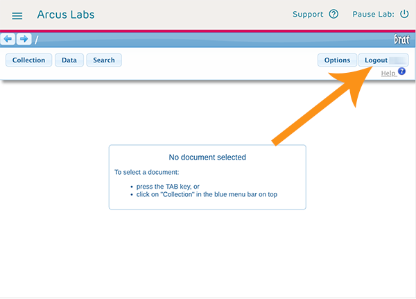
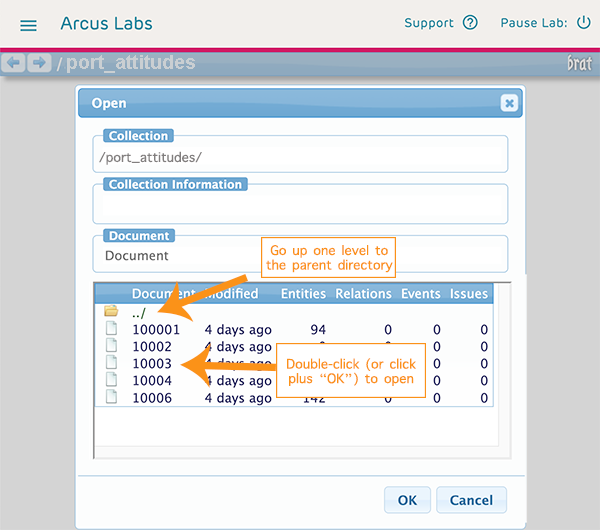

<!--

author:   Rose Hartman
email:    hartmanr1@chop.edu
version: 0.0.0
language: en
narrator: UK English Female
mode: Textbook
title: Training Procedure for Coding Clinical Notes for De-identification

comment:  This is the training procedure for human coders who will be annotating identifying information in clinical notes in an Arcus lab.

import: https://raw.githubusercontent.com/arcus/education_modules/main/_module_templates/macros.md
-->

# Training Procedure for Coding Clinical Notes for De-identification

**Who this is for:** 
This is for human coders who will be annotating identifying information in clinical notes in an Arcus lab.

**What this covers:**
This is the procedure for training new coders. 
It includes the following steps: 

1. Background reading on HIPAA, and on the specific coding ontology for this project
2. A quiz to test understanding of HIPAA's definition of PHI
3. An overview of how to use brat, the Arcus text annotation tool
4. Instructions for completing the reliability test, the last step in the new coder training procedure

There is also additional information about what to expect after you pass the reliability test (regular check-in meetings with other coders) and a note about plans to test for coder reliability on the full dataset after annotation is complete.

## Background Reading

Read the following documents carefully (they will open in a new tab):

- The short section [Protected Health Information](https://www.hhs.gov/hipaa/for-professionals/privacy/special-topics/de-identification/index.html#protected) from the HIPPA De-identification Guidance (you don't need to read the whole webpage, just the few paragraphs defining PHI)
- The [Ontology Guidelines for this project](https://liascript.github.io/course/?https://raw.githubusercontent.com/arcus/Arcus_Labs_Orientation/deid_notes_instructions/deid_notes_annotation_guidelines.md#1). This is the document that explains the coding system we'll use to label identifying information in clinical notes. 

## Quiz: Is this PHI?

For each of the following fake clinical notes, identify whether or not there is PHI present. 
If you're not sure, take your best guess -- the follow-up text will provide more explanation for each example.
(All of the example notes in this training are fake, written for this exercise. 
None are from real patient records.)

> HT, 3yo male, presented with headache and fever. This is his third visit to ED in a week, mom expressed concern that fever isn't resolving. 

[(X)] Yes, this has PHI
[( )] No, this does not have PHI
****

Yes, this contains both health information (symptoms, was seen in the emergency department) and identifying information (the patient's initials, "HT"). 

Note that the patient's age ("3yo") is not identifying under HIPAA
(although remember that age **is** identifying if it is over 89, unless it's given only as "90 or older" or equivalent). 
Our coding procedures are a little broader than HIPAA, so we would still annotate the patient's age in this note, even though it's not legally required.

****

> Patient referred to OT. 
>
> SSN: XX-XXX-1122

[(X)] Yes, this has PHI
[( )] No, this does not have PHI
****

Yes, this contains both health information (referred to OT, occupational therapy) and identifying information (the last four digits of the patient's social security number).

See [May parts or derivatives of any of the listed identifiers be disclosed consistent with the Safe Harbor Method?](https://www.hhs.gov/hipaa/for-professionals/privacy/special-topics/de-identification/index.html#listed).

****

> Pt complains of BL wrist stiffness and pain. She is an Olympic swimmer (won two gold and two silver medals in the 2016 games!). Work closely with both patient and coach to develop a treatment plan that takes her training into account. 

[(X)] Yes, this has PHI
[( )] No, this does not have PHI
****

Yes, this contains both health information (wrist stiffness and pain) and potentially identifying information (the fact that she won gold and silver medals in the 2016 Olympics).
Note that "BL" often stands for "bilateral", and in this context that appears to be what it means. 
If it were the patient's initials, then that would be identifying as well.

This is a situation where the identifying information is not of a typical category (name, age, MRN), but nevertheless it is specific enough that someone might reasonably be able to figure out who this patient is by looking at the list of Olympic medalists from 2016. 
In this case, her fame as an athlete is an "identifying characteristic" under HIPAA. 

See [What constitutes “any other unique identifying number, characteristic, or code” with respect to the Safe Harbor method of the Privacy Rule?](https://www.hhs.gov/hipaa/for-professionals/privacy/special-topics/de-identification/index.html#uniquenumber).

****

> Session 3/5
> 
> Worked on UB strength and coordination, especially crossing midline. Focusing on ADLs such as brushing teeth, donning UB clothing. 
> 
> Session 4/5
> 
> Mom reports exercises at home are going really well. Noticeable improvement in UB coordination today, demonstrated tooth brushing without accommodations on 3/3 trials. 

[( )] Yes, this has PHI
[(X)] No, this does not have PHI
****

This contains health information (the exercises done, how many sessions, patient's improvement in coordination and ability to brush teeth), but it does not contain identifying information.
Note that "Session 3/5" and "Session 4/5" appear to refer to the third of five sessions and fourth of five sessions; while that is health information it is not identifying. 
Similarly, "3/3 trials" appears to mean "three trials out of three total".
Fractions and ratios are sometimes hard to distinguish from dates.

This example also includes a number of abbreviations ("UB" for "upper body", and "ADLs" for "activities of daily living"), which can be hard to parse without some experience with medical jargon.
From how they're used in the sentences here, though, it seems very unlikely that they are identifying information (such as patient initials).

Generic family words like "mom" don't count as names. 

****

> Jan 3, 2020 18:23 
>
> BP 112/90, Temp 102.4F 

[(X)] Yes, this has PHI
[( )] No, this does not have PHI
****

This contains both health information (the patient's blood pressure and temperature) as well as identifying information (the date the individual was treated).
Note that the date (Jan 3, 2020) is identifying, but the time (18:23) doesn't need to be annotated. 

****

## Using the Annotation Tool

You can annotate text in Arcus Labs using a tool called brat (a [recursive acronym](https://en.wikipedia.org/wiki/Recursive_acronym) for "brat rapid annotation tool"). 
This tool allows you to open a note, display it in a visually clean and appealing way, highlight text that has salient characteristics, and add details about those characteristics.

Let's consider what using brat is like:

Step 1: Open the brat tool
------

In the dashboard of an Arcus lab, if the brat note annotator has been added, you'll see it in your list of tools:

<!-- style = "border: 1px solid rgb(var(--color-highlight)); max-width: 400px;"-->

Click on the text "Note Annotator" to enter the annotation tool, and you'll first see a bit of basic instruction.  
Please read this over, and click "OK" to make this initial info screen go away.  
If you want more details on how to use brat, you can always read [the online manual](https://brat.nlplab.org/manual.html).

<!-- style = "border: 1px solid rgb(var(--color-highlight)); max-width: 400px;"-->

Step 2: Log in  
-----

In order to make changes to (not just view) notes, you'll need to log in.  
You'll want to first close any dialog boxes or file pickers, so that your annotation application is empty:

<!-- style = "border: 1px solid rgb(var(--color-highlight)); max-width: 500px;"-->

Notice that there's an application toolbar at the top, in blue.  
It has arrows on the left side and the "brat" logo on the right.  
If you hover over that toolbar, it will expand, and you can choose "log in."    
Credentials for how to log in will be shared with you by the Arcus Applied Data Science team.  

<!-- style = "border: 1px solid rgb(var(--color-highlight)); max-width: 500px;"-->

Once you log in, you won't get any sort of message saying that it worked, but if you hover again over the toolbar, you'll see a logout button with the appropriate user name.  
That's how you'll know you're appropriately logged in!

<!-- style = "border: 1px solid rgb(var(--color-highlight)); max-width: 500px;"-->

Step 3: Open a note.
-----

Hover over the toolbar so that you can click on "Collection", and navigate in the file structure until you reach the note you want to annotate.  
You may have several different folders, organized according to the needs of the project.  

If you go too deeply into a folder structure and need to "back out" to the parent folder, that's what `../` signifies!

Once you see the icon of a piece of paper followed by the name of a note you want to annotate (or check the annotations of), you can double-click on it to open, or click once and then choose "OK" in the lower right.  

<!-- style = "border: 1px solid rgb(var(--color-highlight)); max-width: 500px;"-->

Step 4: Annotate!
----

Once you have a note open, you can select a single word by double-clicking it, or you can use click and drag to highlight a multi-word phrase.  
In the example shown, we highlight a couple of significant words and then add an annotation appropriate for each one.

@gifPreload

<figure>

  

<figcaption style = "font-size: 1em;">

Click on the image to play the demo.

</figcaption>

</figure>

## Reliability Test

To make sure all coders are using the ontology the same way, new coders need to pass a reliability test before they begin annotating new notes. 

To complete your reliability test, log in at arcus.chop.edu, and then select "My Labs" and click to open your Arcus Lab. 
Click the toggle under Lab Status to turn the lab on, and then (once it's available) select Note Annotator from under Lab Tools, and enter the brat username and password. 
Also open the [Ontology Guidelines](https://liascript.github.io/course/?https://raw.githubusercontent.com/arcus/Arcus_Labs_Orientation/deid_notes_instructions/deid_notes_annotation_guidelines.md#1) and keep that available in another tab, so you can reference it as you work.

Navigate to your assigned reliability test directory. 
There will be five note documents. 
For each document you will add, remove, and modify annotations as needed to bring it in line with the Ontology Guidelines. 
As you work, make a note of any instructions in the guidelines that seems unclear to you -- part of the coder training process is improving the materials!

It will likely take you about an hour to annotate all five notes. 

<b style="color: rgb(var(--color-highlight));">Warning!</b> 

Never copy note text or take screenshots of notes. 
If you have a question about a particular note, you can copy the *name of the note document only* (like "10189957") to ask someone else on the study team to look at that note, but never any note text. 

Remember, you can also use the "Unsure" option to flag a particular annotation for review, and/or add a note in the annotation notes box.

Once you've finished annotating all five notes, let your supervisor know. 
They will set up a meeting with you to ask about your experience with the coding training, talk through any questions you have, and review any places where your annotations differ from the standard set.

If your annotations are too different from the standard set, you'll be asked to re-do the reliability test on five new notes. 

<!--
Copy same five notes, with model annotations, into directories called reliability_test_1, reliability_test_2, etc. (would be better with initials).
reliability_test_standard has the "correct" annotations for these five notes.

Can we create automated reports that do any of the following: 
- Identify points of disagreement with reliability_test_standard for any given reliability_test directory
- Provide an overall measure of agreement

Have a second set of five notes available for a re-test if a coder fails the initial test.-->

## Check-ins

<!--
Provide real notes in folder "buckets", to help with coordination across coders?
Can a coder rename a bucket, to indicate they're working on it?-->

After you pass the reliability test, you'll start annotating notes for real. 
You'll have regular check-in meetings with the other coders (ideally, all together, but in 1:1 sessions with a supervisor instead if needed) to address the following: 

- Review tricky annotations together (anything flagged with Unsure)
- Discuss whether or not the ontology guidelines need to be updated

<!--

Can we automate a report of annotations flagged as unsure?-->

## Ongoing Coding Reliability 

In addition to the initial reliability test for all coders, some proportion of the notes will be double-coded, to allow an analysis of agreement between coders in the final data. 
