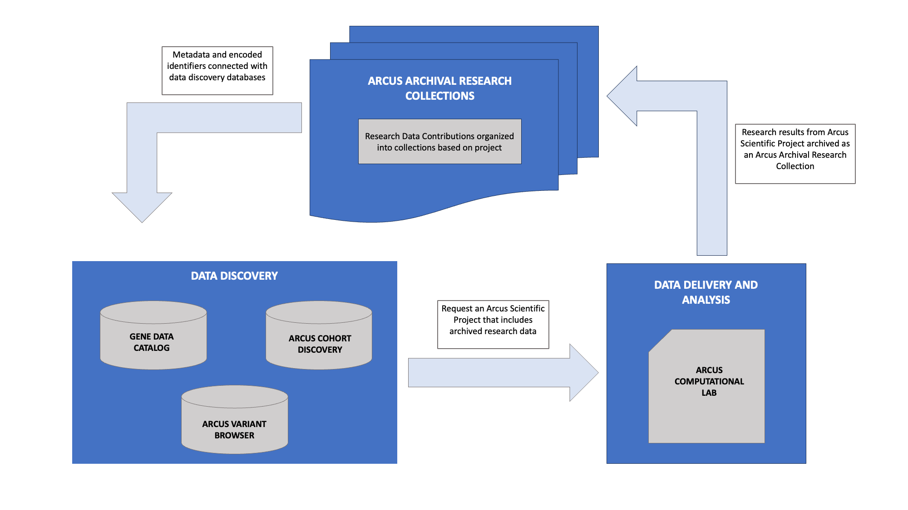
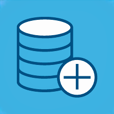

<!--

author:   Arcus Library Sciences
email: dlarcuslibraryscience@chop.edu
version:  1.0.0
current_version_description: Brief description of why this version exists
module_type: standard
docs_version: 1.1.0
language: en
narrator: UK English Female
title: Arcus Data Contribution Orientation
comment:  Learn about archiving research data with Arcus
long_description: Arcus Archives is the canonical repository for research data at CHOP. Archiving research data preserves the important research performed at CHOP according to archival standards while facilitating data sharing. This module reviews reasons to archive research data at Arcus, and the data scoping, privacy review and technical considerations taken before receiving data. Module 2 covers the steps of archiving the data at Arcus.

estimated_time: 30 minutes

@pre_reqs
It's helpful to have reviewed the [Arcus website](https://arcus.chop.edu) at  (available only on the CHOP network), to understand Arcus’s overall goals.

@end

@learning_objectives

After the completion of this training module, learners will be able to:

* Justify archiving research data with Arcus
* Know the tools Arcus uses for sharing data at CHOP
* Understand the steps taken before transferring data to Arcus for archiving.

@end

import: https://raw.githubusercontent.com/arcus/education_modules/main/_module_templates/macros.md
-->

# Arcus Data Contribution Orientation

## Overview

@comment

### Is this module right for me?

@long_description

### Details

**Estimated time to completion**: @estimated_time

**Pre-requisites**: It's helpful to have reviewed the [Arcus website](https://arcus.chop.edu) (available only on the CHOP network), to understand Arcus overall goals.

**Learning Objectives**:

@learning_objectives

Hi! This document is still under construction and testing. We apologize in advance for any broken links or unclear language. We invite your feedback. Please add a [support ticket](https://support.arcus.chop.edu/servicedesk/customer/portal/6/create/249) or [email Arcus Library Sciences](mailto:dlarcuslibraryscience@chop.edu) to let us know what we can improve or suggest additional topics.

Please note that **many of the links here will only work if you're on the CHOP network**.

## Audience

This module introduces the CHOP community to archiving research data in Arcus. It is useful to ANYONE at CHOP involved in creating, managing or analyzing research data.

Archiving and reusing research data is a core element of the Arcus program. Arcus is a suite of tools and services for CHOP’s research community that seamlessly links biological, clinical, research, and environmental data. The Arcus team is comprised of seasoned professionals who support the CHOP community in:

- Discovering and analyzing rich data about patients and research participants using datasets from across CHOP
- Direct access to clinical data and annotations of clinical notes
- Performing analysis in a secure computational environment
- Preserving and discovering research data
- Connecting with other researchers to spur new ideas, efforts, collaborations

All Arcus tools and services are free and open to all CHOP affiliated faculty, staff, fellows and registered NTP (non-traditional personnel) who have met all CHOP, Arcus, and regulatory requirements!

<b style="color: rgb(var(--color-highlight));">Learning connection</b> 

For more information about Arcus and the data and tools and support available through the program, please see the [Arcus homepage](https://www.research.chop.edu/applications/arcus).

### In progress data contributors  

Thank you for agreeing to contribute your data. This module documents the steps you are taking with the Arcus team, and links out to other resources and information about Arcus and Research Data Management.

This module can be used as a reference while you navigate the archiving process, please reach out to the Digital Archivist if you have further questions. Please share this module with others on your research team involved with preparing the data contribution, or other researchers that may be interested in archiving data with Arcus.

### Future contributor

This module is an overview of archiving data with Arcus. We are happy to meet with researchers at all phases of research for research data management consultations and planning for future archival contributions. This includes early in your research project, as we can help set up a project template file directory structure for storing data and recommend metadata and organization best practices. In addition to this module, there are additional data management resources available on CHOP’s [Arcus resources page](https://www.research.chop.edu/applications/arcus/resources).

If after viewing this module, you are prepared to archive data with Arcus, please fill out [the following request](https://pm.arcus.chop.edu/servicedesk/customer/portal/6/create/256) to start the process.

### Arcus Lab users who have data to contribute  

When appropriate, archiving your research in Arcus is expected with a Scientific Project with an Arcus Lab. This is documented in the [Arcus Terms of Use](https://arcus.chop.edu/terms-of-use). Archiving is required if you would like to move any data created within an Arcus Lab to a new Scientific Project with an Arcus Lab or if other research teams would like to re-use your data.

When you are ready to archive your lab data, please submit the following request in the [Arcus Help Center](https://pm.arcus.chop.edu/servicedesk/customer/portal/6/create/256) to begin the data contribution process.

During the orientation for your Arcus Lab, you should have received an orientation to the Project Template structure. A review of this information will be arriving soon in a second training module here, and is also available  in this [Arcus forum post](https://forum.arcus.chop.edu/t/the-arcus-project-template/255). Prior to archiving, the research data and all associated reference information needs to be organized in the project template directory preloaded into your lab. If you need assistance in arranging your data, please request a consultation by the Arcus Library Sciences team using the [following link](https://jira.arcus.chop.edu:8443/servicedesk/customer/portal/6/create/278?q=rdm&q_time=1690816635148).

## Why contribute?

One of the primary functions of Arcus is to link otherwise disparate data sources to enable new opportunities for CHOP researchers and to accelerate the path to discovery. Contributing data to Arcus allows us to achieve this goal in that research data sets can be discovered along with and linked to other research data sets, clinical data sources, and computational tools.

We have designed the data contribution process to be iterative and to complement the diverse needs of the research institute’s user community. Some Arcus projects that are hosted on or dependent on other Arcus or DBHi services (registry or cohort creation, for example) also have a data contribution component that is part and parcel of this research effort.

### Data Reuse

**Collate data in Arcus for use in lab**

As mentioned, contributing research data is prerequisite to working with that data in an Arcus lab. Once data is stored in Arcus it can be both integrated with a variety of data sources and successfully delivered to a lab. Our privacy team has regulatory language that allows for expansive and evolving integration. Arcus labs are available at a persistent web URL that facilitates collaborative research across multiple users.

**Open Science initiatives**

Broadly speaking, Open Science Initiatives promote making publicly funded research data more widely available and collecting and organizing these data in a way that makes them reusable. For example, as of 2023, all NIH funded studies regardless of size must develop a [data management and sharing plan](https://www.research.chop.edu/sites/default/files/2022-11/DBHi_Converting_Resource_DMSP.pdf) which stipulates data is ultimately deposited in a searchable data repository. Archiving your data in Arcus ensures that your data is in compliance with this requirement.

### Grant Requirements

**FAIR Data**

<!-- style = "max-width: 600px" -->

[Findability, Accessibility, Interoperability, and Reusability](https://force11.org/info/the-fair-data-principles/) (FAIR) are four guiding principles that emphasize the need to standardize how machines find and utilize data. They were introduced in 2016 for scientific data management and stewardship.

Arcus has put in place research data archives and library-based discovery services for searching those archives to assist the depositing, management, discovery, and reuse of data. Together with the rest of the Arcus team, a group of librarians and digital archivists establishes the archival procedures and standards and defines the metadata schemas that will direct the creation of the FAIR-compliant data discovery catalog and other services.

### Cost savings 

**Version control and citation standard**

Depositing your data in Arcus removes the headaches associated with ongoing maintenance such as technology going stale or conflicting version histories. Arcus provides a citation standard for all archived datasets that facilitates the publication process and enables the tracking of future uses of your research. Sample grant language and citation examples can be found at [this post](https://forum.arcus.chop.edu/t/arcus-citation-and-recognition/316) on the Arcus Forum.

**Preservation of data and study**

<em> Secure and preserved in Amazon Web Services (AWS) and Google Cloud Storage (GCS) servers. </em>

Digital preservation is more than file transfers and secure storage, it’s about making sure that what’s preserved is understandable and reusable in the future. To that end, Arcus archives more than just the data, it preserves the software, tools, code, and metadata that were central to the research. The Arcus Library Science team will work with you to make sure your data is structured, organized, and described so that whether it’s you looking to revisit your data, or other researchers looking to answer new questions, it will be easy to work with.

## How is it shared?

Arcus maintains a lifecycle of all archived research data. This data is discoverable through three Arcus data discovery tools: Arcus Cohort Discovery, Arcus Variant Browser and the Gene Data Catalog.

- **Arcus Cohort Discovery**: filters deidentified clinical data based on the cohort for the research data set
- **Arcus Omics Variant Browser**: view and filter all annotated variant information for all genomic files in the Arcus archives
- **Gene Data Catalog**: view the metadata (data about the data) for all the research collections within Arcus, and easily request data

The [Gene Data Catalog](https://chop.alationcloud.com) is available to everyone with CHOP credentials. Access to Arcus Cohort Discovery and Omics Variant Browser requires completion of the CITI Human Subjects Protection training and agreement to the Arcus Terms of Use, in addition to CHOP credentials. For more information about accessing the Arcus tools, [see this Job Aid](https://assets.arcus.chop.edu/arcus_education_assets/job_aids/arcus_cohort_discovery.pdf).

If a researcher would like to use the archived data in a research project, it will be delivered to an Arcus Scientific Project with an Arcus Computational lab. Arcus vets all requests to work with data according to the nature of the request and the limitations of the data in question. Research results from Arcus Scientific projects will be archived as new research data collections in Arcus.

### Arcus Cohort Discovery

Arcus Cohort Discovery (ACD) is a filtering and exploration tool for deidentified clinical CHOP date pulled from Electronic Health Records (EHR). It is ideal for feasibility analysis and research planning allowing for preliminary cohort building for future research projects.  
The EHR data is simplified to commonly used fields in data requests – things like age, sex, race, ICD codes, and recency of care. This tool allows you to do basic searches to identify cohorts (groups of patients) that share common features, filtering along inclusion and exclusion criteria. EHR data can also be filtered using researcher created reference cohorts research datasets, and biospecimen samples available in CHOP’s Biorepository. ACD enriches the research datasets, as users can see further detail related to the research collection cohort, or see the overlap of participants between research collections.

<b style="color: rgb(var(--color-highlight));">Learning connection</b> 

For more information about Arcus Cohort Discovery, please see the [general job aid](https://assets.arcus.chop.edu/arcus_education_assets/job_aids/arcus_cohort_discovery.pdf), and the [job aid for data filtering](https://assets.arcus.chop.edu/arcus_education_assets/job_aids/arcus_cohort_discovery_filters.pdf).

### Arcus Variant Browser

The Omics Variant Browser is an application for browsing annotated variant call format (vcf) files across research data collections, such as the Birth Defect Biorepository and the Epilepsy Genetics Research Program. The vcf files annotations include GENCODE, OMIM, NOMAD and Clinvar. More collections and annotations will be added over time. The application is available to everyone with Arcus access.

Arcus intends to add all collections with Whole Genome or Whole Exome Sequenced files to the Omics Variant Browser.

<b style="color: rgb(var(--color-highlight));">Learning connection</b> 

For more information about this tool, see this [Arcus Forum post](https://forum.arcus.chop.edu/t/omics-variant-browser/493).

### Gene Data Catalog

Gene is CHOP’s enterprise data catalog co-managed by Arcus and the Information Services Data Trust Office. With Gene, you can search and browse data assets at CHOP, including:

- Arcus Research Data Collection
- Arcus Reference Cohorts
- Arcus Data Repository Schema
- Arcus GIS resources
- CDW and Clarity Tables
- Objects from Qlik Sense or View and R Studio Connect

In Gene, users can search and browse all research data collection metadata. This includes, among other values: project descriptions, filetypes in the collection, Principal Investigators, and data use restrictions. If a user finds a collection they would like to use in research, they are able to start the request process with Arcus in Gene.

<b style="color: rgb(var(--color-highlight));">Learning connection</b> 

For an introduction to Gene see the [Gene 101 introduction page](https://chop.alationcloud.com/article/912/gene-101-intro-to-gene). For information about Arcus cohort and research data information in Gene, see the [Arcus and Gene article](https://chop.alationcloud.com/article/912/gene-101-intro-to-gene).

### SCIT labs

When a request for archival data is approved, it will be delivered to an Arcus Computational Labs (or Arcus labs for short). Arcus labs are virtual and secure computational environments for clinical data focused research. Labs are configured to meet the requirements of the data or research project requested, with appropriate memory, CPU, and storage capabilities as needed. All labs are configured with open source statistical and data analytics software, including: JupyterLab with language kernels such as Python, RStudio using R, and SQL browser. Arcus Labs accessed on the web using a URL and all members of your team with access to the lab will have the same environment and data. Exporting data from an Arcus Lab is generally prohibited; therefore, this capability is disabled by default. Instead, Arcus Labs are designed for all exploration and analysis to occur within the secure environment of the Arcus Lab itself. Exceptions to the rule against exporting data, such as exporting data for the purpose of publication, are governed by the[Arcus Terms of Use](https://arcus.chop.edu/terms-of-use).

<b style="color: rgb(var(--color-highlight));">Learning connection</b> 

For more information about requesting and using an Arcus Lab, please see the [Arcus Lab Orientation module](https://liascript.github.io/course/?https://raw.githubusercontent.com/arcus/Arcus_Labs_Orientation/main/arcus_orientation.md#1).

## Pre-Data Contribution 

<!-- style = "max-width: 150px;" -->

Before transferring the data, data contributors will meet with an Arcus Digital Archivist to determine whether the data is appropriate for archiving in Arcus. These conversation will determine the data to be contributed, discuss the data contribution process and figure out responsibilities for preparing information.

Before transferring any data, the Digital Archivist will manage the process of: **scoping of data to contribute**, **reviewing the research project for privacy and regulatory issues**, and **creating a plan for the technical considerations of preparing and transferring data**.

### Scope of Contribution

Arcus has standards for contributing data that require some remediation. This is covered in the the second module of this series focused on the [Project Template Directory Structure](https://liascript.github.io/course/?https://raw.githubusercontent.com/arcus/Arcus_Labs_Orientation/main/data_contribution_2_data.md#1) that covers the data preparation workflow in greater detail. If your research is deliberately phased or continually enrolls participants, we can establish a plan of work and cadence for your data submissions.

Data generated in the course of CHOP research will be archived in approved formats, including, but not limited to:

- Genomic data
- Clinical data specifically designated for research use
- Research datasets (raw, processed, analysis, reporting)
- Audiovisual files (images, videos)
- Representative innovative technology
- Representative research datasets produced using data provided by Arcus
- Data resulting from animal studies

In addition, data and files that provide valuable context and support reusability will also be archived. This includes, but is not limited to:

- Project documentation (IRB data, descriptive metadata, administrative information, grant reports, manuals, patient questionnaires)
- Databases, spreadsheets, crosswalks
- Software, scripts, code, logs
- Taxonomies and ontologies
- Cohort definitions
- Readme files and file directory ownership
- Papers/publications

### Privacy Review  

Before any data is archived in Arcus, it is thoroughly reviewed by an Arcus Privacy Analyst to identify potential privacy and regulatory issues. The Privacy Analyst will review the IRB protocol, all consent agreements and data, to determine if it can be shared, and any restrictions on reuse. If the IRB needs to be amended to allow or clarify data reuse, the Privacy Analyst will consult on completing the amendment, including an extensive set of templated language that expedites this process. Arcus can accept a full range of Data Contributions, from those that are completely de-identified to those that are fully identified and including ones that must remain coded. For coded data sets, Arcus offers honest broker services so that data retains its linkages without violating the privacy concerns of patients and researchers.

Based on the privacy review, a Data Contribution Agreement will be created that will be signed by the Principal Investigator. The Data Contribution Agreement is an agreement between the Data Contributor and Arcus that outlines a Contributor’s role in contributing archival data to Arcus and allowing for the sharing and use of such archival data.

As part of the archiving and metadata process, data use terms specified in the Data Contribution Agreement will be added to the description for the collection. The description will also include information about the academic attribution of the data and creators. When data is requested for reuse, these terms will be reviewed and complied with before data delivery. Though Arcus does not allows conditions to be placed on data reuse outside what is required by the IRB protocol and consent documents, we can inform you when the data is reused in a new project if requested.

<b style="color: rgb(var(--color-highlight));">Learning connection</b> 

A general version of this agreement is viewable at [this link](https://arcus.chop.edu/privacy-and-forms/data-contribution-agreement). Your research data is tagged with the appropriate access and use conditions in Arcus discovery tools once it is fully archived. Arcus has an [additional agreement](https://arcus.chop.edu/privacy-and-forms/t-and-c-for-previous-datasets) that authorizes the use of previously collected research data sets. Other Arcus Library Sciences privacy documents are available on PolicyManager including the [Collection Management Policy](https://chop.policymedical.net/policymed/anonymous/docViewer?stoken=14de2fa8-d9f5-4188-983b-29545b20809f&dtoken=5ec24efe-4ad6-4eb6-88ed-6814e94ad45e) and the [Data Sharing and Attribution Policy](https://chop.policymedical.net/policymed/anonymous/docViewer?stoken=14de2fa8-d9f5-4188-983b-29545b20809f&dtoken=83ad177b-a806-4ddd-8fbb-a42acf9b889d).

### Technical Considerations   

The transfer of study data files and the required contextual information is the final step before the archiving process kicks off. All contributed files will be arranged in the our Project Template Directory structure, which will be covered in the next module [LINK] and a [GitHub repository](https://github.research.chop.edu/arcus/rdm-project-template) with more detail about the structure.

Depending on the size of your dataset, a variety of technical solutions are available at CHOP to facilitate the transfer. For large collections, like many omics projects or longitudinally collected clinical datasets, Arcus will provision a secure cloud to cloud transfer or set up an especially provisioned Isilon share. Isilon shares are NAS (network attached storage) arrays configured and managed by [CHOP's Research Information Services](https://www.research.chop.edu/ris-infrastructure-services). They are provisioned using Microsoft Active Directory permissions, and are easy to set up access for any CHOP credentialed staff member.

For smaller datasets, the Digital Archivist can complete the file transfer, once given permission to the project file location within CHOP applications. This includes [RedCap](https://redcap.chop.edu), a GitHub project, or a OneDrive folder.

Arcus has user resources available to help with the organization of your data at any stage in your research timeline. The Digital Archivists and technical experts at Arcus are partners in transferring the data. If needed, they can advise and support transferring files and formatting the needed metadata.
