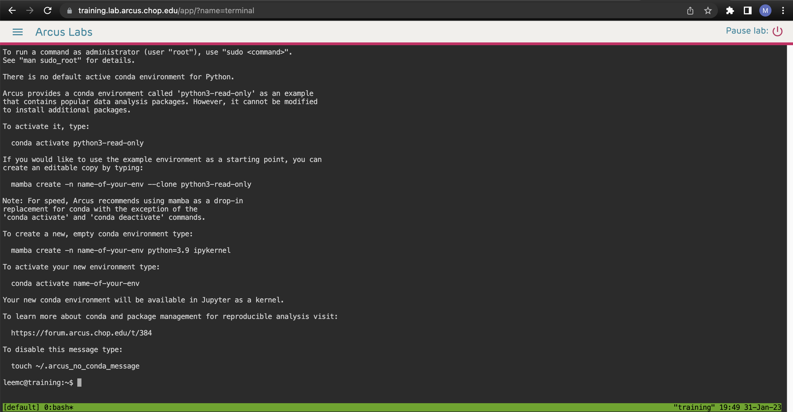

<!--
link:  https://chop-dbhi-arcus-education-website-assets.s3.amazonaws.com/css/styles.css
script: https://kit.fontawesome.com/83b2343bd4.js
title: Arcus Labs Orientation
-->

# New to Bash?

Do you need to how to use the "shell" (or bash, the command line, or the terminal) and don't know where to start? This guide will provide a very brief overview of what these are, and will give you some resources where you can find more information. 

**What is the Shell?**

The "shell" is an program that allows you to interface with your computer by passing commands directly to the operating system. One of the most common shell programs is called a **bash** shell (this is what is used in the Arcus Labs). Usually, users interact with the bash shell using a **command-line interface**, or CLI. In the Arcus Labs, this interface is called the **Terminal**.

**Why use bash in the Terminal?**

Interacting with a computer using bash and a CLI like the Terminal has several benefits:

* Preparing files for processing, and actually processing them, can be time-consuming and error-prone to do one file at a time. 
* By writing bash **scripts** and running them in the Terminal, you can repeatedly perform a series of commands on a file (or multiple files). 
* Bash scripts can make use of other programming languages (like R or Python), other applications, and APIs. 
* Using scripts (which can be saved and run over and over again on new data) helps make your analyses reproducible! 

##  Resources

Bash can be challenging to learn, but you have several options when it comes to growing in your skills.

We have created several bash training modules as part of the [DART (Data and Analytics for Research Training) program](https://arcus.github.io/education_modules/).

DART includes dozens of data science modules that are each 1 hour or less in duration and with a narrow focus and clear learning objectives.  They are asynchronous and you can take them at any time!

Training modules:

[Bash / Command Line 101](https://liascript.github.io/course/?https://raw.githubusercontent.com/arcus/education_modules/main/bash_command_line_101/bash_command_line_101.md)

[Bash: Searching and Organizing Files](https://liascript.github.io/course/?https://raw.githubusercontent.com/arcus/education_modules/main/bash_command_line_102/bash_command_line_102.md)

[Bash: Conditionals and Loops](https://liascript.github.io/course/?https://raw.githubusercontent.com/arcus/education_modules/main/bash_conditionals_loops/bash_conditionals_loops.md)

[Bash: Combining Commands](https://liascript.github.io/course/?https://raw.githubusercontent.com/arcus/education_modules/main/bash_103_combining_commands/bash_103_combining_commands.md)

[Bash: Reusable Scripts](https://liascript.github.io/course/?https://raw.githubusercontent.com/arcus/education_modules/main/bash_scripts/bash_scripts.md)

Additionally, beyond the DART modules, we have other articles and miscellany we suggest, whether those are resources we've created in Arcus.

**Compendia of Resources**:

Tutorials: 
* [Learning the Shell from LinuxCommand.org](https://linuxcommand.org/lc3_learning_the_shell.php)
* Software Carpentries offers an [open source course introducing new users to the Unix Shell](https://swcarpentry.github.io/shell-novice/)
* The Earth Lab at University of Colorado, Boulder has a nice [bash tutorial](https://www.earthdatascience.org/courses/intro-to-earth-data-science/open-reproducible-science/bash/bash-commands-to-manage-directories-files/)
* MDN Web Docs, a project that documents a number of Web platform technologies has a [detailed crash course in bash](https://developer.mozilla.org/en-US/docs/Learn/Tools_and_testing/Understanding_client-side_tools/Command_line)

Cheat sheets:

* [https://github.com/RehanSaeed/Bash-Cheat-Sheet](https://github.com/RehanSaeed/Bash-Cheat-Sheet)
* [https://devhints.io/bash](https://devhints.io/bash)

