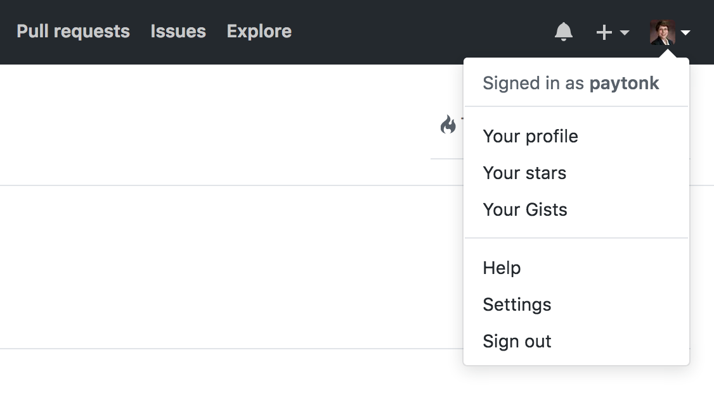

<!--
import: https://raw.githubusercontent.com/arcus/education_modules/main/_module_templates/macros.md
title: New to GitHub?
-->

# New to GitHub?

This is a guide for Arcus Lab users who want to get started with GitHub.

This guide assumes some familiarity with git and version control already. 
If terms like "commit," "repository," and "clone" are new to you in the context of version control, we recommend you check out [New to Version Control](https://liascript.github.io/course/?https://raw.githubusercontent.com/arcus/Arcus_Labs_Orientation/main/new_to_version_control.md#1) first and then come back here. 

## Git vs. GitHub

**Git** is a version control system. 
You can use git to keep track of changes in your files over time, including files you edit collaboratively with others on your team. 

There are a few different ways to use git.
The most basic way is with command line tools, but there are also lots of programs available that make it possible for you to use git in a graphical user interface (GUI).
In an Arcus Lab, you have access to the Terminal to use the command line, and you also have RStudio, which includes a GUI for git. 

<div class = "learn-more">
<b style="color: rgb(var(--color-highlight));">Learning connection</b><br>

For more context about git and version control, see [What is Git?](https://liascript.github.io/course/?https://raw.githubusercontent.com/arcus/education_modules/main/git_cli_vs_gui/git_cli_vs_gui.md#what-is-git?)

</div>

**GitHub** is a website that uses git and makes it a bit easier to use. 
There are other big players in the market that use git, but GitHub is the most popular platform that people tend to use with the git protocol. 

GitHub provides a few very helpful additions to your workflow, over just using git: 

- The visual interface on GitHub provides options for reviewing file history, comparing versions, and merging files that many people find much easier to use than the corresponding command line tools in git. If you're new to git, or new to programming in general, using GitHub can make learning git a little easier.
- GitHub expands some of the functionality of git to include more tools for collaboration. It provides options for issue tracking, comments, and discussion in addition to the version control features of git. 
- GitHub provides a "remote" version of your repository, which means you can easily share your code with others. 

## Why GitHub?

While git by itself is great at version control and keeping track of your changes, GitHub wraps all of the sometimes complex inner workings of git into a visually pleasing, easy to understand user interface. 
GitHub allows you to see things like version history, file change summaries, etc., very simply. 
It’s fairly intuitive for most day-to-day uses.

GitHub is also a very convenient way to publish your analysis code, to share with others in your field.
Your Arcus Lab provides a shared space for you and the other people on your study team to work together and share code, but when in comes time to publish your work you'll want to be able to share your code more broadly.
GitHub has become one of the most popular venues for publishing and sharing code associated with research projects.
Indeed, you may find that your publishers and/or funders *require* you to share your code openly; GitHub is the most straightforward way to do that.

There is a public GitHub website that you can use to host your files for free, if you don’t mind them being public and visible for all to see (https://www.github.com). 
CHOP also has a local GitHub server that looks and acts almost 100% the same as the public GitHub site, but it’s local to CHOP, so you don’t have to worry about violating intellectual property rules (or, if you make your data sufficiently private, even HIPAA worries). 
That can be found at https://github.research.chop.edu.

<div class = "important">
<b style="color: rgb(var(--color-highlight));">Important note</b><br>

We recommend using [CHOP's enterprise GitHub](https://github.research.chop.edu) for the code from your Arcus project, because it provides an additional layer of security as the files remain on CHOP's servers. 

</div>

## Explore a repo on GitHub

For example, check out a CHOP GitHub page with an example analysis script. 
Here’s the link: https://github.research.chop.edu/Hartmanr1/my_project. 

You don’t have to be logged in to CHOP’s GitHub to look at this, by the way, but you do have to be on the CHOP network. 

It shows just two files: The script (analysis.Rmd) and a README file.
Let's focus on analysis.Rmd.
Even though there's only one analysis file, you can look at all sorts of different versions of it, but it’s only one file. 
No cluttering things up with extra files named "\_v1", "\_v2", "\_v2updated" and so on!

The author of this repo made a few changes to this analysis file that might mimic the natural exploration process of a real study, and saved various versions along the way (using git’s “commit” function). 
Let’s take a look at what this repository has in it. 

### What's in a GitHub repo?

Let’s take a look at a few elements of this repo.


**(1) Branches**

Branches are used when you want to simultaneously hang on to several “correct” or “most recent” versions, not just your main (or “master”) version. 
In this case, we need to separately keep track of the scripts that are associated with various publications, so the author started a “NEJM paper” branch just to keep track of what we sent to the New England Journal of Medicine. 
Click on the “2 branches” text to see them.

**(2) Commits**

A “commit” happens when someone (a programmer, a data analyst, a researcher) decides that they’ve changed the file enough that they want to save a version of it for posterity. 
When you commit a file, you are asked to give a comment describing what you did. 
Sometimes, in larger groups (like programmers working on a big software project), there will be some agreed-upon way to write these, but really you can put whatever you want. 
A commit could be a change or two to one file, or multiple changes across several files.

The number of commits shown in this dashboard means the number of commits in the “default” branch (usually called “main”). 
You can click on the “4 commits” text, however, and see a drop-down menu that will allow you to see the commits for any branch of the repo. 
Here's the commit history for the "main" branch in this repo:


**(3) Contributors**

Even if you make your GitHub repository public, that only makes it public for reading, not for making changes. You have to expressly give permission for people to become contributors (people who can commit file changes). Or, someone who’s not a contributor, but has access to your repository, can make some changes and request that you apply them (called a pull request or PR).

**(4) README**

README.md is a “markdown” (thus, .md) file that provides valuable context for anyone trying to understand your repo (including Future You!). 
It explains what the repository contains, how to use it, and so on. 

<div class = "learn-more">
<b style="color: rgb(var(--color-highlight));">Learning connection</b><br>

For tips on how to write an effective README, see [Make a README](https://www.makeareadme.com/).

</div>

## Set up your own repo on GitHub

Go to [CHOP's enterprise GitHub](https://github.research.chop.edu/).
Remember, you need to be on CHOP's network to access this webpage.

You can log in with **your regular CHOP credentials** (the same username and password you use to sign in to Arcus) by clicking on “Sign in” in the upper right:


Once you’ve logged in successfully, click on your user avatar (for now it’ll be a weird geometric shape) in the upper right hand corner, and choose “Profile”. 
Then you can do things like add your photo (click on the avatar to change it), or add a bio. 
It’s sometimes actually convenient to have your photo attached to your profile, because it makes it easier to see quickly who’s done which changes at a glance. 
Your call!



To create a new repo, find the ‘+’ button in the top bar and choose “New Repository”. 


Name it whatever you like, and add a description. 
For now, choose “Private” as your repository. 
(You can change these easily later, if you change your mind; these pieces of data are not themselves under version control.) 
Now the green button at the bottom should be lit and you can click on “Create repository”.


Once you've created the repository on GitHub, you can connect your Arcus Lab git project to it.

<div class = "help">
<b style="color: rgb(var(--color-highlight));">Troubleshooting help</b><br>

Don't have a git project set up in your Arcus lab yet?
Learn about how to do that in [Creating a Git Repository](https://liascript.github.io/course/?https://raw.githubusercontent.com/arcus/education_modules/main/git_creation_and_tracking/git_creation_and_tracking.md#1).

</div>

Follow the instructions to "push an existing repository from the command line" that appear on GitHub after you create the repository.
You can copy that code from the webpage and then paste it into the Terminal application in your lab.


<div class = "help">
<b style="color: rgb(var(--color-highlight));">Troubleshooting help</b><br>

Want help setting this up? 
Reach out to Arcus Education by [submitting a request for support](https://support.arcus.chop.edu/servicedesk/customer/portal/6/create/249?summary=Connecting%20my%20lab%20to%20CHOP%27s%20enterprise%20GitHub) or by signing up for an appointment during [Arcus Education office hours](https://outlook.office365.com/owa/calendar/BKG-StandardArcusEducationOfficeHours@chop.edu/bookings/). 
We can set up a meeting to walk you through the steps.

</div>

## Using git and GitHub in your Arcus lab

There are two main ways to use git in an Arcus lab: 

- with [command line tools in the Terminal application](https://liascript.github.io/course/?https://raw.githubusercontent.com/arcus/Arcus_Labs_Orientation/main/new_to_version_control.md#learning-git)
- by setting up a project in RStudio and enabling git

<div class = "learn-more">
<b style="color: rgb(var(--color-highlight));">Learning connection</b><br>

Want to get started using the command line? 
Check out our Arcus guide for researchers [new to bash](https://liascript.github.io/course/?https://raw.githubusercontent.com/arcus/Arcus_Labs_Orientation/main/new_to_bash.md#1).

</div>

If you prefer a visual interface for version control, then you may like to use RStudio even if you're not writing R code. 

To use git in RStudio, you first need to [create an RStudio project](https://support.posit.co/hc/en-us/articles/200526207-Using-RStudio-Projects). 
Then you can go to the Tools menu at the top of RStudio and select "Project Options". 
Click the "Git/SVN" option on the left, and then select "git" from the dropdown menu for "Version control system".

<div class = "learn-more">
<b style="color: rgb(var(--color-highlight));">Learning connection</b><br>

For a much more detailed (and very well-written!) guide to using git and GitHub in RStudio, see the popular online book [Happy Git with R](https://happygitwithr.com/)

</div>

## Avoid unintentional data exposure

<div class = "warning">
<b style="color: rgb(var(--color-highlight));">Warning!</b><br>

Be extremely careful not to commit any files that contain data. 
This includes [interim](https://liascript.github.io/course/?https://raw.githubusercontent.com/arcus/Arcus_Labs_Orientation/main/data_contribution_2_data.md#data/interim) and [endpoint](https://liascript.github.io/course/?https://raw.githubusercontent.com/arcus/Arcus_Labs_Orientation/main/data_contribution_2_data.md#data/endpoints) data files you've saved, but it also may include other files that have data fields in the output, such as notebooks or reports. 

A common example is a Jupyter notebook used for analysis: 
If you commit while there is output present in the file, then that output becomes part of the commit history on the project. 
If the output includes data, it's a violation of the [Arcus terms of use](https://arcus.chop.edu/terms-of-use) to push that to GitHub -- and depending on the nature of the data and how your GitHub repository is set up, it may be a HIPAA violation as well. 

</div>

To avoid accidentally committing data, we recommend the following:

- Add the line `/data/*` to [your .gitignore file](https://liascript.github.io/course/?https://raw.githubusercontent.com/arcus/education_modules/main/git_creation_and_tracking/git_creation_and_tracking.md#telling-git-not-to-track-some-files). This will automatically prevent you from committing any files saved in the `data` subdirectory unless you specifically override it. 
- If you use Jupyter notebooks, consider using a [pre-commit hook to automatically clear output from your notebooks](#how-to-use-a-precommit-hook-to-clear-output). Instructions are available in the next section.
- If you use .Rmd files, you don't have to be concerned about output being committed in the .Rmd since the file itself never includes the output from code blocks. But if you are version controlling knit reports (for example, .md, .html, .doc, or .pdf files), then you need to make sure there's no data present in the final knitted report. 

<div class = "learn-more">
<b style="color: rgb(var(--color-highlight));">Learning connection</b><br>

For more explanation about the circumstances in which it is and isn't okay to take data out of an Arcus Lab, see the post [Can I export data from an Arcus Lab?](https://forum.arcus.chop.edu/t/can-i-download-or-export-data-from-an-arcus-lab/188)

</div>

### How to use a precommit hook to clear output

**If you don't have any .ipynb files in your repository, feel free to skip this section.**

You can set git up to clear your Jupyter notebook output for you automatically by using a pre-commit git hook. Here's how:

1. In your repo folder, open the .git directory (note that it may be hidden because it starts with a .), then open the hooks directory within it.
2. Open pre-commit.sample and delete the contents (don't worry --- it's just example text that isn't doing anything). Replace them with:

```
#!/bin/bash
/opt/conda/bin/jupyter nbconvert --ClearOutputPreprocessor.enabled=True --inplace notebooks/*.ipynb

if [[ `git diff --name-only` ]]; then
  echo "Commit stopped. There was output in one or more notebooks. You'll need to re-stage and then re-commit."
  exit 1
else
  echo "No output! :)"
  exit 0
fi
```

3. Change the file name from `pre-commit.sample` to just `pre-commit` with nothing after it. (Note that if you choose to save a new file as `pre-commit` rather than editing the `pre-commit.sample` file and renaming it, you'll have to [add an extra step to make your new file executable](https://stackoverflow.com/questions/8598639/why-is-my-git-pre-commit-hook-not-executable-by-default). If you just start with the existing `pre-commit.sample` file, it should be executable already.)

Now whenever you commit **anything** in the repo, the command in the pre-commit hook will run, clearing output from **all** .ipynb files in the notebook directory. 
If you were trying to commit a jupyter notebook and it had output in it, your commit will fail; the output will be cleared for you, but you'll have to re-stage the file and re-commit.

Note: If the git hook isn't working, check that you can run the jupyter command in the hook. 
Go to your main repo folder, and run that command from the command line. 
If it fails you may need to run `conda install -c conda-forge jupyter_contrib_nbextensions` and try again.  

<div class = "help">
<b style="color: rgb(var(--color-highlight));">Troubleshooting help</b><br>

Want help setting this up? 
Reach out to Arcus Education by [submitting a request for support](https://support.arcus.chop.edu/servicedesk/customer/portal/6/create/249?summary=Using%20a%20precommit%20hook%20to%20clear%20output%20in%20a%20jupyter%20notebook) or by signing up for an appointment during [Arcus Education office hours](https://outlook.office365.com/owa/calendar/BKG-StandardArcusEducationOfficeHours@chop.edu/bookings/). 
We can set up a meeting to walk you through the steps.

</div>

## Additional resources

Check out our [Git 102 tutorial](https://education.arcus.chop.edu/git-102/) for more details on setting up and exploring repositories on GitHub. 
(Note that it includes instructions about using the GitHub Desktop app, which is not available in Arcus Labs.)

[GitHub publishes excellent interactive tutorials](https://skills.github.com/) that will teach you about git and GitHub right within the site. 
Note that these lessons all take place on public GitHub (not CHOP's enterprise GitHub), but the functionality should be the same.

To get more practice with git and GitHub, look around at the various [public repos available on GitHub.com](https://github.com/explore) or [CHOP’s enterprise GitHub](https://github.research.chop.edu/repositories). 
Can you figure out how to look at older versions in their entirety? 
How to look at just the lines changed from one version to the next?
