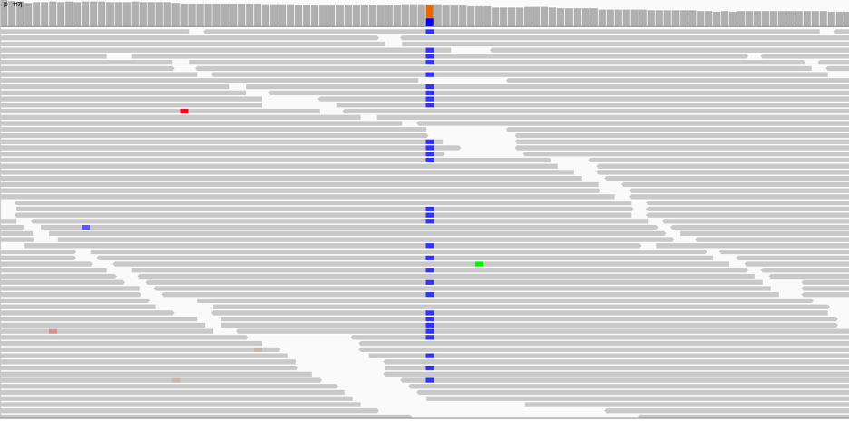

<!--
link:  https://chop-dbhi-arcus-education-website-assets.s3.amazonaws.com/css/styles.css
script: https://kit.fontawesome.com/83b2343bd4.js
title: Arcus Labs Orientation
-->

# Arcus Omics Guide to Exome Analysis

Shridhar can we write a short summary of this document? 

## Audience

The aim of this training is to bring researchers at the Children's Hospital of Philadelphia up to speed fast on:

* What an Arcus lab is
* What the Arcus Lab includes

This training module will be useful for you whether you already have an Arcus Lab as part of an Arcus Scientific Project or you're just getting to know what the various Arcus tools are. 

Some materials here are practical instructions for people who already have Arcus labs, and some materials are introductory and explain what an Arcus lab is.  The table of contents on the left can help you navigate through the materials and allow you to learn just what matters most to you.

<div style = "clear: both;"></div>

### Future Lab Users

If you don't have an Arcus Scientific Project with an Arcus Lab and you're just here to browse and learn, welcome! 

Here you'll learn about what an Arcus lab is and how to work with it.  But even if you have no interest in an Arcus Lab, this document might be useful.  

While most of the information here is designed for Arcus Labs, our linked material about various topics like R and SQL is broadly applicable, even to folks who aren't working with Arcus. We hope you find it helpful. 

If you would like to learn more about what Arcus is and what we do, check out the [Arcus website](https://arcus.chop.edu).  We'd also suggest you check out the "New to" documents, which are good for every researcher to learn about:

* [New to data science](https://liascript.github.io/course/?https://raw.githubusercontent.com/arcus/Arcus_Labs_Orientation/main/new_to_data_science.md)
* [New to SQL](https://liascript.github.io/course/?https://raw.githubusercontent.com/arcus/Arcus_Labs_Orientation/main/new_to_sql.md)
* [New to R](https://liascript.github.io/course/?https://raw.githubusercontent.com/arcus/Arcus_Labs_Orientation/main/new_to_r.md)
* [New to Python](https://liascript.github.io/course/?https://raw.githubusercontent.com/arcus/Arcus_Labs_Orientation/main/new_to_python.md)
* [New to version control](https://liascript.github.io/course/?https://raw.githubusercontent.com/arcus/Arcus_Labs_Orientation/main/new_to_version_control.md)


## Chapter 1 - Introduction

You’ve got an exome sequence! Maybe even several. But how do you find “real” variants among the maze of gigabytes of A, T, C, and G?

Here, we will explore how to handle whole-exome sequencing data and analyze to identify sequence variants. We will use an example to walk through the analysis pipeline step by step with the goal of identifying a disease-causing variant. The same basic workflows and principles can apply to other sequencing data as well, including panel data, whole-genome or RNAseq data.

You may find it helpful to refresh, review, or introduce yourself to some of the fundamentals, including DNA and sequencing methods: ([separate file](https://github.com/shiva-g/arcus_omics_edu/blob/main/media/AOS_PMBIO_Module02_Inputs_subset.pdf), adapted from [Griffith Lab](https://pmbio.org/course/#module-02-inputs/))

When working with DNA sequences, you often need different information for different tasks. For example, you might want or need the original, raw data without adulteration. This typically has two components. First, there’s the sequence itself, or more accurately, many small sequence reads. This is typically formatted as FASTA:


*Figure 1. A few lines of a FASTA file, which contains raw nucleotide sequences as a string or set of strings, one letter per base.*

The second element is quality information. For instance, for every base that the sequencer calls—for every A, T, C, or G in a read—the machine cannot claim to be 100% accurate, and instead measures how confident it is that it has called that base correctly. These base quality scores are historically stored in a QUAL file:


*Figure 2. A few lines of a QUAL file, which lists base quality (BQ) scores in a sequence for each base in a sequencing read. Reads are demarcated with a header line beginning with “>”.*

Usually when handling large sequencing data, both FASTA and QUAL files are merged so that each read and its quality scores are directly associated. This is called a FASTQ file. Sequencing usually includes paired-end reads, where a given fragment of DNA is typically read from both ends instead of just one. Accordingly, there are two reads per fragment in different directions. All reads in one direction are conventionally stored in one FASTQ, and those in the other direction go in a second FASTQ. For example:


*Figure 3. A portion of a FASTQ file. Each sequencing read is represented in four lines: (1) a header beginning with “@”, (2) the base calls for that read, (3) a “+” character which is just a separator, and (4) the base quality scores in an encoded format.*

Having the sequence read along with quality doesn’t help us to infer much from the data. So, the first step we must take is to compare it to a reference. This requires an alignment map. There are three main file formats for alignment maps, all including the same information (a header, individual sequencing reads from your sample, and the reference genome). They are called SAM (sequence alignment map), BAM (binary alignment map), and CRAM (compressed alignment map).

[SAM](https://samtools.github.io/hts-specs/SAMv1.pdf) files are human-readable; that is, if you know what each part of the file means, you can read it line-by-line. A SAM file looks like this:


*Figure 4. A portion of a SAM file, which contains a header followed by lists of mapped reads. Each row includes identifying information, the read sequence and base quality scores, and details about mapping and alignment.*

In contrast, BAM and CRAM files are in binary format. They are legible to the computer but not to us directly—if you tried to open or view a BAM, this is what you’d see:


*Figure 5. A few lines of a raw BAM file, which is in binary format.*

But this really does contain the same information. Using some software (which we will discuss later), the BAM or CRAM file can be read or inspected if necessary:


*Figure 6. Part of a BAM file, viewed using the Samtools software, which is identical in format and content to a SAM file.*

Sometimes you might need to look specifically at variant calls. Maybe you need to see the differences between your sample sequence and the reference genome. Alternatively, you might just need a list of known, common variants in the population to use as a reference. For these applications, variants are almost always in [Variant Call Format](https://samtools.github.io/hts-specs/VCFv4.2.pdf) (VCF), a very specific tab- delimited text file. VCFs have a header giving specifications for the contents of the file, and then have a table-like structure where variants are the rows and individuals are the columns, looking something like this:


*Figure 7. A VCF header, including information, definitions, and additional details for the content of every field in the VCF body.*


*Figure 8. A few lines of the contents of a VCF file. Variants are specified by chromosome, position, reference nucleotide, and alternate allele. For each variant, variant quality, filter details, and numerous additional metrics are also provided in the QUAL, FILTER, INFO, and sample columns.*

For each variant, the position in the genome, the reference, and the alternate (or mutation) are noted along with additional filtration, quality, format, genotype, and related information. When we encounter VCFs later, we will have a clearer idea of what the most relevant information is.

VCF is also used for a special filetype called a genomic VCF or gVCF, which differs in that there is a row for every single position in the genome, regardless of a variant being detected. In our workflow, we will see that gVCFs also contain some additional confidence measures and information which can be used to obtain a much smaller VCF file that is easier to work with.

A few other files we will encounter along the way are index files with suffixes fai/bai/idx/tbi. These files contain information about corresponding files—FASTA, BAM, VCF, etc.—that allow faster viewing, traversing, and processing these large sequencing files. In fact, many tools often will not function without these index files.

Lastly, a BED file is a tab-delimited file that is used to specify regions of the genome. This has a variety of applications, including telling us what parts of the genome are targeted by the sequencer as exonic regions, and therefore where the “exome” is within the genome. For example:


*Figure 9. Portion of a BED file, which specifies regions of the genome by chromosome, start position, and end position.*

There are also several different software tools that have been developed to work with different genomic data, all run from the [command line](https://digitalrepository.chop.edu/commandline_computingtools/). [Samtools](http://www.htslib.org/) is our main set of programs for working with alignment maps. In order to generate these alignments, we will use [BWA](http://bio-bwa.sourceforge.net/) or the Burrows- Wheeler Aligner software together with [Samblaster](https://github.com/GregoryFaust/samblaster). [PicardTools](https://broadinstitute.github.io/picard/) is another set of command line tools, developed by the Broad Institute in Java, for working with sequencing data. Our standard workflow relies mainly on a suite known as [Genome Analysis ToolKit](https://gatk.broadinstitute.org/) (GATK) developed by the Broad Institute. GATK is based in Java and includes many tools for calling, genotyping, and filtering variants. Finally, the variant output will be processed using [Annovar](https://annovar.openbioinformatics.org/), a tool to annotate variants to better understand their impact. Don’t worry too much about the specifics yet—we will work with features of each of these during our exome tutorial.

Before working through this module, we would recommend being familiar with the [command line](https://digitalrepository.chop.edu/commandline_computingtools/), as nearly all of this workflow takes place within the terminal. It would also be helpful to know some [R](https://liascript.github.io/course/?https://raw.githubusercontent.com/arcus/Arcus_Labs_Orientation/main/new_to_r.md) or [Python](https://liascript.github.io/course/?https://raw.githubusercontent.com/arcus/Arcus_Labs_Orientation/main/new_to_python.md) for the final steps of variant discovery. While you will be using reference files and raw data that are in a shared directory within the Arcus lab space, please ensure your working directory is your folder, `/mnt/arcus/lab/users/[username]`. All of your scripts and all files you generate should appear there! We also supply a copy of all intermediate files that you will create during the workflow, although you likely will not need to use them; these are located at `/mnt/arcus/lab/shared/raw_data/intermediate_files`.


## Chapter 2 - Getting Started with Exome

Before we begin the exome analysis tutorial in full force, let’s take a high-level look at our case example, goals, and workflow.

Our general goal in working with these data is to discover variants, i.e., genetic mutations. These may be variants that are likely to represent monogenetic causes of disease, or rare variants for variant burden analysis, or any number of applications. In our case example below, the aim will be the former—we seek a genetic diagnosis on a research basis for our proband (the affected individual).

This example will be a trio exome; that is, whole-exome sequencing of a proband (child) and both biological parents. The family ID is “FAM1,” and we denote individuals by appending “P”, “M”, and “F” for proband, mother, and father, respectively. This exome data was obtained via clinical genetic testing. The proband is a child with developmental and epileptic encephalopathy (DEE), a type of severe epilepsy in which a single causative variant can be identified in the majority of individuals. However, clinical genetic testing did not reveal such a variant. So, we want to re-examine these exome data as researchers to find variants that could possibly cause this individual’s genetic epilepsy.

In order to discover variants, we will work through a pipeline that begins with very raw sequencing data (FASTQ/CRAM/BAM) and ends with a table of possible variants (VCF/CSV). The essential rationale behind this extensive workflow is that the overwhelming majority of deviations from the reference genome are false positives, and by using measured confidence at every step of the process, we can eliminate most of these false positives at different stages.

The key steps in this process are as follows:
1. Procure raw data for processing
2. Map raw sequences to a reference
3. Detect variants
4. Filter for likely real variants
5. Annotate and filter further to identify possibly causative variant(s)

1. Procure raw data for processing
First, we will realign the exomes. The data we received is in CRAM format, which is already aligned to a reference genome. First, we will realign the exomes. We will decompress the CRAM files to obtain BAM files and de-align these to retrieve the original raw FASTQ files, which will be the starting point for the pipeline.

2. Map raw sequences to a reference
Next, we will align the raw sequence reads (FASTQ) to the reference genome, with a few extra quality-control steps to prepare for more accurate variant calling. The prepared file will be in BAM format.

3. Detect actual variants
We will obtain variant calls for every position where something differs from the reference as per our generated BAM file. Then, we will compute how many copies of the variant, if any, each family member likely has, resulting in a VCF.

4. Filter for likely real variants
We will use quality measures for each variant call to filter and label the variants which are high confidence, along with a few adjustment steps to prepare for annotation and possible identification of a causative variant.

5. Annotate and filter further to identify possibly causative variant(s)
From the fully processed VCF file, we will label variants with useful information, such as genes they are located in and frequencies in population databases. We will also compute whether each variant in the proband is inherited from the mother, father, or neither (de novo). This will allow us to filter and search for variants more meaningfully, hopefully revealing a causative variant for the proband’s neurodevelopmental disorder.

This workflow is run primarily with command line tools using bash scripting. In order to make the exome data accessible to typical computational environments, we will work only with one chromosome, chromosome 2. We supply two folders. The first, raw_cram, stores the original CRAM files and associated index files for each of the family members. The second, ref_files, has all the accompanying files that will be necessary at different steps of the pipeline.

We’ll now take the first step to obtain our FASTQ files. If you’re wondering why we bother going “backwards” from data that are already aligned, that’s a totally fair question! We choose to realign for the following reasons:

- We want to be confident that the alignment is consistent with our standards. In our pipelines for large quantities of exome data, this can be helpful for reliability of results.
- In this tutorial, we also do this realignment step for illustrative purposes. Sometimes, data are delivered in FASTQ format, which will require alignment from scratch anyway.
- Sometimes, data are delivered already aligned to a different version of the human genome than the one you want to work with (i.e., hg19 vs hg38), and you’ll need to go back to the raw FASTQ in order to realign to the intended reference version.

Because our data are in a compressed CRAM format, we will need to first decompress it and create a corresponding BAM file using [Samtools](http://www.htslib.org/) for each of the three individuals in the trio:

```
#!/bin/bash
for i in P M F
do
samtools view -bT /mnt/arcus/data/references/hs37d5_chr9.fa /mnt/arcus/lab/shared/raw_data/FAM1${i}.cram -o FAM1${i}.bam
samtools index -b FAM1${i}.bam
done
```

From this BAM file, we can obtain the original reads using [PicardTools](https://broadinstitute.github.io/picard/). Recall that as this is paired-end sequencing, one alignment map corresponds to two FASTQ files!

```
#!/bin/bash
for i in P M F
do
java -Xmx8000m -jar /usr/local/bin/picard.jar SamToFastq INPUT=FAM1${i}.bam VALIDATION_STRINGENCY=LENIENT FASTQ=FAM1${i}_R1.fastq SECOND_END_FASTQ=FAM1${i}_R2.fastq
done
```

We always want to check our data to ensure that our outputs are within reasonable expectations. One such check includes confirming the output file has been created and its size is reasonable. For whole-exome sequencing, the BAM is typically around 10GB and each FASTQ is typically around 10GB, but for our example you should expect smaller files: BAM of 300- 500MB and FASTQ of 500-800MB. You can also peek at the BAM and FASTQ files and make sure they look like you would expect!

```
ls -ltrh *bam
samtools view -h FAM1P.bam | less -S
less -S FAM1M_R1.fastq
```

Congratulations! You now have the raw sequencing reads. Onward to variant discovery!

## Chapter 3 – Aligning Sequences

Raw reads are of limited value unless we know where in the genome they are from, and so aligning to a reference genome is the first major step in analyzing any sequencing data.

The alignment process will consist of three consecutive steps. As you’ll see below, they are typically run together for efficiency, but you may want to run these separately just to be familiar with the intermediate steps. First, we will use the [Burrows-Wheeler Aligner](http://bio-bwa.sourceforge.net/) to perform the actual mapping. Each read from the FASTQ files will be positioned along the reference genome. This will produce a SAM file, a human-readable alignment map.

```
#!/bin/bash
for i in P M F
do
bwa mem -M -R "@RG\\tID:FAM1${i}\\tPU:Illumina\\tLB:SureSelect\\tPL:Illumina\\tSM:FAM1${i}" /mnt/arcus/data/references/hs37d5_chr9.fa FAM1${i}_R1.fastq FAM1${i}_R2.fastq > FAM1${i}.sam
done
```

Most of this script is what you’d expect: We provide the FASTQs to align, the reference to which to align, and specify the output SAM file. The argument following ‘-R' is the read group header line, which we add in order to specify that all of the reads included came from one sequencing run, i.e., one pair of FASTQ files. It identifies the sample and sequencing run and provides details for the tools used to perform the sequencing, i.e., sequencing platform (PL:Illumina) and library (LB:SureSelect).

Second, we will use [Samblaster](https://github.com/GregoryFaust/samblaster) to mark duplicate reads. This is critical because duplicate reads, or repeat measurements, can occur from sequencing error. Samblaster also affords us the opportunity to add some additional details to our alignment map. Recall that every step of the process cannot have 100% accuracy, and instead is done with a certain level of confidence, or “quality.” Here, the aligner tries to match each sequencing read to a part of the reference genome, and can achieve this more confidently for some reads than others. This confidence is captured by mapping quality (MQ), analogous to the base quality (BQ) that captured the confidence of each base call during the sequencing itself. Samblaster adds in these MQ scores in addition to marking the duplicate reads.

```
#!/bin/bash
for i in P M F
do
samblaster --addMateTags -i FAM1${i}.sam -o FAM1${i}_aln.sam
done
```

Lastly, we use Samtools to convert our SAM into a BAM file. This step significantly reduces file size while preserving all the alignment information, and it will allow us to efficiently prepare for variant detection.

```
#!/bin/bash
for i in P M F
do
samtools view -Sb FAM1P_samblaster.sam -o FAM1P_samblaster.bam
done
```

Crucially, all of this can be done with a single line using the pipe operator. This means that the SAM file does not need to be saved locally, which is a huge boon as these files are typically massive and difficult to work with directly. Instead, we start the operation with a pair of FASTQ files and a single BAM file:

```
#!/bin/bash
for i in P M F
do
bwa mem -M -R “@RG\\tID:FAM1${i}\\tPU:Illumina\\tLB:SureSelect\\tPL:Illumina\\tSM:FAM1${i}” /mnt/arcus/data/references/hs37d5_chr9.fa FAM1${i}_R1.fastq FAM1${i}_R2.fastq | samblaster --addMateTags | samtools view -Sb - > FAM1${i}_aln.bam
done
```

As always, it’s nice to check the output here!

There are two more operations to carry out for our BAM files to be optimally ready for variant calling: we need to coordinate-sort the file and then recalibrate the base quality scores.

Our newly aligned BAM file has reads in a certain order. Sequencers will cover the same region of the genome with several reads of varying lengths, starting positions, and ending positions. These overlapping reads are typically not output in “order” by position in the genome. It is helpful to sort the reads in our alignment map by the leftmost (5’-most) coordinate for one key reason: indexing. Indexing is necessary for many programs to use BAM files as inputs. This is because they need to quickly access the file’s contents without going through the entire massive alignment map every time. So, if we want to visualize or call variants, we need to index by position—which requires first that the BAM file be organized by position, i.e., coordinate- sorted!

We sort and index the BAM as follows:

```
#!/bin/bash
for i in P M F
do
samtools sort -o FAM1${i}.sorted.bam FAM1${i}_aln.bam
samtools index FAM1${i}.sorted.bam
done
```

The next step is to recalibrate the base quality scores. Base quality score recalibration (BQSR) is a deep topic to discuss. The GATK website discusses this at length and is highly [interesting reading](https://gatk.broadinstitute.org/hc/en-us/articles/360035890531-Base-Quality-Score-Recalibration-BQSR-), but we will only briefly summarize the idea here. Essentially, base quality scores can suffer from bias. Recall that BQ scores are part of our raw sequence data and represent the sequencer’s confidence that a given base was correctly called. BQSR analyzes the entire set of BQ scores to assess what factors of the sequence might contribute to a sequencer being over- or under-confident in its calls. This produces a table, which it uses to adjust these scores up or down accordingly. By mitigating sequencer bias, BQSR makes it more likely that variants we call going forward are genuine and unbiased. We use two lines of code for BQSR, one to generate the recalibration table and one to transform the actual scores:

```
#!/bin/bash
for i in P M F
do
java -Xmx8000m -jar /opt/gatk-4.3.0.0/gatk-package-4.3.0.0-local.jar BaseRecalibrator -R /mnt/arcus/data/references/hs37d5_chr9.fa -I FAM1${i}.sorted.bam --known-sites /mnt/arcus/data/references/ref_snps.vcf.gz --known-sites /mnt/arcus/data/references/ref_indels.vcf.gz -O FAM1${i}.sorted.recal_data.table

java -Xmx8000m -jar /opt/gatk-4.3.0.0/gatk-package-4.3.0.0-local.jar ApplyBQSR -R /mnt/arcus/data/references/hs37d5_chr9.fa -I FAM1${i}.sorted.bam --bqsr FAM1${i}.sorted.recal_data.table -O FAM1${i}.sorted.recal_data.bam
done
```

A quick check that our sorted, recalibrated BAM is there ... and with that, we are finally ready to find variants!


## Chapter 4 – Finding Variants in the Haystack

After completing the previous steps, we have alignment maps that compare our sequences to the reference genome. If you take a close look at these alignments, you will see many, many deviations across the exome. One read might look like it has a gap; another might have a different base call. There are far, far more differences than real variants! Separating signal from noise is a complex task demanding machine learning algorithms that use a variety of inputs, including read depth and base and mapping quality scoress, to determine the likelihood that a deviation is a real variant.

The likelihood of a real non-reference allele, or difference from the reference genome, can be thus measured for every position in the genome. We often want to compare these calls across multiple individuals who will have deviations at numerous, but not always the same, position. So, it is useful and customary to describe every position in the genome to facilitate this. Accordingly, these likelihoods are listed in a gVCF file, which represents variant calls as tab- delimited rows, one corresponding to each position in the reference. For compression purposes, though, large blocks without any deviation can be represented by a single row.

We use the HaplotypeCaller tool from GATK to compute these non-reference alleles:

```
#!/bin/bash
for i in P M F
do
java -Xmx8000m -jar /opt/gatk-4.3.0.0/gatk-package-4.3.0.0-local.jar HaplotypeCaller -R /mnt/arcus/data/references/hs37d5_chr9.fa -I FAM1${i}.sorted.recal_data.bam -ERC GVCF -G StandardAnnotation -G AS_StandardAnnotation -G StandardHCAnnotation -O FAM1${i}.sorted.recal_data.gVCF
done
```
Once each individual’s gVCF is created, we can combine them. Remember that down the line, we want to analyze these three samples together as a trio in order to use parental information to help find a diagnostic variant in the proband. By combining the samples at this stage, the subsequent algorithms can potentially benefit from the extra information from including additional samples. In our small case example, this effect is minimal to nonexistent, but with large cohorts, this represents best practice. The [GATK documentation](https://gatk.broadinstitute.org/hc/en-us/articles/360035890431-The-logic-of-joint-calling-for-germline-short-variants) details this in more depth.

```
#!/bin/bash

java -Xmx8000m -jar /opt/gatk-4.3.0.0/gatk-package-4.3.0.0-local.jar CombineGVCFs -R /mnt/arcus/data/references/hs37d5_chr9.fa -G StandardAnnotation -G AS_StandardAnnotation -G StandardHCAnnotation --variant FAM1P.sorted.recal_data.gVCF --variant FAM1M.sorted.recal_data.gVCF --variant FAM1F.sorted.recal_data.gVCF -O FAM1.gVCF
```

After combining our gVCFs, we have a massive list of possible variants with likelihoods and quality descriptors galore. How do we go from this to knowing that, for instance, one individual is heterozygous for a given variant, while another is homozygous for the reference (does not carry the variant)?

This requires a step called “genotyping.” We want to use all of the metrics and data at our disposal to estimate genotypes for each variant for each individual. As you might expect, there’s a GATK tool for this—genotypeGVCFs! Using this tool will yield a true VCF, which is the fundamental set of variant calls that we will be able to analyze further:

```
#!/bin/bash

java -Xmx8000m -jar /opt/gatk-4.3.0.0/gatk-package-4.3.0.0-local.jar GenotypeGVCFs -R /mnt/arcus/data/references/hs37d5_chr9.fa -G StandardAnnotation -G AS_StandardAnnotation --variant FAM1.gVCF -O genotyped_FAM1.vcf
```

Remember to check your VCF! In addition to the standard VCF header and columns, you should see a column named for each of our three samples that provides genotyping information for that sample. VCFs are much smaller than gVCFs or BAMs, so expect this file to be around 10MB for this example, and around 50MB for a full exome sequence.

```
less -S genotyped_FAM1.vcf
```

If all looks good, you’re ready to filter in the next section.

## Chapter 5 – Filter, Filter, Filter! 

At this point, there’s good news and bad news. The good news is that you’ve managed to dodge an immense quantity of would-be fake calls and “variants.” The bad news is that the majority of what’s left is still mostly just that—bad calls. Sorting out the remainder requires that we take advantage of a few measurements we have in our VCF.

An important note here is that different types of variants are measured, and need to be treated, differently. Specifically, indels (small insertions or deletions) differ from SNVs (single- nucleotide variants or point mutations). Accordingly, the first step here will be to break up our VCF into the indels and the SNVs:

```
#!/bin/bash

java -Xmx8000m -jar /opt/gatk-4.3.0.0/gatk-package-4.3.0.0-local.jar SelectVariants -R /mnt/arcus/data/references/hs37d5_chr9.fa -V genotyped_FAM1.vcf --select-type SNP -O raw_snp.vcf

java -Xmx8000m -jar /opt/gatk-4.3.0.0/gatk-package-4.3.0.0-local.jar SelectVariants -R /mnt/arcus/data/references/hs37d5_chr9.fa -V genotyped_FAM1.vcf --select-type INDEL -O raw_indels.vcf
```

Next, we can look at a whole slew of metrics to filter on. For large cohorts, GATK would recommend [variant quality score recalibration](https://gatk.broadinstitute.org/hc/en-us/articles/360035531612-Variant-Quality-Score-Recalibration-VQSR-) (VQSR), which uses information for variant calls from a large set of individuals to filter using statistical models. In contrast, for our single trio, we will practice hard-filtering, which uses predetermined threshold values for some metrics to filter variants that are unlikely to be real. These are based on [recommendations](https://gatk.broadinstitute.org/hc/en-us/articles/360035890471-Hard-filtering-germline-short-variants) from GATK. We will briefly summarize the rationale for each.

A variant call is unlikely to be real if there is a reasonable chance that there is no variant at all at that position. This can be determined through the calculations involved in the earlier genotyping step and is represented by the value QD (or QualByDepth).

Variant calls are also less trustworthy if the non-reference allele was almost only present in reads going in one direction, known as strand bias. We use a scaled statistical measure called FS (or FisherStrand) to label these calls likely to suffer from strand bias.

What if a variant is called with high quality and no strand bias, but the reads that were used do not actually cover that position? To filter variants that have been called based on poor mapping, we use MQ (or RMSMappingQuality), which measures the average and variance of mapping quality for the reads covering a position. We also use MQRankSum (or MappingQualityRankSumTest), a related statistical measure, to remove variants where mapping quality is different for alternate vs reference reads.
  
Lastly, since sequencing reads overlap, the same variant can (and should) be detected in the middle of some reads and at the ends of others. For SNVs, a variant call is untrustworthy if the alternate allele is only found at the ends of reads—the most error-prone locations during sequencing. So, we filter for these variants using a statistical measure called ReadPosRankSum.

The variant filtration step is done using GATK. Notice how the filter expressions incorporate these ideas to label bad variant calls! We also immediately merge the filtered SNV and indel VCFs back together, since from now on the variants that passed filtration can be treated similarly:

```
#!/bin/bash

java -Xmx8000m -jar /opt/gatk-4.3.0.0/gatk-package-4.3.0.0-local.jar VariantFiltration -R /mnt/arcus/data/references/hs37d5_chr9.fa -V raw_snp.vcf --filter-expression "QD < 2.0 || FS > 60.0 || MQ < 40.0 || MQRankSum < -12.5 || ReadPosRankSum < -8.0" --filter-name "my_snp_filter" -O filtered_snp.vcf

java -Xmx8000m -jar /opt/gatk-4.3.0.0/gatk-package-4.3.0.0-local.jar VariantFiltration -R /mnt/arcus/data/references/hs37d5_chr9.fa -V raw_indels.vcf --filter-expression "QD < 2.0 || FS > 200.0 || ReadPosRankSum < -20.0" --filter-name "my_indel_filter" -O filtered_indels.vcf

java -Xmx8000m -jar /usr/local/bin/picard.jar MergeVcfs R=/mnt/arcus/data/references/hs37d5_chr9.fa I=filtered_snp.vcf I=filtered_indels.vcf O=genotyped_FAM1_filtered.vcf
```

The two final processing steps for the VCF are decomposition and normalization. Decomposition turns the file from one position per line to one variant per line. Here are two VCFs showing identical variants:


*Figure 10. An example of a multiallelic variant, i.e., a variant in which two different bases are in the “ALT” column of the VCF.*


*Figure 11. An example of a decomposed multiallelic variant, i.e., a pair of variants with the same position and reference, but different alternate bases, which are on distinct lines of the VCF.*

Note how in the first image, multiple variants are called at the same position and are in the same row. This is more difficult to work with when analyzing variants in an automated fashion,
  
especially compared to the lower file (decomposed), where each variant gets its own row. Accordingly, we choose to decompose our VCF:

```
#!/bin/bash
vt decompose -s genotyped_FAM1_filtered.vcf -o genotyped_FAM1_filtered_decomposed.vcf
```

Left-normalization helps ensure consistent notation of indel variants. Here’s a nice figure from Michigan’s [Genome Analysis Wiki](https://genome.sph.umich.edu/wiki/Variant_Normalization/) showing the same variant written five different ways:


*Figure 12. Graphic showing the effects of normalization. Since the reference and alternate alleles are just strings of bases, a deletion can be written variably depending on how the alternate sequence is aligned and notated. Normalization ensures such variants are notated with consistent left-alignment and parsimony.*

However, there is only one simplest, standardized representation—the latter in purple. Normalization automatically takes care of this for us:

```
#!/bin/bash
vt normalize -n -r /mnt/arcus/data/references/hs37d5_chr9.fa genotyped_FAM1_filtered_decomposed.vcf -o FAM1_final.vcf
```

Don’t forget to inspect your VCF quickly! Some variants should now have a “my_snp_filter” or “my_indel_filter” in the FILTER column, resulting from our filtration. The header also maintains a record of what the filters themselves entailed.

Ready to see what these variants are? Let’s find out in the next chapter!

## Chapter 6 – Annotate... and Maybe Find a Diagnosis?

A fully processed VCF captures a massive list of likely variants. What remains to be seen, though, is what these variants actually are. Where is this variant located? What gene is it in? How can we classify it—is it missense, frameshift, synonymous, intronic? Is it commonly seen in healthy individuals? Many of these details can be incredibly useful in variant interpretation.

Accordingly, we want to annotate every variant in this VCF with corresponding details. Tools such as the Ensembl [Variant Effect Predictor](https://useast.ensembl.org/info/docs/tools/vep/index.html) (VEP) and [Annovar](https://annovar.openbioinformatics.org/en/latest/) take advantage of massive databases to label variants with large quantities of additional data. They can tell you, among other things:
- what gene a variant is located in
- what its consequence on that gene is
- where on the chromosome the variant is
- whether published computational prediction tools predict the variant to be damaging
- whether the variant has been seen in population databases

We will use Annovar to discover gene consequence and population frequencies for our called variants using [RefSeq](https://www.ncbi.nlm.nih.gov/refseq/) and [gnomAD](https://gnomad.broadinstitute.org/). RefSeq includes genome, transcript, and protein sequences which can be used to map variants to specific gene consequences. GnomAD includes >100,000 exomes from unaffected individuals, providing a powerful estimate of population frequencies for variants.

Annovar yields two output files, VCF and TXT. The VCF file has annotations added to the INFO column, and while it can be useful, it is more difficult to work with downstream. In contrast, the TXT file is a neat, tab-delimited table containing all of this information while preserving the contents of the original VCF as well in columns named “Otherinfo.”

Here’s how we annotate:

```
#!/bin/bash

perl /mnt/arcus/lab/shared/annovar/table_annovar.pl FAM1_final.vcf /mnt/arcus/data/references/ -buildver hg19 -out FAM1_myanno -remove -protocol refGeneWithVer,gnomad211_exome -operation g,f -nastring . -vcfinput
```

Take a quick look at your outputs. If you indeed have a tab-separated Annovar output, you’re almost there!

You now have all the data you need to find a diagnostic variant for our proband. The challenge we pose is for you to discover this variant yourself!

Here’s some intuition to help guide you on your way. Recall that our proband had a neurodevelopmental disorder, while both parents were unaffected. The diagnostic variant will therefore most likely fall into one of two categories:
- recessively inherited, i.e., each parent carries one variant in a gene and the proband carries both
- *de novo*, i.e., the proband carries a variant that is not present in either parent

A hint here is that this genotype information was obtained at the VCF stage, so it will be present in the VCF-like columns in the Annovar output. Additionally, a disease-causing variant will likely have:
- protein-altering effect, i.e., it is exonic and has a consequence on the protein produced by a gene
- absent or extremely low population frequency; a variant that causes a neurodevelopmental disorder should not be present in healthy population controls

You could reasonably use any language you’re comfortable with for these downstream analyses, but we typically use R. Your task is to use the genotyping and annotation data you’ve generated to filter for the most likely disease-causing variants.

Once you have potential variant(s) on hand, it’s useful to quickly check how reliable the variant is in two ways. First, it’s good to have a quick inspection of the preserved VCF data, especially the AD and DP fields. If these values are higher (>10), this indicates that the region was highly covered during sequencing, with large numbers of reads supporting the variant.

Secondly, visualizing the putative variant is immensely useful. The Integrative Genomics Viewer is the preferred tool for this. It can be installed locally or used as a [web app](http://igv.org/app); we will use a version of the latter. We can view the aligned sequencing reads along with any differences present in these reads by loading the sorted BAM file and its index.

Ensure you have the correct reference genome, hg19, loaded:


*Figure 13. Snapshot from the IGV web app. Users should select ‘Human (GRCh37/hg19)’ from the Genome dropdown menu before uploading the aligned file.*

Next, load a local file using the “Tracks” menu, being sure to select both the sorted BAM and its index simultaneously. You can then specify the genomic position of the variant you want to view using the search box. Automatically, reads will be displayed as a “track” in the window. This will allow us to visually confirm that the variant is believable. For example, here’s a high- and low-quality variant visualized in IGV:



*Figure 14. An example of a clean variant call in IGV. There is high read depth and coverage at this and surrounding positions. The variant is detected in reads in either direction, as well as both in the middle of some reads and at the end of others. Roughly 50% of reads capture the variant. The variant is surrounded by very little additional deviation from the reference, suggesting it is not in a sequencing error-prone region.
*


*Figure 15. An example of a messy variant call in IGV. There is low read depth and coverage at this and surrounding positions. The variant is detected in reads in either direction, as well as both in the middle of some reads and at the end of others. However, fewer than 50% of reads capture the variant. The variant is surrounded by frequent deviation from the reference, suggesting it is in a sequencing error-prone region.*

Notice how compared to the high-quality variant, the “bad” variant is:
- in a low-coverage region, i.e., not as many reads overlapping at this position
- surrounded by several deviations, i.e., likely in a sequencing error-prone region
- skewed in allele ratio, i.e., not a good balance in reads showing reference and alternate
alleles

As you can see, IGV is fantastic for additional visual confirmation of variant quality! You can even view multiple tracks at once. If you want to confirm a variant’s inheritance, it’s helpful to view the proband and both parents’ exomes at same region simultaneously to see reads supporting the inheritance model you predicted.

It can also be useful to supplement our annotated data with additional sources, especially for potential variants that are not obviously pathogenic or in well-established disease genes. Here are some suggestions!

- [ClinVar](https://www.ncbi.nlm.nih.gov/clinvar/) for previous reports of a variant
- [OMIM](https://www.omim.org/) for possible gene-disease associations
- [gnomAD](https://gnomad.broadinstitute.org/) for similar population variants, constraint metrics
- [GTEx](https://gtexportal.org/) for tissue expression information

Hopefully, you find what you believe is a diagnostic variant for this proband. If so, we reveal this and conclude in the next section!

## Chapter 7 – Tying it All Together

Now that you’ve run your first exome, let’s recap the scenario. Our proband had a developmental and epileptic encephalopathy, an epilepsy that is associated with variants in a large number of genes, but did not have a clinical finding of a disease-causing variant. We aimed to find a variant that is (a) real and (b) likely causative of the proband’s disorder.

To isolate a disease-causing variant, we began by obtaining the raw sequence data from the proband and both parents. We realigned this data to a reference genome and used these alignments to hone our quality scores. The alignments let us compute variants and genotypes for each family member. We filtered this strenuously, considering quality metric, gene, population, and inheritance information to eliminate as many false-positive calls as possible. This yielded a small set of possible variants, which we could visualize or examine using other databases.

Ultimately, we were indeed able to find a diagnostic variant: chr9:g.130430459_130430460del, or STXBP1:c.895_896del, p.S300Pfs*13. This variant is a frameshift deletion, meaning it has a predicted loss-of-function effect. Note that loss-of-function variants in STXBP1 are a cause of developmental and epileptic encephalopathy! Additionally, the variant is de novo, consistent with both parents being unaffected. It is also absent in gnomAD, and therefore not found in known healthy population controls. These features are highly suggestive that this variant in STXBP1 is indeed the cause of this proband’s genetic epilepsy.

Congratulations on making it through! This walkthrough introduced you to many of the commonly used tools and resources in our genomics work. We encourage you to read through the documentation and databases linked throughout the module as you continue to explore omics science!
