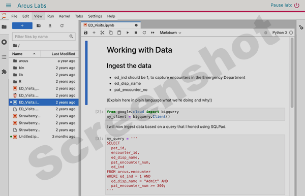

<!--
link:   https://storage.googleapis.com/chop-dbhi-arcus-education-website-assets/css/styles.css
script: https://kit.fontawesome.com/83b2343bd4.js
title: Arcus Labs Orientation
-->

# New to Python?

**What is Python?**

<!-- style = "max-width:400px; float:left; margin-right: 2rem; margin-bottom: 2rem;"-->

Python is a general purpose programming language that can be used in a number of settings, from website development to robotics.  For our purposes, one common usage of Python is in data analysis and machine learning.  

While many researchers use R, a different language, for data analysis, Python also has important strengths in data analytics, especially in image analysis and natural language processing.  Often, data analysis takes place in a special format of Python language called a "notebook".  If you've heard of "iPython" notebooks or "Jupyter" notebooks or labs, that's the format we're talking about.  You may have also seen a notebook format in Google Collaboratory (or Colab) notebooks.  These notebooks allow your code to be interspersed with formatted text that is intended to communicate with other humans, not with a computer.  In Arcus, we provide the JupyterLab environment to provide users with notebook functionality.

Additionally, Python is widely used in machine learning, a computational method that helps develop models that can classify data and make predictions on new data.  Often the development of machine learning takes place in notebooks, which makes trial and error and human intervention easy, and is then, once successful, is scaled up for production use in an automated form that doesn't use notebooks but rather raw python code for speed and efficiency.

**What Makes Python Popular?**

Like R, Python is free and open source, and promotes research reproducibility.

## Arcus-Specific Python Training

<!--
style = "max-width:400px; float:right; margin-left: 2em;"-->

For an example of how to use Python / JupyterLab in your Arcus lab, start with the training videos on your lab's landing page.

These are very introductory, but help you understand specifically how to work with  your Arcus lab.  

We strongly encourage you to watch **all of the videos**, in order, even the ones that don't refer to Python specifically.  It's only about an hour of your time, and we think it will answer many of your questions and save time in the long run.

## Additional Resources

The training videos barely scratch the surface of how to get started.  We did that on purpose, so that they're short enough that everyone can watch them.

But they aren't enough to get you started **really** learning Python.  You have several options when it comes to growing in your Python skills.

There are a number of university classes, online courses and live workshops that go in depth about how to use Python.  Simply search for courses at the university or MOOC (e.g. Coursera) you prefer to use.  

When looking for a course in Python, it's important to search specifically for phrases like "Python for data analysis" or "Python notebook".  Python is a broad language with many kinds of training courses associated, and there are many courses out there that won't make sense for your use case.  You don't want to waste hours or days learning the kind of Python that's best for building desktop applications, for example, if what you really want to learn is how to write the kind of Python that's used for data analysis.

If you prefer something a bit more "just in time", however, we suggest the Python modules from the [DART (Data and Analytics for Research Training) program](https://arcus.github.io/education_modules/).

DART includes dozens of data science modules that are each 1 hour or less in duration and with a narrow focus and clear learning objectives.  They are asynchronous and you can take them at any time!

Arcus Education's DART program is the result of [an NIH grant aimed at educating biomedical researchers](https://www.research.chop.edu/announcements/dbhi-and-drexel-collaborate-to-advance-biomedical-data-science-education).
If you'd like to learn more about DART, fill out our [interest form](https://redcap.link/dart-interest) or email us at dart@chop.edu.

Training modules:

* [Demystifying Python](https://liascript.github.io/course/?https://raw.githubusercontent.com/arcus/education_modules/main/demystifying_python/demystifying_python.md)
* [Python Basics: Functions, Methods, and Variables](https://liascript.github.io/course/?https://raw.githubusercontent.com/arcus/education_modules/main/python_basics_variables_functions_methods/python_basics_variables_functions_methods.md)
* [Python Basics: Lists and Dictionaries](https://liascript.github.io/course/?https://raw.githubusercontent.com/arcus/education_modules/main/python_basics_lists_dictionaries/python_basics_lists_dictionaries.md)
* [Python Basics: Loops and Conditionals](https://liascript.github.io/course/?https://raw.githubusercontent.com/arcus/education_modules/main/python_basics_loops_conditionals/python_basics_loops_conditionals.md)
* [Transform Data with pandas](https://liascript.github.io/course/?https://raw.githubusercontent.com/arcus/education_modules/main/pandas_transform/pandas_transform.md)
* [Data Visualization in seaborn](https://liascript.github.io/course/?https://raw.githubusercontent.com/arcus/education_modules/main/data_visualization_in_seaborn/data_visualization_in_seaborn.md)

Additionally, beyond the NIH grant, we have other articles and miscellany we suggest, whether those are resources we've created in Arcus, or things we recommend from the larger Python community.

**Compendia of Resources**:

* Our ["Python 101" Guide](https://education.arcus.chop.edu/guides/python-101/) includes links to articles, webinars, and other materials on a variety of topics.
