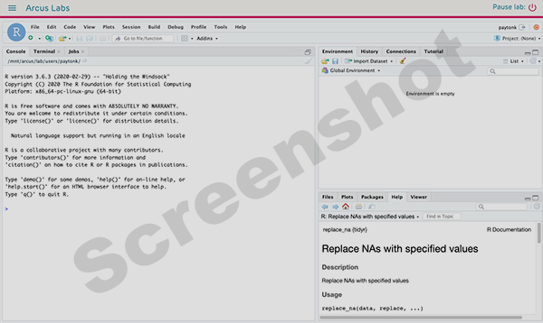
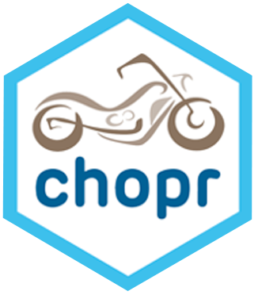

<!--
link:  https://storage.googleapis.com/chop-dbhi-arcus-education-website-assets/css/styles.css
script: https://kit.fontawesome.com/83b2343bd4.js

Title: New to R?
-->

# New to R?

**What is R?  RStudio?**

<!-- style = "border: 1px solid rgb(var(--color-highlight)); max-width: 600px; float: left; margin-right: 2rem; margin-bottom: 2rem;"-->

R is a free, open source language that is specifically focused on statistical data analysis.  It is [increasing in market share among researchers](https://r4stats.com/articles/popularity/) (second only to SPSS and outpacing SAS, Stata, JMP, Matlab, and other solutions you may have used) and has multiple advantages over "point and click" statistical data analysis.

RStudio is a free tool made by Posit (formerly RStudio) that makes using R much simpler than using R alone.  RStudio is provided as a tool in Arcus labs and is nearly identical to the RStudio you might be accustomed to using in CHOP's HPC, on CHOP's RStudio Connect server, or on your computer.  It allows you to analyze data stored in your lab for your research project.

In R, you write scripts.  Scripts are computer code that record a series of operations you want to perform on your data.  Operations could include things like:

* Ingesting data (bringing it into R) from an outside source like a .csv or a database
* Cleaning data (say, removing rows in which not every likert scale question was answered)
* Performing statistical tests (like a T-test on subjects and controls)
* Visualizing data (for example, creating an ROC)
* And much more!

**Why is R Popular?**

By using a script, you simply execute the code that could have multiple steps, such as combining data, de-identifying and cleaning data, performing analysis and statistical tests, and creating visualizations. If more data get added, you simply run the script again. You already did the hard work of writing the script, so now all you have to do is essentially hit "run".

If you realize that your workflow needs a bit of tweaking toward the beginning, you can update that part of your script and leave the rest untouched. Again, you just run the script with your changes, and you've saved yourself a lot of time compared to when changing something far upstream of your analysis meant hours of manual cleaning of data or re-creation of new files.

**What Makes R Difficult?**

Unless you recently left graduate school, you probably learned a different paradigm of data analysis, one that depended on point-and-click software.  Or perhaps you don't work directly with data but hire a statistician to do that work for you.  Learning to "DIY" is rewarding but can definitely feel frustrating, especially when you already have a system that works.  It is difficult to transition from using a system you're comfortable with to one that you're less adept at.  We do think that the gains of using R, in terms of research reproducibility, greater publication options, and more fine-grained control over things like visualizations, outweigh the annoyances of having to learn to write code.

## CHOP Has an R User Group!

<!-- style = "border: 1px solid rgb(var(--color-highlight)); max-width: 200px; float: left; margin-right: 2rem; margin-bottom: 2rem;"-->

CHOP has a vibrant R User Group made up of employees from all over the institution who use R for many different use cases.  This is a great place to start connecting with other people, asking for help, and seeking advice.

Please fill out this form to [join the CHOPR User Group](https://bit.ly/chopRusers)!  This will add you to the Outlook distribution list for emails as well as give you instructions on how to add yourself to our Slack workspace, where people ask coding questions (and answer them!).

Joining the R User Group means you'll be informed about periodic intro to R workshops, R User Group talks, and other resources you'll find useful.  Especially if you're the only person in your lab who uses R, it can be important to find a community of practice that can help guide you.  Intro to R workshops are given a few times a year and include five hours of hands-on, synchronous work intended to get you started working with R as a brand-new beginner.  To learn more about the course, visit the [R101 course website](https://arcus.github.io/intro-to-r-for-clinical-data/).

As you gain expertise, we also invite you to participate by leading an R User Group meeting!  You don't have to be an expert for years in order to share your skills.  Even if you only know a little, you know more than some people, and you can share pitfalls to avoid and the routes to success for data analysis tasks you conducted on your type of research data.

## Arcus-Specific R Training

<!-- style = "border: 1px solid rgb(var(--color-highlight)); max-width: 600px; float: left; margin-right: 2rem; margin-bottom: 2rem;"-->

For an example of how to use R in your Arcus lab, start with the training videos on your lab's landing page.

These are very introductory, but help you understand specifically how to work with your Arcus lab.  

We strongly encourage you to watch **all of the videos**, in order, even the ones that don't refer to R specifically.  It's only about an hour of your time, and we think it will answer many of your questions and save time in the long run.

## Additional Resources

The training videos barely scratch the surface of how to get started.  We did that on purpose, so that they're short enough that everyone can watch them.

But they aren't enough to get you started **really** learning R.  You have several options when it comes to growing in your R skills.

There are a number of university classes, online courses and live workshops that go in depth about how to use R.  Simply search for courses at the university or MOOC (e.g. Coursera) you prefer to use.

If you prefer something a bit more "just in time", however, we suggest the R modules from the [DART (Data and Analytics for Research Training) program](https://arcus.github.io/education_modules/).

DART includes dozens of data science modules that are each 1 hour or less in duration and with a narrow focus and clear learning objectives.  They are asynchronous and you can take them at any time!

Arcus Education's DART program is the result of [an NIH grant aimed at educating biomedical researchers](https://www.research.chop.edu/announcements/dbhi-and-drexel-collaborate-to-advance-biomedical-data-science-education).
If you'd like to learn more about DART, fill out our [interest form](https://redcap.link/dart-interest) or email us at dart@chop.edu.

Training modules:

* [R Basics: Introduction](https://liascript.github.io/course/?https://raw.githubusercontent.com/arcus/education_modules/main/r_basics_introduction/r_basics_introduction.md)
* [R Basics: Transform Data](https://liascript.github.io/course/?https://raw.githubusercontent.com/arcus/education_modules/main/r_basics_transform_data/r_basics_transform_data.md)
* [R Basics: Visualize Data](https://liascript.github.io/course/?https://raw.githubusercontent.com/arcus/education_modules/main/r_basics_visualize_data/r_basics_visualize_data.md)
* [Reshaping Data in R: Long and Wide Data](https://liascript.github.io/course/?https://raw.githubusercontent.com/arcus/education_modules/main/r_reshape_long_wide/r_reshape_long_wide.md)
* [Missing Values in R](https://liascript.github.io/course/?https://raw.githubusercontent.com/arcus/education_modules/main/r_missing_values/r_missing_values.md)
* [Data Visualization in ggplot2](https://liascript.github.io/course/?https://raw.githubusercontent.com/arcus/education_modules/main/data_visualization_in_ggplot2/data_visualization_in_ggplot2.md)
* [Summary Statistics in R](https://liascript.github.io/course/?https://raw.githubusercontent.com/arcus/education_modules/main/r_summary_stats/r_summary_stats.md)

Additionally, beyond the NIH grant, we have other articles and miscellany we suggest, whether those are resources we've created in Arcus, or things we recommend from the larger R community.

**Compendia of Resources**:

* Our ["R 101" Guide](https://education.arcus.chop.edu/guides/r-101/) includes links to articles, webinars, and other materials on a variety of topics.

**Other Resources**:

* [EdX Data Science in R](https://www.edx.org/course/data-science-r-basics)
* [Coursera Data Science in R Specialization by Johns Hopkins University](https://www.coursera.org/specializations/jhu-data-science)
* [Importing your data into R](https://bookdown.org/pdr_higgins/rmrwr/importing-your-data-into-r.html)
* [R for Data Science (English)](https://r4ds.had.co.nz/)
* [R for Data Science (Spanish)](https://es.r4ds.hadley.nz/)
