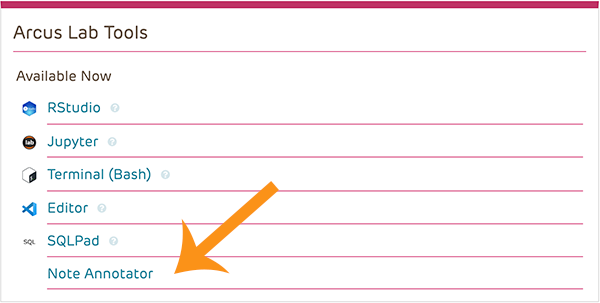
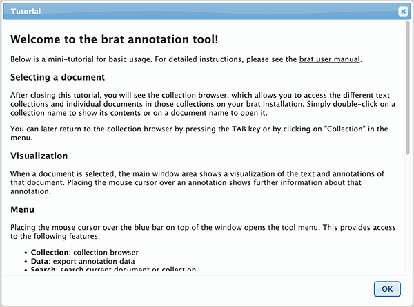

<!--
author:   Arcus Education
email:    arcus-support@chop.edu
version:  1.0.0
language: en
narrator: US English Female
title: New to Text Data

link:   https://storage.googleapis.com/chop-dbhi-arcus-education-website-assets/css/styles.css
script: https://kit.fontawesome.com/83b2343bd4.js

-->

# New to Text Data?

Working with text data, such as clinical notes, for the first time?  This is for you!

Clinical notes, allergy comments, and other free-text fields appear in the clinical record, and you may also have research data gathered outside the clinical record, such as writing samples, diagnostic interview transcripts, or other text.

Text data is incredibly rich, because it represents complex human communication in terms of vocabulary, syntax, the use of specialized lingo, and much more.  Learning to work with text data can take lots of different forms depending on what you need to do.  Let's take a few topics and address how you may wish to learn some practical skills for each.

## Pattern Matching (Regular Expressions)

Regular expressions reflect **patterns in text**.  For example, you may want to flag all examples of ten digits that could be phone numbers, because these run the risk of being protected health information (PHI).  So you want to match patterns that could look like ten digits in a row, or three digits, three digits, four digits, separated by parentheses or dashes or periods.  You can do this by using regular expressions!

Or, maybe you want to bulk rename a bunch of files.  If your files all have a similar structure, something like `lastname_randomnumber.txt`, and you want to remove the first bit of the file name, and leave the files just titled `randomnumber.txt`, you can do that using regular expressions.

Regular expressions can be useful when you're looking for things that have a certain similarity in **structure**:

* The way a particular lab measurement looks (e.g. 3.8 μg/dL): 

  - some number that might include a decimal
  - then the symbols "μg" or the word "microgram" or "micrograms"
  - the "/" symbol
  - then the symbols "dl" or "dL" or the word "deciliter" 
* The way a Social Security Number looks (e.g. 111-22-3333):

  - three digits
  - a dash or space 
  - two digits
  - a dash or space 
  - four digits 

Regular expressions may not be the best way to find data that has **semantic** (meaning-related) similarity (e.g. similar terms such as "emesis", "vomiting", "nausea", "queasy", "sick to her stomach", etc.)

To learn more about regular expressions, we suggest some modules we created, that go from very simple (what exactly **are** regular expressions?) to quite advanced!

<!-- data-type="none" -->
| Title  | Description  | Duration  |
| :--------- | :--------- | :--------- |
| [Demystifying Regular Expressions](https://liascript.github.io/course/?https://raw.githubusercontent.com/arcus/education_modules/main/demystifying_regular_expressions/demystifying_regular_expressions.md#1)| Learn about pattern matching using regular expressions, or regex. | 30 min |
| [Regular Expressions Basics](https://liascript.github.io/course/?https://raw.githubusercontent.com/arcus/education_modules/main/regular_expressions_basics/regular_expressions_basics.md#1)| Begin to use regular expressions, or regex, for simple pattern matching.| 60 min|
| [Regular Expressions: Groups](https://liascript.github.io/course/?https://raw.githubusercontent.com/arcus/education_modules/main/regular_expressions_groups/regular_expressions_groups.md#1) | Use regular expressions, or regex, for complex pattern matching involving capturing and non-capturing groups. | 30 min|
| [Regular Expressions: Flags, Anchors, and Boundaries](https://liascript.github.io/course/?https://raw.githubusercontent.com/arcus/education_modules/main/regular_expressions_boundaries_anchors/regular_expressions_boundaries_anchors.md#1)| Use flags, anchors, and boundaries in regular expressions, or regex, for complex pattern matching. | 45 min|
| [Regular Expressions: Lookaheads](https://liascript.github.io/course/?https://raw.githubusercontent.com/arcus/education_modules/main/regular_expressions_lookaheads/regular_expressions_lookaheads.md#1)| Use regular expressions, or regex, for complex pattern matching involving lookaheads. | 30 min|

## Automatically detecting clinical concepts: Named Entity Recognition

In medicine, sometimes notes reflect medical jargon, such as "pt febrile", sometimes they reflect a parent report, as in, "Mom says Suzy has been feverish for 2 days." Being able to find "patients experiencing fever" given the wide diversity of language used in the clinical record can be challenging.  

Sometimes, clinical concepts are regularly charted in a very prescribed way, such as using a code (think of ICD or CPT codes as ways to make it much easier to organize data).  But sometimes that doesn't happen. Not every symptom or condition has a code, or rises to the level of importance that it would be listed in a diagnosis field.  How can you automatically detect clinical concepts in text, such as in a provider note?

Named Entity Recognition
-----

Named entity recognition, or NER, is a subset of natural language processing (NLP).  Named entity recognition is a sophisticated computational approach to finding the same sort of thing that might be referred to in a number of ways.  "Temp of 104F", "febrile", and "fever" might all jump out to you as reflecting a similar reality: a patient who is running a fever.  

Much of this is contextual.  After all, if you were studying the weather, "104" might be a global warming or summer forecast reference, and if you were studying musical or cinematic history, "fever" might refer to "Saturday Night Fever," or Beatlemania.  Because medical data is so widely studied, tools already exist that are designed to make named entity recognition possible for things like clinical records, and these tools have been trained on medical text.  It's context aware, and can find symptoms, conditions, medications, and other types of entities that are important in medicine.

cTAKES
-----

At CHOP, Arcus has analyzed every clinical note in Epic using an open source tool called cTAKES (clinical Text Analysis and Knowledge Extraction System).  This means that if you're searching for entities that exist as part of a major ontology like the Human Phenotype Ontology (HPO) or SNOMED, you can use cTAKES annotations (indicators that include what was found and where) on clinical notes.  Let's consider an example text:

> Suzy, 10y5m female, presents with headache and fever.  Parents say pt has been "spaced out" and possibly fainted / seized at school, was sent home prior to coming to ED.  Report that Suzy has possibly been feverish for ~48h.  Monday, her temp was 100F, responsive to antipyretic (Tylenol given at home).  Unclear hx of febrile seizures in infancy.

If we ask cTAKES to examine this text, we'll get back some annotations. Let's look at what cTAKES discovers:

Notice that there are some things that cTAKES did not highlight that you might still find interesting, like "100F" or "fainted/seized".  cTAKES isn't a full replacement for close expert reading of notes.  However, cTAKES does a good job of identifying:

* Signs and symptoms like "headache" and "fever"
* Medications like "Tylenol"
* Diseases and disorders like "febrile seizures"

If we were to look more closely at what cTAKES reports about these discoveries (for example, drilling down into the details about "febrile seizures"), we can see that it provides a number of details.

<!-- style = "border: 1px solid rgb(var(--color-highlight)); max-width: 400px;"-->

We can see information including:

* The ontology cTAKES is using to describe this entity: SNOMED CT
* The kind of entity cTAKES thinks this is: Disease/disorder
* The code within the ontology for this entity: 41497008
* The preferred name for this entity: "Febrile Convulsions"
* Whether this entity shows negation (e.g. "no evidence of..."): False
* Whether this entity shows uncertainty: False
* Whether this entity is generic: False
* Whether this entity shows as historical: True
* Whether this entity includes conditionality: False
* The subject of the entity: patient

Notice that the jargon "hx of" was correctly read as referring to medical history!

If you were to imagine trying to capture information about a clinical concept across millions of notes, in order to, for example, track the seasonality of fever, you can understand the power of a tool like cTAKES.  It works pretty well to discover clear-cut mentions of clinical realities and it can even get at details like whether something is being mentioned as a current concern or in terms of medical history.  Is it perfect?  No.  Does it allow you to scale up how you use notes, and give you the opportunity to study many more notes than human experts could?  Yes!

Annotation Data
-----

If you request an Arcus lab with clinical note annotations from cTAKES, you'll have the details that we saw above in a table of SQL data, as well as the location within the note where the text was found. If we think of the note about Suzy as being note "123", this is what the cTAKES annotations might look like in your Arcus lab data (we've omitted some columns for simplicity).

<!-- data-type="none" class="tight-table" style="font-size:80%"-->
| note\_id  | begin\_span | end\_span | annotation\_type  | negated | history\_of |  subject | ontology\_preferred\_text |
| --- | ---  | ---  | --- | --- | --- | --- | --- | ---| --- | --- | --- | --- |
| 123 | 35 | 42 | SignSymptomMention | false | false |  patient | Headache |
| 123 | 48 | 52 | SignSymptomMention | false | false |  patient | Fever |
| 123 | 207 | 214 | SignSymptomMention | false | false |  patient | Fever |
| 123 | 281 | 287 | MedicationMention | false | false |  patient | Tylenol |
| 123 | 320 | 326 | SignSymptomMention | false | false |  patient | Fever |
| 123 | 328 | 335 | SignSymptomMention | false | true |  patient | Seizures |
| 123 | 320 | 335 | DiseaseDisorderMention | false | true |  patient | Febrile Convulsions |

## Using Large Language Models

Have you been captivated by the possibilities of using large language models to generate text, such as composing an overview of a patient's medical history, translating clinical records from another language into English, summarizing a journal article, or helping draft emails?  You're not alone!

You can learn more about LLMs like ChatGPT in our [Demystifying Large Language Models](https://liascript.github.io/course/?https://raw.githubusercontent.com/arcus/education_modules/main/demystifying_large_language_models/demystifying_large_language_models.md#1) module!

## Manually annotating text (BRAT annotator)

Perhaps you want to make notes (annotations) on clinical notes fields.  As a nurse educator who works with patients, you're interested in the psychological impact to patients in the days leading up to having a port placed. You want to examine the evidence from clinical notes where there's some mention that patients are experiencing fear, anxiety, or sadness related to their port placement.  For example, you might want to flag a few phrases in this fictional note, which we've bolded here:

> Pt is **worried about** port placement, **sad** about not being able to play sports.  Expresses some **concerns** about proper port hygiene and risks associated with infection.  Parents v supportive. Suggest working with child life / occupational health wrt sports-adjacent activities.  pt and family scheduled for port hygiene education / wound care education on Sept 4.

You've tried automated annotation, for example, by using cTAKES, but the tools available aren't reliably detecting what you want to capture.  So, you've pivoted in your research approach.  You requested from Arcus all the clinical notes within 3 days of port placement for patients who received ports in the past two years.  

Those notes have been delivered to an Arcus lab, and you and your colleague are now manually going through the notes, identifying text that indicates anxiety, grief, sadness, anger, fear or similar emotional reactions that are directly related to port placement.  These notes already have some annotations (added, for example, by cTAKES), but you are pretty sure you'll need to correct or enrich those annotations. By annotating the text yourselves, you're spending a lot of time, but you're also identifying patterns that might later be used for automation, multiplying your expertise by applying it computationally.  

You can annotate text in Arcus Labs using a tool called BRAT.  This allows you to open a note, display it in a visually clean and appealing way, and highlight text that has salient characteristics.

Let's consider what using BRAT is like:

Step 1: Open the BRAT annotator
------

In the dashboard of an Arcus lab, if the BRAT note annotator has been added, you'll see it in your list of tools:

<!-- style = "border: 1px solid rgb(var(--color-highlight)); max-width: 400px;"-->

Click on the text "Note Annotator" to enter the annotation tool, and you'll first see a bit of basic instruction.  Please read this over, and click "OK" to make this initial info screen go away.

<!-- style = "border: 1px solid rgb(var(--color-highlight)); max-width: 400px;"-->

Step 2: Log in  
-----

In order to make changes to (not just view) notes, you'll need to log in.  You'll want to first close any dialog boxes or file pickers, so that your annotation application is empty:

<!-- style = "border: 1px solid rgb(var(--color-highlight)); max-width: 500px;"-->

Notice that there's an application toolbar at the top, in blue.  It has arrows on the left side and the "brat" logo on the right.  If you hover over that toolbar, it will expand, and you can choose "log in."    Credentials for how to log in will be shared with you by the Arcus Applied Data Science team.  

<!-- style = "border: 1px solid rgb(var(--color-highlight)); max-width: 500px;"-->

Once you log in, you won't get any sort of message saying that it worked, but if you hover again over the toolbar, you'll see a logout button with the appropriate user name.  That's how you'll know you're appropriately logged in!

<!-- style = "border: 1px solid rgb(var(--color-highlight)); max-width: 500px;"-->

Step 3: Open a note.
-----

Hover over the toolbar so that you can click on "Collection", and navigate in the file structure until you reach the note you want to annotate.  You may have several different folders, organized according to the needs of the project.  

If you go too deeply into a folder structure and need to "back out" to the parent folder, that's what `../` signifies!

Once you see the icon of a piece of paper followed by the name of a note you want to annotate (or check the annotations of), you can double-click on it to open, or click once and then choose "OK" in the lower right.  

<!-- style = "border: 1px solid rgb(var(--color-highlight)); max-width: 500px;"-->

Step 4: Annotate!
----

